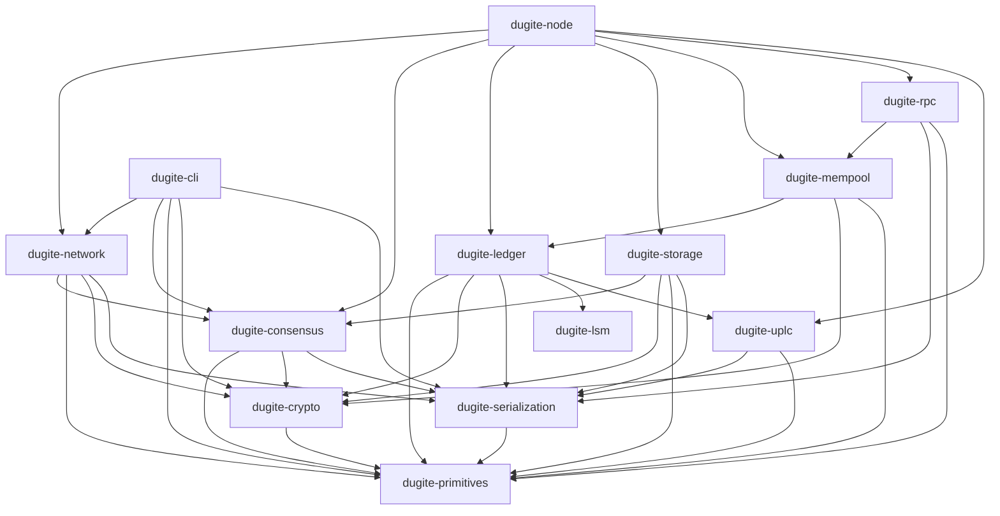

<p align="center">
  
</p>

Named after the [dugite](https://en.wikipedia.org/wiki/Dugite) (*Pseudonaja affinis*), a highly venomous brown snake indigenous to Perth, Western Australia — where the project's main author is from. Dugites are fast, resilient, and quietly formidable; traits shared by this node. They're also responsible for the loss of more than a few beloved family pets over the years.

A Cardano node implementation written in Rust, aiming for 100% compatibility with [cardano-node](https://github.com/IntersectMBO/cardano-node).

Built by [Sandstone Pool](https://www.sandstone.io/)

[Documentation](https://michaeljfazio.github.io/dugite/) | [Benchmarks](https://michaeljfazio.github.io/dugite/reference/benchmarks.html) | [Developer Wiki](https://github.com/michaeljfazio/dugite/wiki) | [Discussions](https://github.com/michaeljfazio/dugite/discussions)

[](https://github.com/michaeljfazio/dugite/actions/workflows/ci.yml)
[](https://github.com/michaeljfazio/dugite/actions/workflows/code-scanning.yml)
[](https://codecov.io/gh/michaeljfazio/dugite)
[](https://github.com/michaeljfazio/dugite/actions/workflows/benchmarks.yml)
[](https://michaeljfazio.github.io/dugite/)
[](LICENSE)
[](https://www.rust-lang.org/)
[](https://cardano.org/)
[](https://github.com/michaeljfazio/dugite/discussions)
[](https://github.com/michaeljfazio/dugite/stargazers)

> [!CAUTION]
> **Dugite is in early development and is NOT recommended for production use.**
> APIs, storage formats, and on-chain behavior may change without notice. Ledger validation is incomplete and may accept invalid transactions or reject valid ones. **Do not use this software to operate a stake pool, manage real funds, or participate in mainnet governance.** Use at your own risk on testnets only.

For project status, capability matrix, and known issues see the [Developer Wiki](https://github.com/michaeljfazio/dugite/wiki).

## What you get

Four binaries, built from one workspace:

| Binary | What it is |
|--------|------------|
| `dugite-node` | The node — sync, ledger, mempool, forging, Mithril import, Prometheus metrics, optional UTxO RPC (gRPC) server |
| `dugite-cli` | cardano-cli compatible CLI: 11 command groups, era-prefix aliases |
| `dugite-monitor` | Terminal monitoring dashboard |
| `dugite-config` | Interactive TUI config editor |

Download them from [Releases](https://github.com/michaeljfazio/dugite/releases), or build from source below.

## Quick Start

Prerequisites: the latest stable [Rust](https://rustup.rs/) toolchain and `protoc`
(`apt install protobuf-compiler libprotobuf-dev` / `brew install protobuf`) — the
UTxO RPC crate generates its gRPC stubs at build time.

Dugite ships a top-level [`justfile`](./justfile) — install [just](https://github.com/casey/just) and the most common workflows become one-liners. `just --list` shows everything.

```bash
# Build, lint, test (full CI gate)
just check

# Fast sync with a Mithril snapshot (recommended), then run as a relay on preview.
just mithril-import preview
just run-relay preview
```

`mithril-import`, `run-relay`, and `run-bp` each take `mainnet`, `preview`, or `preprod`.

Without `just`, the same steps map directly to the underlying scripts and `cargo` commands:

```bash
cargo build --release
./scripts/mithril/import.sh preview
./target/release/dugite-node run \
  --config config/preview/config.json \
  --topology config/preview/topology.json \
  --database-path ./db-preview \
  --socket-path ./node.sock \
  --host-addr 0.0.0.0 \
  --port 3001
```

For installation, configuration, networks, monitoring, block-producer setup, and the full CLI reference, see the [documentation](https://michaeljfazio.github.io/dugite/).

| Network | Magic | Config |
|---------|-------|--------|
| Mainnet | `764824073` | `config/mainnet/` |
| Preview | `2` | `config/preview/` |
| Preprod | `1` | `config/preprod/` |

Each config directory is self-contained: `config.json`, `topology.json`, and the Byron, Shelley, Alonzo, and Conway genesis files.

## Architecture

Dugite is a 16-crate Cargo workspace (plus `xtask` and two test-suite crates under `tests/`) with an in-house multi-era CBOR decoder and UPLC CEK machine for full Cardano wire-format compatibility.



`dugite-monitor` and `dugite-config` are standalone TUIs and take no workspace
dependencies at build time.

See [Architecture Overview](https://michaeljfazio.github.io/dugite/architecture/overview.html) for the per-crate breakdown, and [Architecture Decision Records](https://github.com/michaeljfazio/dugite/wiki/Architecture-Decision-Records) for design rationale.

## Development

```bash
just check       # full CI gate: fmt-check + clippy + build + test + test-doc
just test        # cargo nextest run --workspace
just test-doc    # cargo test --doc
just clippy      # cargo clippy --all-targets -- -D warnings
just fmt-check   # cargo fmt --all -- --check   (apply with: just fmt)
```

Zero-warning policy is enforced: all code must compile cleanly with clippy and pass formatting checks.

A three-node loopback devnet (dugite BP + relay against a cardano-node BP) backs
release validation — `just devnet-validate-smoke` for the PR gate,
`just devnet-validate-extended` for the release gate. Upstream wire-format and
evaluation fidelity is checked against a pinned corpus with
`just download-upstream-fixtures && just test-conformance`.

See [CONTRIBUTING.md](CONTRIBUTING.md) for the full workflow, and [Getting Started for Developers](https://github.com/michaeljfazio/dugite/wiki/Getting-Started-for-Developers) on the wiki.

Benchmark instructions and tracked baselines: [Benchmarks](https://michaeljfazio.github.io/dugite/reference/benchmarks.html).

## Acknowledgments

Special thanks to the following individuals for their contributions and support:

- **Andrew Westberg** (BCSH)
- **Samuel Leathers**
- **Homer J** (AAA)

## License

Apache-2.0
