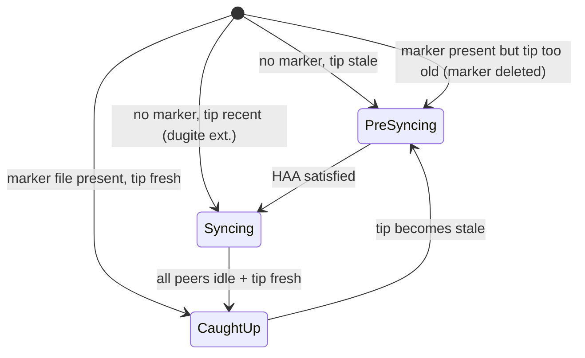

# Ouroboros Genesis Support

Dugite includes a Genesis State Machine (GSM) that tracks the node's sync progression through the Ouroboros Genesis protocol states.

## Overview

The GSM implements three states matching the Ouroboros Genesis specification:

- **PreSyncing** — Waiting for enough trusted big ledger peers (BLPs). The Historical Availability Assumption (HAA) requires a minimum number of active BLPs before sync begins.
- **Syncing** — Active block download with density-based peer evaluation. The GSM monitors chain density across peers and can disconnect peers with insufficient chain density (GDD).
- **CaughtUp** — Normal Praos operation. The node is at or near the chain tip and participates in standard consensus.

### Enabling Genesis Mode

Genesis mode is opt-in via the `--consensus-mode genesis` CLI flag:

```bash
dugite-node run \
  --consensus-mode genesis \
  --config config/preview/config.json \
  ...
```

When not enabled (the default `praos` mode), the GSM immediately enters `CaughtUp` and all Genesis constraints are disabled. This is the recommended mode for nodes that sync from Mithril snapshots.

### State Transitions



A `caught_up.marker` file is written to the database directory when the node reaches `CaughtUp`, enabling fast restart without re-evaluating the Genesis bootstrap. The startup state is chosen from the marker's presence and the current tip's age (mirroring Haskell's `initializationGsmState`):

| Marker | Tip age at startup | Initial state |
|--------|---------------------|----------------|
| Absent | Unknown, or >= the stability-window threshold | `PreSyncing` |
| Absent | Recent (< threshold) | `Syncing` — **dugite extension** (see below) |
| Present | Young enough | `CaughtUp` |
| Present | Too old | `PreSyncing`, and the marker is deleted |

The "absent marker + recent tip → `Syncing`" row does not exist in Haskell, where an absent
marker always starts in `PreSyncing`. Haskell avoids the resulting stall by requiring a
`peerSnapshotFile` in the topology so big-ledger peers are seeded instantly; dugite adds this
startup shortcut instead, for deployments (e.g. fresh Mithril-snapshot bootstraps) without a peer
snapshot file — without it, a node that is already near the live tip (its chain already certified
by the Mithril certificate chain) would otherwise wait through a full HAA bootstrap it doesn't
need, and could stall for k blocks in the interim.

### The Historical Availability Assumption (HAA) in detail

`PreSyncing → Syncing` is gated by `haa_satisfied()`, which is a three-way case split (not a
single "enough BLPs" check), mirroring Haskell's `outboundConnectionsState`:

1. **Bootstrap peers configured** (topology has a non-empty `bootstrapPeers` set) — satisfied when
   every established *outbound* peer is in `bootstrap ∪ trustable local roots` (a closure
   condition) **and** at least one of those peers is both hot and specifically a bootstrap peer
   (not just any trusted hot peer). Inbound connections are excluded from this assessment
   entirely.
2. **No bootstrap peers, Praos mode** — always `false`. Haskell treats this as ordinary
   `UntrustedState`, so this is silent (no warning), not an error condition.
3. **No bootstrap peers, Genesis mode** — satisfied purely by the count of active
   (hot) big-ledger peers meeting the configured minimum — untrusted peers don't factor in at all.

Only case 3 is the direct "enough BLPs" gate for a from-scratch Genesis bootstrap; case 1 is what
governs a bootstrap-peer-configured topology, and case 2 means Praos-mode nodes without bootstrap
peers never satisfy HAA (irrelevant to them, since the GSM only enforces HAA in Genesis mode).

### Features

- **State tracking**: PreSyncing/Syncing/CaughtUp with automatic transitions
- **Big Ledger Peer identification**: Pools in the top 90% of active stake are classified as BLPs
- **Genesis Density Disconnector (GDD)**: Compares chain density across peers within the genesis window and disconnects peers with insufficient density
- **Limit on Eagerness (LoE)**: Computes the maximum immutable tip slot based on candidate chain tips
- **Peer snapshot loading**: JSON-based peer snapshot for initial peer discovery

## Recommended Deployment

The recommended deployment path uses Mithril snapshot import for fast sync with the default `praos` consensus mode:

```bash
# Import a Mithril snapshot first
dugite-node mithril-import --network-magic 2 --database-path ./db

# Then run in default praos mode
dugite-node run --config config/preview/config.json --database-path ./db ...
```
