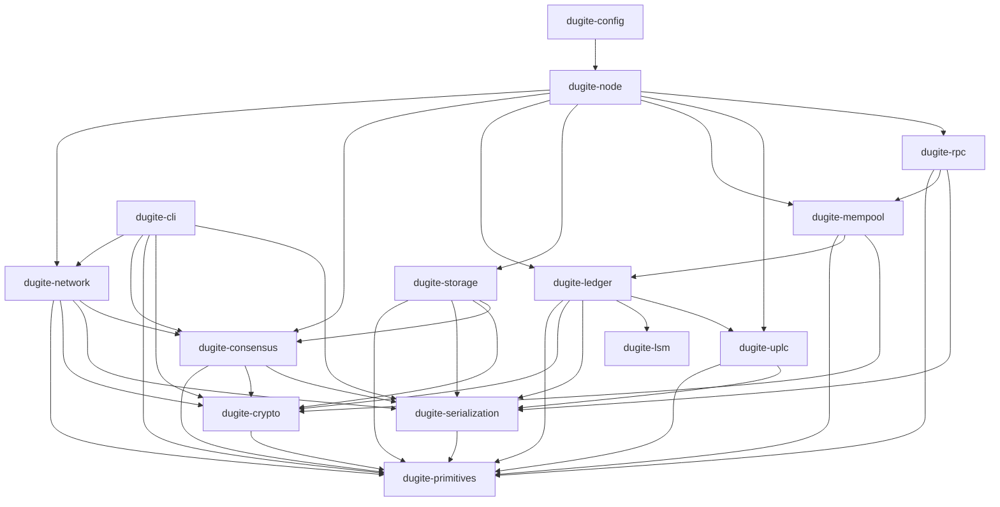

# Architecture Overview

Dugite is organized as a 16-crate Cargo workspace under `crates/` (plus an `xtask` build-tooling
crate and two test-only crates, `tests/conformance` and `tests/golden`, outside `crates/`). Each
crate has a focused responsibility and well-defined dependencies.

## Crate Workspace

| Crate | Description |
|-------|-------------|
| `dugite-primitives` | Core types: hashes, blocks, transactions, addresses, values, protocol parameters (Byron through Conway, plus the in-progress Dijkstra era) |
| `dugite-crypto` | Ed25519 keys, VRF, KES, text envelope format |
| `dugite-serialization` | In-house multi-era CBOR encoding/decoding for Cardano wire format |
| `dugite-lsm` | Pure Rust LSM-tree engine with WAL, compaction, bloom filters, and snapshots — standalone, no dependency on any other workspace crate |
| `dugite-network` | Ouroboros mini-protocols (ChainSync, BlockFetch, TxSubmission, KeepAlive, PeerSharing), N2N client/server, N2C server, peer manager |
| `dugite-consensus` | Ouroboros Praos, chain selection, epoch transitions, slot leader checks |
| `dugite-ledger` | UTxO set (LSM-backed via UTxO-HD), transaction validation, ledger state, certificate processing, native script evaluation, reward calculation |
| `dugite-mempool` | Thread-safe transaction mempool with input-conflict checking and TTL sweep (depends on `dugite-ledger` for validation types) |
| `dugite-storage` | ChainDB (ImmutableDB append-only chunk files + VolatileDB in-memory) |
| `dugite-node` | Main binary, config, topology, pipelined chain sync loop, Mithril import, block forging |
| `dugite-rpc` | Native UTxO RPC (gRPC) server exposing chain/mempool data via the `utxorpc` spec |
| `dugite-cli` | cardano-cli compatible CLI (address, key, transaction, query, stake-address, stake-pool, governance, node, genesis, byron, and text-view command groups) |
| `dugite-monitor` | Terminal monitoring dashboard (ratatui-based, real-time metrics via Prometheus polling) — standalone binary with no internal crate dependencies |
| `dugite-config` | Interactive TUI configuration editor with tree navigation, inline editing, type validation, and diff view (depends on `dugite-node` for the config/runtime types it edits) |
| `dugite-uplc` | In-house UPLC CEK machine for Plutus V1/V2/V3 (and Dijkstra's V4) script evaluation |
| `dugite-integration-tests` | End-to-end integration tests across the workspace |

## Crate Dependency Graph

Notably, `dugite-mempool` depends on `dugite-ledger` (it reuses the Phase-1/Phase-2 validation
types), not the reverse — the mempool is a thin admission-control layer over the ledger's own
validation, not an independent crate the ledger reaches into. `dugite-monitor` and `dugite-lsm`
are the two workspace leaves with zero dependencies on other Dugite crates: the monitor talks to
a running node purely over Prometheus HTTP and the N2C socket, and the LSM engine is a
general-purpose on-disk data structure with no Cardano-specific knowledge.

## Key Dependencies

- **tokio** — Async runtime
- **dugite-lsm** — Pure Rust LSM tree for the on-disk UTxO set (UTxO-HD)
- **minicbor** — CBOR encoding for custom types
- **ed25519-dalek** — Ed25519 signatures
- **blake2b_simd** — SIMD-accelerated Blake2b hashing
- **clap** — CLI argument parsing
- **tracing** — Structured logging

## Design Principles

### Zero-Warning Policy

All code must compile with `RUSTFLAGS="-D warnings"` and pass `cargo clippy --all-targets -- -D warnings`. This is enforced by CI.

### Wire-Format Compatibility

Dugite uses an in-house multi-era CBOR decoder (`dugite-serialization`) for all block and transaction deserialization, ensuring exact wire-format compatibility with cardano-node. Internal types (`dugite-primitives`) are populated directly from the decoded CBOR.

Key patterns:
- `Transaction.hash` is `blake2b_256(raw_body_cbor)` over bytes captured by `KeepRaw::parse_with` during decode
- `ChainSyncEvent::RollForward` uses `Box<Block>` to avoid large enum variant size
- Invalid transactions (`is_valid: false`) are skipped during `apply_block`
- Pool IDs are `Hash28` (Blake2b-224), not `Hash32`

### Multi-Era Support

Dugite handles all Cardano eras from Byron through Conway, plus early support for the
not-yet-released Dijkstra era (protocol version 12, storage era tag 8, HFC index 7 — includes
PlutusV4). The serialization layer handles era-specific block formats transparently, while the
ledger layer applies era-appropriate validation rules.
