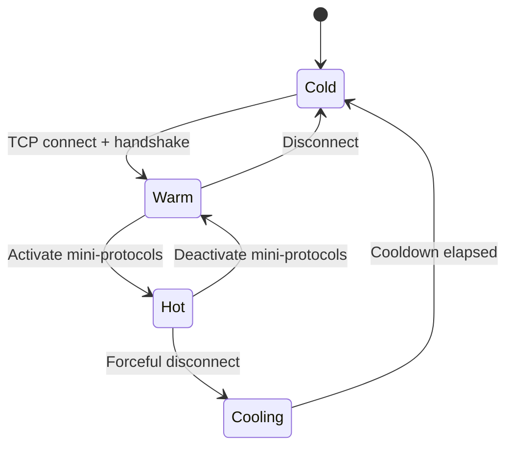

# P2P Governor

This document describes Dugite's peer management architecture, implementing the
Ouroboros P2P peer selection governor.

---

## Architecture

Two modules implement peer management in `dugite-network`:

### PeerManager (`manager.rs`)

The data layer. Tracks every known peer in a `HashMap<SocketAddr, PeerInfo>` keyed by socket
address, with `PeerInfo.state` holding each peer's temperature.

| Feature | Description |
|---|---|
| `PeerState` | `Cold < Cooling < Warm < Hot`, mirroring Haskell's `PeerStatus` — `Cooling` is a lingering-connection state between Hot and Cold (dugite's TCP `TIME_WAIT` analogue), not a fourth independent bucket |
| `PeerSource` | `Topology` (topology-file config), `Dns` (SRV/A/AAAA resolution), `Ledger` (SPO relays from `pool_params`), `PeerSharing` (gossip) |
| Big-ledger-peer / local-root tracking | Tracked as separate `HashSet<SocketAddr>` / group lists passed into the governor, not as a per-peer category enum |
| Fetch bandwidth ("GSV"/"fetchyness") | EWMA bytes/sec per peer from completed BlockFetch ranges, used to rank peers for the single bulk-sync fetch slot (see [Sync Pipeline](./sync-pipeline.md)) |
| Reputation scoring | `0.4×reputation + 0.4×latency_score + 0.2×failure_score`; +0.01 per success, -0.1 per failure |
| Exponential backoff | 5s → 10s → 20s → 40s → 80s → 160s (capped) ± 2s fuzz on connection failure |
| Inbound connection limit | Configurable max inbound connections |
| `DiffusionMode` | InitiatorOnly / InitiatorAndResponder |
| Failure-count time decay | Halves every 5 minutes |

### Governor (`governor.rs`)

The policy layer. Its decision function is called on a 2-second `tokio::interval` in
`dugite-node`; churn timers (below) run on their own, much longer independent cadences checked on
every tick.

| Feature | Description |
|---|---|
| `PeerTargets` | root/known/established/active + BLP variants |
| Sync-state-aware target switching | A separate, smaller `sync_target_*` set applies during Genesis-mode PreSyncing/Syncing |
| Big-ledger-peer promotion priority | BLPs promoted first during sync |
| Active (hot) peer target enforcement | Promotes/demotes to meet active target |
| Established (warm+hot) target enforcement | Maintains established peer count |
| Surplus reduction | Demote/disconnect lowest reputation, local-root protected |
| Three independent churn timers | Hot churn (rotate one hot peer), cold churn (forget lowest-reputation cold peers once the pool exceeds 150% of `max_cold`), warm churn (quality-based rotation) |
| Default targets | active=20, established=30, known=150 (matching cardano-node) |

---

## Wiring

The governor runs inline in the main `select!` loop in `node/mod.rs` — not as a separate spawned
task. Every 2 seconds (`governor_ticker`) it:

1. Acquires a read lock on `Arc<RwLock<PeerManager>>`, snapshots local-root groups, the
   big-ledger-peer set, and the peer currently holding the BlockFetch fetch slot (so the governor
   never demotes the peer actively downloading blocks), then calls
   `governor.compute_actions_with_blp(...)`, which returns a `Vec<GovernorAction>`. Churn
   decisions are folded into this same call — there is no separate churn step.
2. `GovernorAction::PromoteToWarm(addr)` is dispatched via a background `tokio::spawn` (through
   `lifecycle.spawn_connect(...)`) so a slow TCP connect never blocks the block-processing side of
   the same `select!` loop.
3. All other actions (`PromoteToHot`, `DemoteToWarm`, `DemoteToCold`, `ForgetPeer`,
   `PeerShareRequest`, `DiscoverMore`) are fast, O(1) operations applied inline under a write lock
   on the same tick.

---

## Peer Selection State Machine

Peers progress through a formal state machine (`PeerState`, mirroring Haskell's `PeerStatus`):

`Cooling` sits between `Hot`/`Warm` and `Cold` — a peer whose connection is being torn down but
hasn't fully released yet (the outbound-governor reflection of the connection manager's
`TerminatingState`, dugite's analogue of TCP `TIME_WAIT`). It is not eligible for re-promotion
until it reaches `Cold`.

---

## Target Counts

The governor maintains six independent target counts:

| Target | Default |
|---|---|
| Known peers | 150 |
| Established peers | 30 |
| Active peers | 20 |
| Known big-ledger peers | 15 |
| Established big-ledger peers | 10 |
| Active big-ledger peers | 5 |

When any target is not met, the governor attempts to satisfy the deficit.
When any target is exceeded, surplus peers are demoted by lowest reputation.

---

## Local Root Peer Pinning

Local root peers (from `localRoots` in the topology file) have pinned targets
that override the normal target counts. Local roots are never demoted for
surplus reduction and are never churned.

---

## Churn

The governor performs periodic churn to rotate peers:

- **Deadline churn (normal mode)** — Approximately every 55 minutes, a fraction
  of established and active peers are replaced.
- **Bulk sync churn** — During active block download, churn cycles are more
  aggressive (~15 minutes) to shed peers with poor block-fetch performance.

---

## Big Ledger Peer Preference During Sync

Big ledger peers (SPOs in the top 90% of stake, obtained via
`GetLedgerPeerSnapshot`) serve as trusted anchors during bulk block download.
The governor maintains a separate target bucket for BLPs. When `SyncState` is
`Syncing` or `PreSyncing`, BLP targets take priority.

---

## Thread Safety

The `PeerManager` is wrapped in `Arc<RwLock<PeerManager>>`. Each governor tick acquires a read
lock to snapshot peer state and compute `GovernorAction`s, then a separate write lock only to
apply the fast, inline actions (background connects are dispatched as their own tasks and never
hold the lock), keeping the write-lock window minimal.

---

## Files

| File | Purpose |
|---|---|
| `crates/dugite-network/src/peer/governor.rs` | Policy decisions and target enforcement |
| `crates/dugite-network/src/peer/manager.rs` | Peer state tracking and reputation |
| `crates/dugite-network/src/peer/selection.rs` | Composite scoring formula |
| `crates/dugite-network/src/peer/discovery.rs` | Peer discovery (topology, DNS, ledger, peer-sharing) |
| `crates/dugite-node/src/node/mod.rs` | Governor tick wiring (inline in the main `select!` loop) |
| `crates/dugite-node/src/config.rs` | Topology parsing, target defaults |
