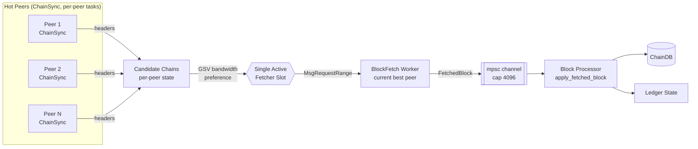

# Sync Pipeline

Dugite pipelines block synchronization, separating header collection (one ChainSync task per hot
peer) from block body fetching (deliberately serialized onto a single "best" peer at a time) for
maximum throughput without wasting bandwidth on duplicate downloads.

## Architecture

## Pipeline Stages

### 1. Header Collection (ChainSync, per hot peer)

Every hot peer runs its own ChainSync client task using the N2N ChainSync mini-protocol (V14+).
Each task pipelines up to `DUGITE_PIPELINE_DEPTH` (default 300) `MsgRequestNext` messages
in flight rather than waiting for each `MsgRollForward` serially, and writes its results into a
per-peer `CandidateChainState` entry shared with the BlockFetch decision loop.

The ChainSync protocol involves:
1. **MsgFindIntersect** — Find a common point between the node and the peer
2. **MsgRequestNext** — Request the next header
3. **MsgRollForward** — Receive a new header
4. **MsgRollBackward** — Handle a chain reorganization

### 2. Block Fetch — single active fetcher, GSV-preferred

Header collection is per-peer and concurrent, but block **body** downloading deliberately is not:
only one BlockFetch worker is allowed to hold the "active fetcher" slot at a time, matching
Haskell's `bfcMaxConcurrencyBulkSync = 1`. This was a validated finding, not an oversight —
concurrent multi-peer body fetching was measured to be slower in practice (duplicate/wasted
downloads and lock contention outweigh the extra bandwidth), so dugite concentrates fetching on
whichever peer is currently serving fastest.

Peer workers contend for the slot via a lock-free `compare_exchange` on a shared atomic, polled
every 10ms (matching Haskell's `bfcDecisionLoopIntervalPraos`). When the slot is free, only the
top `K=2` peers ranked by measured fetch bandwidth (an EWMA of bytes/sec per completed range,
tracked per peer as "GSV" / "fetchyness" in `PeerManager`) are allowed to claim it — a hot standby
so a momentarily-busy best peer can't stall the slot, while fetching still concentrates on the
fastest peers rather than round-robining fairly.

The BlockFetch protocol involves:
1. **MsgRequestRange** — Request a range of blocks by header hash
2. **MsgBlock** — Receive a block
3. **MsgBatchDone** — Signal the end of a batch

Each range's size is chosen adaptively against an 8 MiB byte budget (`BLOCKFETCH_RANGE_BYTE_BUDGET`)
using a running average of recently-seen block sizes, clamped to `[64, MAX_BLOCKS_PER_FETCH]`
blocks (`MAX_BLOCKS_PER_FETCH = 2000`, the network's per-batch DoS cap; operator-overridable up to
that ceiling via `DUGITE_BLOCKFETCH_MAX_RANGE`). This auto-grows toward the cap for tiny Byron
blocks and shrinks for large Conway blocks, so the worker's per-range decode buffer stays bounded
in every era. Up to 2 `MsgRequestRange` requests are pipelined in flight at once
(`BLOCKFETCH_PIPELINE_WINDOW`) so the next range's network round-trip overlaps the previous
range's receipt/decode instead of being paid serially.

### 3. Block Processing

Each `FetchedBlock` arrives over an `mpsc` channel (capacity 4096, overridable via
`DUGITE_FETCHED_BLOCKS_CAP`) and is applied to the ledger state as it is dequeued:

1. **Deserialization** — Raw CBOR bytes are decoded into Dugite's internal `Block` type using Dugite's in-house multi-era CBOR decoder. `Transaction.hash` is computed as `blake2b_256` over the *original* wire bytes captured during decode (`KeepRaw::parse_with`), never a re-encoding — a load-bearing invariant, since a re-encode that differs from the wire bytes by even one byte would silently diverge the hash from Haskell's.
2. **Ledger validation** — Each block is validated against the current ledger state (UTxO checks, fee validation, certificate processing)
3. **Storage** — Valid blocks are added to the ChainDB (volatile database first, flushed to immutable when k-deep) — the ChainDB write happens **before** the ledger apply, so a crash mid-apply never leaves the ledger ahead of durable storage
4. **Epoch transitions** — At epoch boundaries, stake snapshots are rotated and rewards are calculated

### Progress Reporting

Progress is logged periodically, showing:
- Current slot and block number
- Epoch number
- UTxO count
- Sync percentage (based on slot vs. wall-clock time)
- Blocks-per-second throughput metric

## Rollback Handling

When the ChainSync peer sends a `MsgRollBackward` message, the node:

1. Identifies the rollback point (a slot/hash pair)
2. Removes rolled-back blocks from the VolatileDB
3. Reverts the ledger state to the rollback point
4. Resumes header collection from the new tip

Only blocks in the VolatileDB (the last k=2160 blocks) can be rolled back. Blocks that have been flushed to the ImmutableDB are permanent.

## Pipelined ChainSync

Dugite uses pipelined ChainSync to avoid the round-trip latency bottleneck of serial header requests. Instead of waiting for each `MsgRollForward` before requesting the next header, the node sends up to 300 `MsgRequestNext` messages concurrently (configurable via `DUGITE_PIPELINE_DEPTH`).

This bypasses a serial ChainSync state machine in favor of a custom implementation that manages the pipeline depth directly.

## Performance Characteristics

- **Header collection** is pipelined per peer (up to 300 in-flight requests, configurable via `DUGITE_PIPELINE_DEPTH`) and runs concurrently across every hot peer
- **Block body fetching** is deliberately single-peer at any instant (GSV-preferred, top-`K=2` hot standby) — measured faster in practice than concurrent multi-peer body fetching, which wasted bandwidth on duplicate/contended downloads
- **Block processing** applies blocks one at a time as they are dequeued from the fetch channel, in slot order
- **Throughput** depends on network latency, the current fetch peer's bandwidth, and block sizes — the sustained ceiling is set by whichever is slower: peer download bandwidth or ledger-apply throughput

On preview testnet, full sync from genesis completes in approximately 10 hours, with block replay (from Mithril snapshot) achieving ~13,700 blocks/second.
