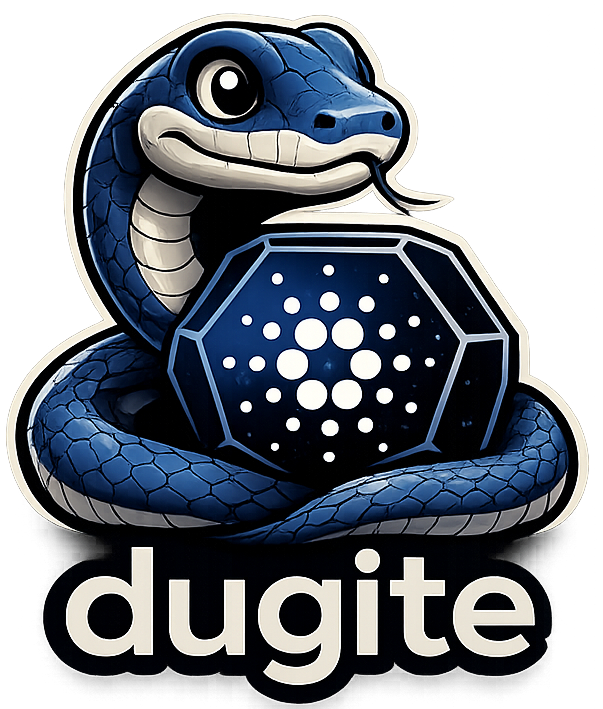

# Introduction

  

**Dugite** is a Cardano node implementation written in Rust, aiming for 100% compatibility with [cardano-node](https://github.com/IntersectMBO/cardano-node) (Haskell).

Built by [Sandstone Pool](https://www.sandstone.io/).

## Why Dugite?

The Cardano ecosystem benefits from client diversity. Running multiple independent node implementations strengthens the network by:

- **Resilience** — A bug in one implementation does not bring down the entire network.
- **Performance** — Rust's zero-cost abstractions and memory safety without garbage collection enable high-throughput block processing.
- **Verification** — An independent implementation validates the Cardano specification against the reference Haskell node, catching ambiguities and edge cases.
- **Accessibility** — A Rust codebase broadens the pool of developers who can contribute to Cardano infrastructure.

## Key Features

- **Full Ouroboros Praos consensus** — Slot leader checks, VRF validation, KES period tracking, epoch nonce computation.
- **Multi-era support** — Byron, Shelley, Allegra, Mary, Alonzo, Babbage, Conway, and Dijkstra eras.
- **Conway governance (CIP-1694)** — DRep registration, voting, proposals, constitutional committee, treasury withdrawals.
- **Pipelined sync** — ChainSync headers are pipelined per peer (default depth 300, tunable via `DUGITE_PIPELINE_DEPTH`), decoupled from block fetching. Bulk block fetch uses a single active fetch slot contested by the fastest peers, mirroring cardano-node's `maxConcurrencyBulkSync = 1`.
- **Plutus script execution** — Plutus V1/V2/V3 (and V4 from Dijkstra) evaluation via the in-house `dugite-uplc` CEK machine (fully conformant, all 999 upstream test vectors pass).
- **Node-to-Node (N2N) protocol** — Full Ouroboros mini-protocol suite: ChainSync, BlockFetch, TxSubmission2, KeepAlive, PeerSharing.
- **Node-to-Client (N2C) protocol** — Unix domain socket server with LocalChainSync, LocalStateQuery, LocalTxSubmission, and LocalTxMonitor.
- **UTxO RPC (gRPC) server** — Optional native `utxorpc` server (sync, query, submit, watch) with reflection and gRPC-Web support. See [UTxO RPC](./running/utxo-rpc.md).
- **cardano-cli compatible CLI** — Key generation, transaction building, signing, submission, queries, and governance commands.
- **Prometheus metrics** — Real-time node metrics on port 12796 by default (deliberately offset from cardano-node's 12798 so both can run on one host).
- **P2P networking** — Peer manager with cold/warm/hot lifecycle, DNS multi-resolution (A/AAAA/SRV), ledger-based peer discovery, and inbound rate limiting.
- **ChainSync Jumping (CSJ)** — Phase A Ouroboros Genesis support: dynamic intersection discovery across multiple peers for faster tip-of-chain recovery.
- **Mithril snapshot import** — Fast initial sync by importing a Mithril-certified snapshot.
- **SIGHUP topology reload** — Update peer configuration without restarting the node.

## Project Status

> **Dugite is in early development and is NOT recommended for production use.**
> APIs, storage formats, and on-chain behavior may change without notice. Ledger
> validation is incomplete and may accept invalid transactions or reject valid
> ones. **Do not use this software to operate a stake pool, manage real funds, or
> participate in mainnet governance.** Use at your own risk on testnets only.

Dugite is under active development. It can sync against both the Cardano mainnet and preview/preprod testnets. The node implements the full N2N and N2C protocol stacks, ledger validation, epoch transitions with stake snapshots and reward distribution, and Conway-era governance.

For a detailed checklist of implemented and pending features, see the [Developer Wiki](https://github.com/michaeljfazio/dugite/wiki).

## License

Dugite is released under the [Apache-2.0 License](https://github.com/michaeljfazio/dugite/blob/main/LICENSE).
