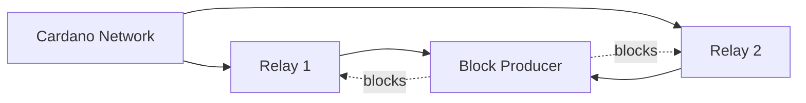

# Kubernetes Deployment

Dugite ships a Helm chart at `charts/dugite-node/` for deploying to Kubernetes as either a **relay node** or a **block producer**. Container images are published on every tagged release as multi-arch (`linux/amd64`, `linux/arm64`) images at `ghcr.io/michaeljfazio/dugite`.

## Prerequisites

- Kubernetes 1.27+
- Helm 3.12+ (chart was tested against Helm 4.x)
- A `StorageClass` that supports `ReadWriteOnce` persistent volumes
- (Optional) [Prometheus Operator](https://github.com/prometheus-operator/prometheus-operator) for `ServiceMonitor` scraping

## Quick Start

Deploy a relay node on the preview testnet:

```bash
helm install dugite-relay ./charts/dugite-node \
  --set network.name=preview
```

This will:
1. Run a Mithril snapshot import (init container) with the Haskell ancillary state — bootstrap time drops from a multi-hour replay to ~15 minutes.
2. Start the node syncing with the preview testnet.
3. Create a 100 GiB persistent volume for the chain database.
4. Expose Prometheus metrics on port 12796.

## Chart Reference

### Node role

The chart supports two deployment modes:

```yaml
# Relay node (default)
role: relay

# Block producer
role: producer
```

### Network selection

```yaml
network:
  name: preview              # mainnet, preview, or preprod
  port: 3001                 # N2N port
  hostAddr: "0.0.0.0"
  diffusionMode: InitiatorAndResponder  # use InitiatorOnly for BPs behind NAT
  peerSharing: null          # null = auto (on for relay, off for BP); set true/false to override
```

`network.magic` is derived automatically from `network.name`. Override only for private networks.

### Persistence

```yaml
persistence:
  enabled: true
  storageClass: ""           # blank = cluster default; "-" = no storageClassName
  size: 100Gi                # preview ~16 GiB, preprod ~50 GiB, mainnet 150+ GiB
  accessMode: ReadWriteOnce
  existingClaim: ""          # use an existing PVC
```

For mainnet, 200 GiB is a safe minimum once Conway-era state and the LSM UTxO backend are accounted for.

### Resources

```yaml
resources:
  requests:
    cpu: "1"
    memory: 3Gi
  limits:
    cpu: "4"
    memory: 16Gi
```

Soak-test RSS on preview is ~2.6 GiB; mainnet steady state is 8–10 GiB. Raise `requests.memory` to 4–6 GiB and `limits.memory` to 24–32 GiB for mainnet bulk sync.

### Mithril import

```yaml
mithril:
  enabled: true              # run Mithril import on first start (idempotent)
  includeAncillary: true     # download Haskell ledger state — drops bootstrap to ~15 min
```

Set `mithril.includeAncillary: false` to fall back to chunk-by-chunk replay. Trust model is documented in [Mithril Ancillary](./mithril-ancillary.md).

### Storage profile

```yaml
storageProfile: high-memory  # ultra-memory | high-memory (default) | low-memory | minimal
```

Match this to `resources.limits.memory`: `high-memory` ≈ 16 GiB, `low-memory` ≈ 8 GiB, `minimal` ≈ 4 GiB.

### Metrics and monitoring

```yaml
metrics:
  enabled: true
  port: 12796                # 12796 keeps dugite from colliding with cardano-node (12798)
  compat: false              # emit cardano_node_metrics_* aliases for legacy dashboards
  require: false             # treat metrics bind failure as fatal startup error
  serviceMonitor:
    enabled: false           # set true if running Prometheus Operator
    interval: 30s
    labels: {}
```

When `serviceMonitor.enabled` is true the chart creates a `ServiceMonitor` resource for automatic Prometheus scraping. Enable `compat: true` to keep existing cardano-node Grafana dashboards working unmodified.

Available metrics include `sync_progress_percent`, `blocks_applied_total`, `utxo_count`, `epoch_number`, `peers_connected`, and more. See [Monitoring](./monitoring.md) for the full list.

### UTxO RPC (gRPC) server — #672

```yaml
rpc:
  enabled: false             # set true to enable the v1beta UTxO RPC API
  port: 50051
  host: "127.0.0.1"          # set to 0.0.0.0 to expose via Service
  service: false             # expose RPC on the cluster Service (requires host: 0.0.0.0)
```

When `rpc.enabled` is true the deployment adds an `rpc` container port and the node starts the gRPC server. Setting `rpc.service: true` adds an `rpc` port to the Service and a NetworkPolicy rule (for the producer NetworkPolicy) allowing cross-pod gRPC access.

### Consensus mode (genesis sync) — #535

```yaml
consensusMode: ""            # "" = praos (default); set "genesis" to opt in to Genesis sync
```

Currently the JSON config field `ConsensusMode` is not wired through to the runtime gate, so the chart passes the value via `--consensus-mode` on the CLI when set.

### Logging

```yaml
logging:
  minSeverity: Info          # Debug | Info | Notice | Warning | Error | Critical
  rustLog: "info"            # tracing_subscriber EnvFilter directive
  format: text               # text (human-readable) or json (structured for log shippers)
  noColor: true              # disable ANSI colors in container stdout
```

### Liveness threshold

```yaml
livenessThresholdSecs: 600   # /live returns 503 if no block applied in this window
```

This is passed via `--liveness-threshold-secs`. Set to 0 to make `/live` always return 200 (probes still pass even if the node has stalled).

### Topology

```yaml
topology:
  bootstrapPeers:
    - address: preview-node.play.dev.cardano.org
      port: 3001
  localRoots: []
  publicRoots:
    - accessPoints:
        - address: preview-node.play.dev.cardano.org
          port: 3001
      advertise: false
  useLedgerAfterSlot: 102729600   # mainnet=0, preview=102729600, preprod=76723200
```

## Relay Node Deployment

A relay node connects to the Cardano network, syncs blocks, and serves them to connected peers and local clients.

### Minimal relay

```bash
helm install dugite-relay ./charts/dugite-node \
  --set network.name=mainnet \
  --set persistence.size=200Gi
```

### Relay with custom topology

```bash
helm install dugite-relay ./charts/dugite-node \
  --set network.name=mainnet \
  --set persistence.size=200Gi \
  -f relay-values.yaml
```

`relay-values.yaml`:

```yaml
topology:
  bootstrapPeers:
    - address: backbone.cardano.iog.io
      port: 3001
    - address: backbone.mainnet.cardanofoundation.org
      port: 3001
    - address: backbone.mainnet.emurgornd.com
      port: 3001
  localRoots:
    - accessPoints:
        - address: dugite-producer-dugite-node.default.svc.cluster.local
          port: 3001
      advertise: false
      trustable: true
      valency: 1
  publicRoots:
    - accessPoints:
        - address: backbone.cardano.iog.io
          port: 3001
        - address: backbone.mainnet.cardanofoundation.org
          port: 3001
      advertise: false
  useLedgerAfterSlot: 0
```

### Relay with Prometheus Operator

```bash
helm install dugite-relay ./charts/dugite-node \
  --set network.name=mainnet \
  --set metrics.serviceMonitor.enabled=true \
  --set metrics.serviceMonitor.labels.release=prometheus
```

Enable `metrics.compat=true` if your dashboards still reference `cardano_node_metrics_*` series.

## Block Producer Deployment

A block producer creates blocks when elected as slot leader. It requires KES, VRF, and operational certificate keys.

### Create keys Secret

```bash
kubectl create secret generic dugite-producer-keys \
  --from-file=kes.skey=kes.skey \
  --from-file=vrf.skey=vrf.skey \
  --from-file=node.cert=node.cert
```

### Deploy the producer

```bash
helm install dugite-producer ./charts/dugite-node \
  --set role=producer \
  --set network.name=mainnet \
  --set producer.existingSecret=dugite-producer-keys \
  --set persistence.size=200Gi \
  --set network.diffusionMode=InitiatorOnly \
  --set network.peerSharing=false
```

`InitiatorOnly` is the canonical block-producer diffusion mode — the BP only opens outbound connections to its relays.

### Producer security

When `role=producer`, the chart automatically creates a `NetworkPolicy` that:

- Restricts N2N ingress to pods labeled `app.kubernetes.io/component: relay`.
- Allows metrics scraping (and, when `rpc.service=true`, RPC) from anywhere in the cluster.
- Leaves egress unrestricted so the BP can reach its relay(s).

Block producers should **never** be exposed directly to the internet.

### Producer + Relay architecture

A typical production deployment uses one or more relay nodes that shield the block producer:



Deploy both:

```bash
# Block producer
helm install dugite-producer ./charts/dugite-node \
  --set role=producer \
  --set network.name=mainnet \
  --set producer.existingSecret=dugite-producer-keys \
  -f producer-values.yaml

# Relay(s) pointing at the producer
helm install dugite-relay ./charts/dugite-node \
  --set role=relay \
  --set network.name=mainnet \
  -f relay-values.yaml
```

`producer-values.yaml`:

```yaml
network:
  diffusionMode: InitiatorOnly
  peerSharing: false

topology:
  bootstrapPeers: []
  localRoots:
    - accessPoints:
        - address: dugite-relay-dugite-node.default.svc.cluster.local
          port: 3001
      advertise: false
      trustable: true
      valency: 1
  publicRoots: []
  useLedgerAfterSlot: -1
```

## Verifying the Deployment

Pod status:

```bash
kubectl get pods -l app.kubernetes.io/name=dugite-node
```

Logs:

```bash
kubectl logs -f deploy/dugite-relay-dugite-node
```

Query the node tip via N2C (the IPC socket is shared with the pod):

```bash
kubectl exec deploy/dugite-relay-dugite-node -- \
  dugite-cli query tip \
  --testnet-magic 2 \
  --socket-path /ipc/node.sock
```

For mainnet, replace `--testnet-magic 2` with `--mainnet`.

Metrics:

```bash
kubectl port-forward svc/dugite-relay-dugite-node 12796:12796
curl -s http://localhost:12796/metrics | grep sync_progress
```

UTxO RPC (if `rpc.enabled=true`):

```bash
kubectl port-forward svc/dugite-relay-dugite-node 50051:50051
grpcurl -plaintext localhost:50051 list
```

## Configuration Reference

| Parameter | Default | Description |
|-----------|---------|-------------|
| `role` | `relay` | Node role: `relay` or `producer` |
| `image.repository` | `ghcr.io/michaeljfazio/dugite` | Container image |
| `image.tag` | Chart appVersion | Image tag |
| `network.name` | `preview` | Network: `mainnet`, `preview`, `preprod` |
| `network.port` | `3001` | N2N port |
| `network.diffusionMode` | `InitiatorAndResponder` | `InitiatorOnly` for BPs behind NAT |
| `network.peerSharing` | `null` | `true`/`false` to override the relay/BP default |
| `mithril.enabled` | `true` | Run Mithril import on first start |
| `mithril.includeAncillary` | `true` | Download Haskell ledger state (~15 min bootstrap) |
| `ledger.replayLimit` | `null` | Max blocks to replay (`null` = unlimited) |
| `ledger.pipelineDepth` | `150` | ChainSync pipeline depth |
| `storageProfile` | `high-memory` | `ultra-memory` / `high-memory` / `low-memory` / `minimal` |
| `consensusMode` | `""` | Set `"genesis"` to opt in to Genesis sync (#535) |
| `livenessThresholdSecs` | `600` | `/live` returns 503 after this idle window |
| `experimentalHardForksEnabled` | `false` | Signal PV 11 0 in forged headers |
| `persistence.enabled` | `true` | Enable persistent storage |
| `persistence.size` | `100Gi` | Volume size |
| `metrics.enabled` | `true` | Enable Prometheus metrics |
| `metrics.port` | `12796` | Metrics port (avoids cardano-node's 12798) |
| `metrics.compat` | `false` | Emit `cardano_node_metrics_*` aliases |
| `metrics.serviceMonitor.enabled` | `false` | Create a `ServiceMonitor` |
| `rpc.enabled` | `false` | Enable UTxO RPC (gRPC) server |
| `rpc.port` | `50051` | RPC port |
| `rpc.service` | `false` | Expose RPC on the cluster Service |
| `logging.format` | `text` | `text` or `json` |
| `producer.existingSecret` | `""` | Secret with `kes.skey` / `vrf.skey` / `node.cert` |
| `resources.requests.cpu` | `1` | CPU request |
| `resources.requests.memory` | `3Gi` | Memory request |
| `resources.limits.memory` | `16Gi` | Memory limit |
