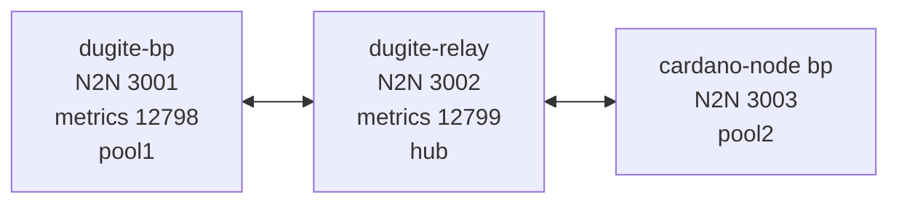

# Local Testnet

A 3-node loopback testnet for verifying dugite block production and diffusion
against the Haskell reference implementation. One dugite block producer, one
dugite relay, and one cardano-node block producer, all on the same machine,
all on the loopback interface — both BPs connect to the network only through
the dugite relay.

## What this is



The dugite relay is the only path between the two BPs. A block forged by
dugite-bp must transit dugite-relay's BlockFetch server before cardano-bp
can fetch it (and vice versa). This is what the soak test exercises.

The chain boots into Conway PV10 from a fresh genesis with two equally-staked
pools, 1-second slots, `activeSlotsCoeff = 0.2`, `epochLength = 500`, and
`securityParam = 10`. Blocks are minted every ~5 seconds on average, and the
30-minute soak crosses 3–4 epoch boundaries.

## Prerequisites

- `cardano-node` >= 11.0.1 and `cardano-cli` >= 11.0.0 on `$PATH`
- `target/release/dugite-node` built (`cargo build --release` from the repo root)
- `jq` for JSON manipulation
- ~2 GB of free disk for the soak
- **macOS:** the system-builtin `caffeinate` (used to suppress App Nap during the soak). This dependency is macOS-only; on Linux the soak runs unwrapped.

The setup script's prereq check will refuse to run if any of these are missing.

## One-time setup

```bash
./testnet/local-devnet/setup.sh
```

This generates a fresh genesis (4 files: byron, shelley, alonzo, conway),
key sets for two stake pools, four stake delegators, three genesis keys, and
one UTxO funding key. All output lands under `testnet/local-devnet/genesis/`,
`testnet/local-devnet/keys/`, and `testnet/local-devnet/config/` (rendered
configs). Generated keys and genesis files are gitignored.

Expected output ends with:

```
[INFO]  All configs + topologies rendered to testnet/local-devnet/config/
[INFO]  Setup complete. Next: ./run.sh
```

The genesis start time is set to "now + 30 seconds." Re-run `setup.sh` if more
than ~5 minutes pass before you call `run.sh` (the start-time freshness check
will refuse to start a stale chain).

## Running the network

```bash
./testnet/local-devnet/run.sh
```

This starts the three nodes in the background (caffeinate-wrapped on macOS),
records PIDs to `state/<node>.pid`, sends logs to `logs/<node>.log`, and
exposes N2C sockets at:

- `testnet/local-devnet/state/dugite-relay.sock`
- `testnet/local-devnet/state/dugite-bp.sock`
- `testnet/local-devnet/state/cardano-bp.sock`

You can query each socket with `cardano-cli` (or `dugite-cli`, which speaks
the same N2C protocol):

```bash
cardano-cli query tip \
  --testnet-magic 42 \
  --socket-path testnet/local-devnet/state/dugite-bp.sock
```

To stop the network:

```bash
./testnet/local-devnet/stop.sh
```

This sends SIGTERM, waits 5 seconds, then SIGKILL if needed. DBs and logs
are preserved in `state/` and `logs/`.

## Running the soak test

```bash
./testnet/local-devnet/soak.sh         # default: 1800s (30 minutes)
./testnet/local-devnet/soak.sh 300     # 5-minute smoke test
```

The soak runs three concurrent samplers while it's alive:

- **tip-sampler** — every 5 seconds, queries `tip` on each socket and appends
  `(ts, node, slot, block_no, hash, era)` rows to `tip-samples.csv`.
- **block-recorder** — tails the three node logs and writes one row per first-
  sight of each block, with observer, forge/recv flag, slot, hash, and (for
  forge events) the issuer's vkey.
- **tx-injector** — at T+2 min, T+10 min, and T+20 min, submits 5 self-transfer
  payment transactions to each of the 3 sockets (15 per wave, 45 total) and
  records each submission's txid and return code.

Evidence lands in `testnet/local-devnet/evidence/<timestamp>/`. A heartbeat
line is printed every 30 seconds with current tips from all three nodes.

## Verifying results

After the soak finishes, `soak.sh` does not automatically run verify — run it
manually:

```bash
./testnet/local-devnet/verify.sh testnet/local-devnet/evidence/<timestamp>/
```

The verifier evaluates four pass/fail predicates and writes
`evidence/<timestamp>/report.md`. Predicates:

| # | Predicate | Pass condition |
|---|-----------|----------------|
| 1 | **Block forge cross-check** | Every confirmed (slot, hash) pair is seen by all three observers in `blocks.csv`. (Most-recent 10 blocks are excluded from the check to allow rollback grace.) |
| 2 | **Per-BP forge attribution** | Both pools forged >= 3 blocks each. Expected ~180 each at f=0.2, sigma=0.5 — failure at 3 is a real wiring bug, not a slot-lottery flake. |
| 3 | **Transaction inclusion round-trip** | Every submitted tx has `submit_rc=0` and (when run with the devnet up) appears in all three nodes' UTxO sets at the genesis payment address. |
| 4 | **Tip parity over time** | At >=95% of 5-second ticks (excluding the first 60s warmup), all three nodes report tips within 2 blocks of each other. |

The `report.md` includes a metadata snapshot (versions, genesis hashes, magic),
counts (block events, tx submissions, tip samples), a forge-attribution
breakdown, and a per-predicate result table.

You can also self-test the verifier (without a real soak) using committed
test fixtures:

```bash
./testnet/local-devnet/verify.sh --self-test
```

## Topology & port reference

| Process | N2N | Metrics | Socket | Config | Topology |
|---------|-----|---------|--------|--------|----------|
| `dugite-bp` (pool1) | 3001 | 12798 | `dugite-bp.sock` | `dugite-bp.config.json` | `dugite-bp.topology.json` |
| `dugite-relay` (hub) | 3002 | 12799 | `dugite-relay.sock` | `dugite-relay.config.json` | `dugite-relay.topology.json` |
| `cardano-node bp` (pool2) | 3003 | — | `cardano-bp.sock` | `cardano-bp.config.json` | `cardano-bp.topology.json` |

The devnet uses the standard Cardano N2N port (3001) for `dugite-bp` and
single-digit increments for the relay (3002) and the Haskell BP (3003). The
metrics ports follow the same convention: `dugite-bp` keeps the well-known
Prometheus default (12798), the relay exposes 12799. If a public-network
soak is running on the same host it must be stopped before the devnet boots,
since both processes would otherwise bind 3001/12798.

### Monitoring with `dugite-monitor`

Because `dugite-bp` runs on the default metrics port (12798), the bundled
TUI monitor connects with no overrides. In a separate terminal once the
devnet is up:

```bash
./target/release/dugite-monitor
```

To inspect the relay instead of the BP, point the monitor at its metrics
port:

```bash
./target/release/dugite-monitor --metrics-url http://localhost:12799/metrics
```

The `cardano-node` BP does not expose a Prometheus endpoint in this devnet
(its EKG/Prometheus exporters are disabled to keep the configuration minimal
and avoid port collisions).

## Configuration reference

The genesis is generated by `cardano-cli conway genesis create-testnet-data`
with two override fragments committed under `config/spec/`. Only fields that
differ from cardano-cli's defaults are listed below.

`config/spec/shelley-spec.json`:

| field | value | purpose |
|-------|-------|---------|
| `slotLength` | `1.0` | 1-second slot duration |
| `activeSlotsCoeff` | `0.2` | f = 0.2; ~5s expected block time |
| `epochLength` | `500` | ~8.3 minutes per epoch -> 3–4 epoch transitions in the 30-min soak |
| `securityParam` | `10` | small k -> fast immutability (3k/f ~= 150 slots) |
| `updateQuorum` | `2` | matches the 3 genesis keys (2-of-3) |
| `maxLovelaceSupply` | `60_000_000_000_000_000` | 60 B ADA, mainnet-shaped |
| `networkMagic` | `42` | local devnet magic |

`config/spec/conway-spec.json` carries Conway governance parameters; for a
30-min run with no proposals only the protocol version matters. PV is set
to 10.0 so the chain boots straight into Conway.

## Troubleshooting

- **`ERROR: cardano-cli x.y.z < 11.0.0 required`** — install a newer cardano-cli; see prerequisites.
- **`ERROR: Port 3001 is in use`** — another devnet (or the public soak rig) is using a port. Run `./stop.sh` or `lsof -iTCP:3001`.
- **`Genesis is N seconds old (>300s). Re-run ./setup.sh`** — the start time has drifted; re-run setup.
- **Tips not advancing after `run.sh`** — check `logs/<node>.log` for the failing node. Most common cause is a KES key path mismatch (re-run `setup.sh`).
- **Soak hangs on macOS** — confirm `caffeinate` is wrapping the dugite processes via `ps auxw | grep caffeinate`. App Nap can freeze dugite for tens of minutes without it.
- **`dugite-monitor` shows no data** — confirm the BP is exposing metrics on 12798 with `curl -s localhost:12798/metrics | head`. If empty, the BP either failed to start or its config doesn't have the Prometheus exporter enabled (the devnet template enables it by default).

## What this validates

- Dugite block production end-to-end (forge -> adopt -> diffuse)
- Dugite relay's bidirectional ChainSync/BlockFetch (Haskell <-> Rust <-> Haskell)
- Dugite N2N peer connection lifecycle on loopback
- Dugite N2C local-socket tx submission, query tip, query utxo
- Cross-implementation chain agreement under healthy conditions

## What this does NOT validate

- Byron-era code paths (chain boots in Conway)
- Hard-fork combinator era transitions (none occur during the soak)
- Multi-relay diffusion topologies (single hub)
- Plutus phase-2 / governance enactment (no proposals or scripts)
- Mainnet-scale peer counts, NAT/firewall behaviour, or BGP-level routing
- Mithril snapshot import (covered by other tests)

### Known dugite-node bugs surfaced by this testnet

Bringing up the devnet for the first time exposed four real defects in
`dugite-node`. Three were fixed on this branch as part of bringing the test
infrastructure online; the fourth is tracked separately and remains the
blocker for full predicate parity.

- **Bug A** (FIXED in this branch as `7e6a4af54`): ChainSync intersection at
  Origin with a non-Origin local tip used to leave the node permanently stuck
  on its own fork — the node sat at the local tip and never re-intersected
  once the peer caught up. The fix disconnects after a backoff so the next
  reconnection can intersect at a real shared point. This was the root cause
  behind the "node appears to hang" reports.
- **Bug B** (FIXED in this branch as `59a5fc64d`): the live BlockFetch apply
  path did not push `LedgerDelta`s onto the `LedgerSeq`, so a fork-switch
  rollback would fail to find the rollback ledger state on shallow chains
  and silently keep the wrong tip. The fix pushes deltas in all apply paths
  (live, replay, and triggered-fork) so rollback is always possible up to k.
- **Bug C** (FIXED in this branch as `9d30beaf2`): the forge loop fired as
  soon as the node finished booting, even before any peer connection or
  ChainSync intersection had completed. On a fresh devnet, dugite-bp would
  self-forge an orphan block at chain start, then refuse to abandon it. The
  fix gates the forge loop on `peer_hot_count > 0` AND at least one
  successful ChainSync intersection.
- **Bug D** (NOT YET FIXED — tracked in
  [#497](https://github.com/michaeljfazio/dugite/issues/497)): after initial
  sync, dugite-bp's chain selection does not switch to a peer's longer
  competing chain when two BPs forge concurrently. The peer chain's blocks
  are received and stored in VolatileDB, but the local chain selector never
  adopts them — `dugite_blocks_applied_total` stays stuck at the initial-sync
  count while `dugite_blocks_forged_total` continues to grow on the local
  fork. Predicates 1 (forge cross-check) and 3 (tx round-trip) will FAIL
  for `dugite-bp` until this is resolved. The relay is unaffected (it
  doesn't forge) and adopts the canonical chain cleanly.

---

Tracking: see the GitHub issue linked from
[`docs/superpowers/specs/2026-05-16-local-testnet-design.md`](https://github.com/michaeljfazio/dugite/blob/main/docs/superpowers/specs/2026-05-16-local-testnet-design.md).
