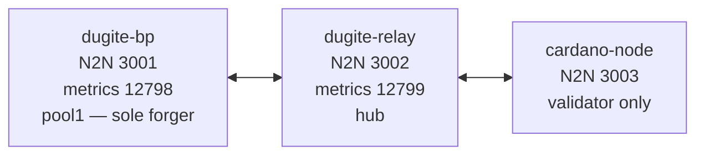

# Local Testnet

A 3-node loopback testnet for verifying dugite block production and diffusion
against the Haskell reference implementation. One dugite block producer, one
dugite relay, and one cardano-node validator (relay role), all on the same
machine, all on the loopback interface — the cardano-node connects through
the dugite relay.

## What this is



dugite-bp is the **sole block producer**. cardano-node runs as a passive
validator (no forging keys passed) and chainsync+blockfetches every block
forged by dugite-bp, applying each one through the Haskell ledger. This
gives us byte-exact cross-validation of dugite's forged blocks against the
reference implementation with **zero risk of asymmetric forks** (no two
forgers competing for the same height).

The chain boots into Conway PV10 from a fresh genesis with a single
forging pool (pool1, 100% of active stake; pool2's keys exist but its
stake is 0), 1-second slots, `activeSlotsCoeff = 0.5`, `epochLength = 400`,
and `securityParam = 40`. Blocks are minted every ~2 seconds on average
and an epoch elapses every ~6.7 minutes, so the 30-minute soak crosses
~4 epoch boundaries (enough for reward distribution to complete before
the soak ends).

> **Historical note:** prior to 2026-05-18, cardano-node also ran as a
> forger (pool2, equal stake) for symmetric multi-forger cross-validation.
> That topology produced an asymmetric-fork class that no per-tx test
> could survive: the slower side's leader-slot timer fired before
> propagation completed and each pool ended up on its own short chain
> permanently (first-seen tiebreaker, equal lengths). Making
> cardano-node a validator eliminates that class entirely while
> preserving the cross-validation we actually rely on (does cardano-node
> accept every dugite block byte-for-byte?).

## Prerequisites

- `cardano-node` >= 11.0.1 and `cardano-cli` >= 11.0.0 on `$PATH`
- `target/release/dugite-node` built (`cargo build --release` from the repo root)
- `jq` for JSON manipulation
- ~2 GB of free disk for the soak
- **macOS:** the system-builtin `caffeinate` (used to suppress App Nap during the soak). This dependency is macOS-only; on Linux the soak runs unwrapped.

The setup script's prereq check will refuse to run if any of these are missing.

## Justfile recipes

The scripts below are the underlying entry points. For everyday use the
`justfile` wraps them — both shapes are equivalent:

| Recipe | Wraps |
|--------|-------|
| `just devnet-setup` | `setup.sh` |
| `just devnet-run` | `run.sh` |
| `just devnet-soak` | `soak.sh` (30 min) |
| `just devnet-verify` | `verify.sh` against the most recent evidence round |
| `just devnet-stop` | `stop.sh` |
| `just devnet-report [TAG]` | single-round release report from the latest evidence |
| `just devnet-validate-smoke` | one boot, ~5 min: setup + run + tx-zoo (`01`, `02`, `08`) + log-level predicate + report. PR gate for core crates. |
| `just devnet-validate-extended` | ~75 min, 3 rounds: used for release tagging |

`devnet-verify` and `devnet-report` locate the newest directory containing a
`metadata.json` under `evidence/` or `evidence-archive/auto/` — that file is
what distinguishes a real soak round from the evidence directories that
`09-cli-parity` and `protocols/` also create.

Both `devnet-validate-*` recipes install an `EXIT` trap that runs `stop.sh`,
so an aborted run does not leave orphaned nodes holding ports 3001-3003.

## One-time setup

```bash
./testnet/local-devnet/setup.sh
```

This generates a fresh genesis (4 files: byron, shelley, alonzo, conway),
key sets for two stake pools, four stake delegators, three genesis keys, and
one UTxO funding key. All output lands under `testnet/local-devnet/genesis/`,
`testnet/local-devnet/keys/`, and `testnet/local-devnet/config/` (rendered
configs). Generated keys and genesis files are gitignored.

Expected output ends with:

```
[INFO]  All configs + topologies rendered to testnet/local-devnet/config/
[INFO]  Setup complete. Next: ./run.sh
```

The genesis start time is set to "now + 30 seconds." Re-run `setup.sh` if more
than ~5 minutes pass before you call `run.sh` (the start-time freshness check
will refuse to start a stale chain).

## Running the network

```bash
./testnet/local-devnet/run.sh
```

This starts the three nodes in the background (caffeinate-wrapped on macOS),
records PIDs to `state/<node>.pid`, sends logs to `logs/<node>.log`, and
exposes N2C sockets under `/tmp/ld-$(id -u)/`:

| Node | Socket |
|------|--------|
| `dugite-relay` | `/tmp/ld-<uid>/relay.sock` |
| `dugite-bp` | `/tmp/ld-<uid>/dbp.sock` |
| `cardano-bp` | `/tmp/ld-<uid>/cbp.sock` |

> Sockets live under `/tmp/ld-<uid>/` rather than inside the repo because
> macOS caps `sun_path` at 104 bytes, and both a worktree path and the
> default macOS `$TMPDIR` (`/var/folders/...`) blow past that.

You can query each socket with `cardano-cli` (or `dugite-cli`, which speaks
the same N2C protocol):

```bash
cardano-cli query tip \
  --testnet-magic 42 \
  --socket-path "/tmp/ld-$(id -u)/dbp.sock"
```

To stop the network:

```bash
./testnet/local-devnet/stop.sh
```

This sends SIGTERM, waits 5 seconds, then SIGKILL if needed. DBs and logs
are preserved in `state/` and `logs/`.

## Running the soak test

```bash
./testnet/local-devnet/soak.sh         # default: 1800s (30 minutes)
./testnet/local-devnet/soak.sh 300     # 5-minute smoke test
```

The soak runs three concurrent samplers while it's alive:

- **tip-sampler** — every 5 seconds, queries `tip` on each socket and appends
  `(ts, node, slot, block_no, hash, era)` rows to `tip-samples.csv`.
- **block-recorder** — tails the three node logs and writes one row per first-
  sight of each block, with observer, forge/recv flag, slot, hash, and (for
  forge events) the issuer's vkey.
- **tx-injector** — at T+2 min, T+10 min, and T+20 min, submits 5 self-transfer
  payment transactions to each of the 3 sockets (15 per wave, 45 total) and
  records each submission's txid and return code.

Evidence lands in `testnet/local-devnet/evidence/<timestamp>/`. A heartbeat
line is printed every 30 seconds with current tips from all three nodes.

## Verifying results

After the soak finishes, `soak.sh` does not automatically run verify — run it
manually:

```bash
./testnet/local-devnet/verify.sh testnet/local-devnet/evidence/<timestamp>/
```

The verifier evaluates five pass/fail predicates and writes
`evidence/<timestamp>/report.md`. Predicates:

| # | Predicate | Pass condition |
|---|-----------|----------------|
| 1 | **Block forge cross-check** | Every canonical (slot, hash) pair is seen by all three observers in `blocks.csv`. Orphans are excluded. |
| 2 | **Per-BP forge attribution** | dugite-bp forged >= 3 blocks; pool2 forged 0 (cardano-node is a validator). Expected ~900 by dugite-bp at f=0.5, σ=1.0 — failure at 3 is a real wiring bug, not a slot-lottery flake. Any forge events attributed to a non-dugite-bp issuer are a setup error. |
| 3 | **Transaction inclusion round-trip** | Every submitted tx has `submit_rc=0` and (when run with the devnet up) appears in all three nodes' UTxO sets at the genesis payment address. SKIPs when the round submitted no txs. |
| 4 | **Tip parity over time** | At >=95% of 5-second ticks (excluding the warmup window), all three nodes report tips within 2 blocks of each other. |
| 5 | **Tip age** | `dugite_tip_age_seconds` stays below threshold on every dugite node after the catch-up grace window. SKIPs when the soak is too short to sample. |

The `report.md` includes a metadata snapshot (versions, genesis hashes, magic),
counts (block events, tx submissions, tip samples), a forge-attribution
breakdown, and a per-predicate result table.

You can also self-test the verifier (without a real soak) using committed
test fixtures:

```bash
./testnet/local-devnet/verify.sh --self-test
```

## Topology & port reference

| Process | N2N | Metrics | Socket | Config | Topology |
|---------|-----|---------|--------|--------|----------|
| `dugite-bp` (pool1, sole forger) | 3001 | 12798 | `/tmp/ld-<uid>/dbp.sock` | `dugite-bp.config.json` | `dugite-bp.topology.json` |
| `dugite-relay` (hub) | 3002 | 12799 | `/tmp/ld-<uid>/relay.sock` | `dugite-relay.config.json` | `dugite-relay.topology.json` |
| `cardano-node` (validator) | 3003 | — | `/tmp/ld-<uid>/cbp.sock` | `cardano-bp.config.json` | `cardano-bp.topology.json` |

The devnet uses the standard Cardano N2N port (3001) for `dugite-bp` and
single-digit increments for the relay (3002) and the Haskell BP (3003). The
metrics ports follow the same convention: `dugite-bp` keeps the well-known
Prometheus default (12798), the relay exposes 12799. If a public-network
soak is running on the same host it must be stopped before the devnet boots,
since both processes would otherwise bind 3001/12798.

### Monitoring with `dugite-monitor`

Because `dugite-bp` runs on the default metrics port (12798), the bundled
TUI monitor connects with no overrides. In a separate terminal once the
devnet is up:

```bash
./target/release/dugite-monitor
```

To inspect the relay instead of the BP, point the monitor at its metrics
port:

```bash
./target/release/dugite-monitor --metrics-url http://localhost:12799/metrics
```

The `cardano-node` validator does not expose a Prometheus endpoint in this
devnet (its EKG/Prometheus exporters are disabled to keep the configuration
minimal and avoid port collisions).

## Configuration reference

The genesis is generated by `cardano-cli conway genesis create-testnet-data`
with two override fragments committed under `config/spec/`. Only fields that
differ from cardano-cli's defaults are listed below.

`config/spec/shelley-spec.json`:

| field | value | purpose |
|-------|-------|---------|
| `slotLength` | `1.0` | 1-second slot duration |
| `activeSlotsCoeff` | `0.5` | f = 0.5; ~2s expected block time |
| `epochLength` | `400` | ~6.7 minutes per epoch -> ~4 epoch transitions in the 30-min soak. The Praos lower bound is `3k/f = 240` slots; we stay safely above that while keeping reward/governance cycles short enough for tx-zoo. |
| `securityParam` | `40` | small k -> fast immutability (3k/f = 240 slots) |
| `updateQuorum` | `2` | matches the 3 genesis keys (2-of-3) |
| `maxLovelaceSupply` | `60_000_000_000_000_000` | 60 B ADA, mainnet-shaped |
| `networkMagic` | `42` | local devnet magic |
| `protocolParams.protocolVersion` | `{major: 10, minor: 0}` | boots straight into Conway |

Note that the protocol version lives in **`shelley-spec.json`**, not in the
Conway spec. `config/spec/conway-spec.json` carries the Conway governance
parameters — pool/DRep voting thresholds, `govActionLifetime` (6 epochs),
`govActionDeposit`, `dRepDeposit`, `dRepActivity`,
`minFeeRefScriptCostPerByte`, and the Plutus V3 cost model. Those values are
load-bearing for the governance, proposal, and voting categories of the
tx-zoo, so they are not inert filler even on a short run.

## Troubleshooting

- **`ERROR: cardano-cli x.y.z < 11.0.0 required`** — install a newer cardano-cli; see prerequisites.
- **`ERROR: Port 3001 is in use`** — another devnet (or the public soak rig) is using a port. Run `./stop.sh` or `lsof -iTCP:3001`.
- **`Genesis is N seconds old (>300s). Re-run ./setup.sh`** — the start time has drifted; re-run setup.
- **Tips not advancing after `run.sh`** — check `logs/<node>.log` for the failing node. Most common cause is a KES key path mismatch (re-run `setup.sh`).
- **Soak hangs on macOS** — confirm `caffeinate` is wrapping the dugite processes via `ps auxw | grep caffeinate`. App Nap can freeze dugite for tens of minutes without it.
- **`dugite-monitor` shows no data** — confirm the BP is exposing metrics on 12798 with `curl -s localhost:12798/metrics | head`. If empty, the BP either failed to start or its config doesn't have the Prometheus exporter enabled (the devnet template enables it by default).

## What this validates

- Dugite block production end-to-end (forge -> adopt -> diffuse)
- Dugite relay's ChainSync/BlockFetch serving (Rust -> Haskell validator)
- Dugite N2N peer connection lifecycle on loopback
- Dugite N2C local-socket tx submission, query tip, query utxo
- Byte-exact acceptance of every dugite-forged block by cardano-node 11.0.1+
  (the Haskell ledger applies each block; any header / body / Conway
  predicate mismatch surfaces as a `ChainDB.AddBlockValidation.InvalidBlock`
  trace in `logs/cardano-bp.log`)

## What this does NOT validate

- Byron-era code paths (chain boots in Conway)
- Hard-fork combinator era transitions (none occur during the soak)
- Multi-relay diffusion topologies (single hub)
- Plutus phase-2 / governance enactment — *the soak itself* submits only identical self-payments. Scripts, proposals, voting, and enactment are covered by the tx-zoo (`03`, `06`, `07`, `10`, `12`) under a separate driver
- Symmetric multi-forger chain selection (cardano-node is a validator here, not a forger — see "Historical note" at top)
- Mainnet-scale peer counts, NAT/firewall behaviour, or BGP-level routing
- Mithril snapshot import (covered by other tests)

## Transaction validation (tx-zoo)

In addition to the soak (which exercises block production + diffusion under a
steady-state load of identical self-payments), the devnet ships with a
**transaction zoo** that exercises the full Conway tx surface against the same
3-node hub. Use this when you want to verify that the dugite mempool, forger,
and validator accept every transaction class that mainnet allows.

```bash
./testnet/local-devnet/tx-zoo/run-all.sh --setup    # one-time: keys + Plutus binaries
./testnet/local-devnet/tx-zoo/run-all.sh            # run everything
./testnet/local-devnet/tx-zoo/run-all.sh 03-plutus  # one category
./testnet/local-devnet/tx-zoo/run-all.sh --summary  # totals from the last run
```

The zoo covers 12 categories (111 scripts total):

| Category | Scripts | Covers |
|----------|---------|--------|
| `01-bookkeeping` | 8 | simple-pay, multi-output, metadata CIP-20/CIP-25, validity intervals, required signers, treasury donation, tx chaining |
| `02-native-scripts` | 7 | all/any/atLeast policies, time-locked, burns, pay-to-script, spend-from-script |
| `03-plutus` | 14 | V1/V2/V3 spend, mint, inline datums, reference scripts, reference inputs, datum-hash reveal, collateral consumption |
| `04-stake` | 7 | register, delegate, combined certs, deregister, pool register/retire, reward withdrawal |
| `05-governance-certs` | 8 | DRep register/update/deregister, vote-delegation (DRep + always-abstain + always-no-confidence), CC hot-key authorisation, CC resignation |
| `06-proposals` | 7 | Info, ParameterChange, HardForkInitiation, TreasuryWithdrawal, NoConfidence, UpdateCommittee, NewConstitution |
| `07-voting` | 8 | DRep + SPO + CC yes/no/abstain |
| `08-negative` | 19 | min-utxo violation, fee-too-low, expired TTL, insufficient collateral, double-spend, and other rejection paths |
| `09-cli-parity` | 24 | runs `cardano-cli` against **both** sockets and diffs the answers |
| `10-gov-lifecycle` | 5 | end-to-end proposal -> vote -> ratify -> enact |
| `11-mempool` | 3 | mempool admission and eviction behaviour |
| `12-post-enactment` | 1 | state after a governance action is enacted |

Each script submits through the dugite relay socket and waits for inclusion
at that same socket to guarantee diffusion + validation on the dugite path
before recording PASS/FAIL/SKIP into `tx-zoo/state/results.csv`.

> **Reading `09-cli-parity`:** it runs `cardano-cli` against both sockets and
> diffs the responses — it never invokes `dugite-cli`. What it measures is
> dugite-**node**'s LSQ responses. A failure on *both* sides is a harness bug,
> never a dugite-cli gap.

### Requirements

- The devnet must be up via `./run.sh` (the zoo refuses to start without all 3
  sockets).
- The Conway genesis must boot at protocol version >= 10 so Plutus V1/V2/V3
  and Conway-only certs are admissible. The committed `shelley-spec.json`
  already sets `protocolVersion.major = 10`; if you fork the spec to a lower
  version every script that touches Plutus or governance will record FAIL
  with "ScriptFailed: requires protocol >= N" from cardano-cli or the dugite
  mempool.
- The zoo uses vendored always-true Plutus binaries for V1/V2/V3 scripts.
  Three categories (collateral, ref-scripts, inline-datum) run with these vendored
  versions; only the negative-path "insufficient collateral" needs a real V2
  always-true script (also vendored).

### Caveats

- **`not-included` failures**: the zoo uses a single shared funding wallet
  (the genesis UTxO key) and runs scripts in lexical order. Each test
  consumes the largest UTxO at that wallet, so concurrent runs against the
  same socket will race. If you see intermittent `not-included` in
  `results.csv` for a tx that was added to the mempool, check that no other
  client is submitting to the same socket — the zoo expects exclusive access.
- **Rewards warmup**: `reward-withdrawal` cannot succeed until the delegated
  stake earns rewards, which requires at least two epoch boundaries after
  delegation. On the 400-slot epoch this means the script SKIPs for roughly
  the first ~13 minutes after a fresh devnet boot. The script records SKIP
  with reason `no-rewards` rather than failing.

### Seated CC member

`cardano-cli conway genesis create-testnet-data` emits an empty
Constitutional Committee (`members={}, threshold=0`), which would make the
CC hot-key auth, CC resignation, and CC voting scripts non-runnable. To
provide full governance coverage out of the box, `setup.sh` generates a CC
cold/hot key pair at `keys/cc-1/` and post-processes the generated
`conway-genesis.json` to seat that member with a 1-of-1 threshold and a
long expiry term (epoch 1000). `tx-zoo/lib/keygen.sh` then reuses those
same keys, so `05g-cc-hot-key-authorization`, `05h-cc-resign`,
`07f-cc-vote-yes`, and `07g-cc-vote-no` operate on a genuine seated member
rather than an orphan keypair.

If you fork `setup.sh` or generate genesis through any other path, ensure
the resulting `conway-genesis.json` has a non-empty `committee.members`
map and a `threshold` matching that membership; otherwise those four
scripts will auto-SKIP with reason `empty-committee` / `cc-not-authorized`.

Results are appended to `tx-zoo/state/results.csv` (one row per script with
ts, name, status, txid, detail) and the per-script stderr lives under
`tx-zoo/state/logs/<name>.log`. After a failed run, re-run a single category
or script directly:

```bash
./testnet/local-devnet/tx-zoo/03-plutus/03a-spend-v1.sh
```

---

Tracking: see the GitHub issue linked from
[`docs/superpowers/specs/2026-05-16-local-testnet-design.md`](https://github.com/michaeljfazio/dugite/blob/main/docs/superpowers/specs/2026-05-16-local-testnet-design.md).
