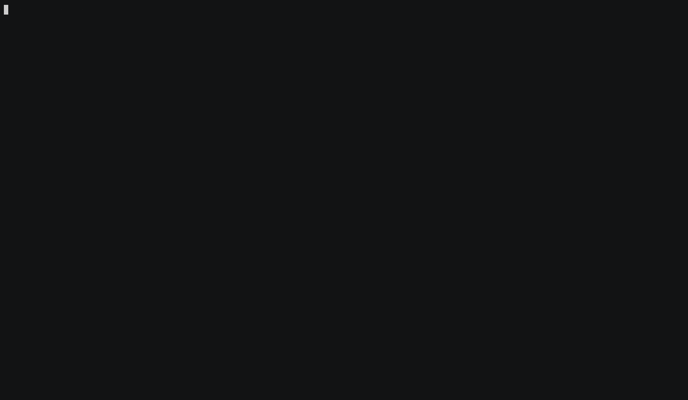

# Monitoring

Dugite provides two complementary monitoring tools: a terminal dashboard (`dugite-monitor`) for quick at-a-glance status, and a Prometheus-compatible metrics endpoint for production alerting and dashboards.

## Terminal Dashboard (dugite-monitor)

`dugite-monitor` is a standalone binary that renders a real-time status dashboard in the terminal by polling the node's Prometheus endpoint. It requires no external infrastructure and works over SSH.



```bash
# Auto-discover a running dugite-node and attach
dugite-monitor

# Monitor a specific endpoint (skips discovery)
dugite-monitor --metrics-url http://192.168.1.100:12796/metrics

# Pin the epoch length instead of auto-detecting it from dugite_network_magic
dugite-monitor --network-magic 2

# Show disk usage for the node's database volume in the Resources panel
dugite-monitor --db-path ./db-preview
```

When `--metrics-url` is omitted, `dugite-monitor` enumerates running `dugite-node` processes (via `sysinfo` + `netstat2`) and probes their `/metrics` endpoints. One node found: it attaches silently. Multiple: a selection dialog appears. None: it falls back to `http://localhost:12798/metrics`.

> **Careful:** that fallback (12798) is *not* the node's default metrics port (12796 — see [Which port?](#which-port) below). The fallback only matters when discovery finds nothing, in which case there is usually no node to monitor anyway. If the monitor reports no data, pass `--metrics-url` explicitly with the port your config actually pins.

The dashboard displays five panels:

- **Node** — role, network, version, era, uptime
- **Chain** — epoch progress bar, block/slot/tip metrics, density, forks, tx counts
- **Connections** — P2P state, inbound/outbound, cold/warm/hot, uni/bi/duplex counts
- **Resources** — CPU %, live memory, RSS memory (plus disk when `--db-path` is set)
- **Peers** — RTT bands (0-50 ms, 50-100 ms, 100-200 ms, 200 ms+), min/avg/max RTT

Metrics are polled once per second. The interval is a compile-time constant — there is no flag to change it.

| Key | Action |
|-----|--------|
| `q` / `Esc` | Quit |
| `t` | Cycle theme |
| `r` | Force-refresh metrics |
| `s` | Switch to a different node |
| `h` / `?` | Toggle help overlay |

---

## Prometheus Metrics Endpoint

Dugite exposes a Prometheus-compatible metrics endpoint for monitoring node health and sync progress.

## Metrics Endpoint

The metrics server responds to any unrecognised HTTP path with Prometheus exposition format metrics:

```
http://localhost:12796/metrics
```

### Which port?

The built-in fallback is **12796**, deliberately offset from cardano-node's 12798 so a dugite node and a Haskell node can co-exist on one host. The shipped per-network configs each pin a port explicitly, so in practice the port comes from the config file:

| Config | `MetricsPort` |
|--------|---------------|
| `config/preview/config.json` | 12796 |
| `config/preprod/config.json` | 12799 |
| `config/mainnet/config.json` | 12800 |
| *(field absent)* | 12796 |

Resolution order, highest priority first:

1. `--no-metrics` → server disabled.
2. `--metrics-port <PORT>` → explicit operator override (wins even over `TurnOnLogMetrics=false`).
3. `TurnOnLogMetrics: false` in the config JSON → server disabled (master off-switch, matching cardano-node).
4. `MetricsPort` in the config JSON.
5. Built-in default 12796.

Pass `--require-metrics` to make a bind failure a fatal startup error instead of a logged warning.

> The examples below use 12796. Substitute your network's port from the table above.

Example response:

```
# HELP dugite_blocks_received_total Total blocks received from peers
# TYPE dugite_blocks_received_total counter
dugite_blocks_received_total 1523847

# HELP dugite_blocks_applied_total Total blocks applied to ledger
# TYPE dugite_blocks_applied_total counter
dugite_blocks_applied_total 1523845

# HELP dugite_slot_number Current slot number
# TYPE dugite_slot_number gauge
dugite_slot_number 142857392

# HELP dugite_block_number Current block number
# TYPE dugite_block_number gauge
dugite_block_number 11283746

# HELP dugite_epoch_number Current epoch number
# TYPE dugite_epoch_number gauge
dugite_epoch_number 512

# HELP dugite_sync_progress_percent Chain sync progress (0-10000, divide by 100 for %)
# TYPE dugite_sync_progress_percent gauge
dugite_sync_progress_percent 9542

# HELP dugite_utxo_count Number of entries in the UTxO set
# TYPE dugite_utxo_count gauge
dugite_utxo_count 15234892

# HELP dugite_mempool_tx_count Number of transactions in the mempool
# TYPE dugite_mempool_tx_count gauge
dugite_mempool_tx_count 42

# HELP dugite_peers_connected Number of connected peers
# TYPE dugite_peers_connected gauge
dugite_peers_connected 8
```

## Health Endpoint

The metrics server exposes a `/health` endpoint for monitoring node status:

```
GET http://localhost:12796/health
```

Always returns **200 OK**. The `status` field carries the verdict:

- **healthy** — sync progress >= 99.9%
- **syncing** — actively catching up to chain tip
- **stalled** — no blocks received for > 5 minutes AND sync < 99%

```json
{
  "status": "healthy",
  "uptime_seconds": 3421,
  "slot_number": 142857392,
  "block_number": 11283746,
  "epoch_number": 512,
  "sync_progress": 99.95,
  "peers_connected": 8,
  "last_block_received_at": "2026-03-14T12:34:56.789Z"
}
```

`last_block_received_at` is `null` until the first block arrives.

## Readiness Endpoint

For Kubernetes readiness probes:

```
GET http://localhost:12796/ready
```

Returns **200 OK** when `sync_progress >= 99.9%`, **503 Service Unavailable** otherwise:

```json
{"ready": true}
```

or:

```json
{"ready": false, "sync_progress": 75.42}
```

## Liveness Endpoint

For Kubernetes liveness probes — this is the one that should restart a wedged pod:

```
GET http://localhost:12796/live
```

Returns **200 OK** when a block has been applied within `--liveness-threshold-secs` (default 600), or when no block has arrived yet but the node has been up for less than that window (warm-up grace). Otherwise **503**:

```json
{"alive": true, "threshold_secs": 600}
```

```json
{"alive": false, "threshold_secs": 600, "last_block_received_at": "2026-03-14T12:34:56.789Z"}
```

Set `--liveness-threshold-secs 0` to make `/live` always return 200.

> `/ready` tracks *sync progress*; `/live` tracks *forward progress*. A node that is 40% synced but applying blocks is correctly not-ready and alive. Wiring a liveness probe to `/ready` will restart-loop a node that is merely still syncing.

## EKG Compatibility Endpoint

```
GET http://localhost:12796/ekg
```

Returns the nested-object JSON layout that cardano-node's EKG (`System.Remote.Monitoring`) exposes, so legacy gLiveView / CNTools dashboards that poll port 12788 can be pointed at dugite unmodified.

## Available Metrics

### Counters

| Metric | Description |
|--------|-------------|
| `dugite_blocks_received_total` | Total blocks received from peers |
| `dugite_blocks_applied_total` | Total blocks successfully applied to the ledger |
| `dugite_transactions_received_total` | Total transactions received |
| `dugite_transactions_validated_total` | Total transactions validated |
| `dugite_transactions_rejected_total` | Total transactions rejected |
| `dugite_rollback_count_total` | Total number of chain rollbacks |
| `dugite_block_apply_failures_total` | Blocks that failed to apply to the ledger |
| `dugite_fetched_blocks_not_connecting_total` | Fetched blocks that did not connect to the current chain |
| `dugite_header_full_validations_total` | Headers that went through full crypto validation |
| `dugite_header_validation_failures_total` | Headers that failed validation |
| `dugite_blocks_forged_total` | Total blocks forged by this node |
| `dugite_leader_checks_total` | Total VRF leader checks performed |
| `dugite_leader_checks_not_elected_total` | Leader checks where node was not elected |
| `dugite_forge_failures_total` | Block forge attempts that failed |
| `dugite_blocks_announced_total` | Blocks successfully announced to peers |
| `dugite_forge_race_lost_total` | Forged blocks that lost the race to another pool |
| `dugite_forge_slot_battles_total` | Slot battles entered |
| `dugite_forge_announce_no_subscribers_total` | Forged blocks with no peer to announce to |
| `dugite_n2n_connections_total` | Total N2N (peer-to-peer) connections accepted |
| `dugite_n2c_connections_total` | Total N2C (client) connections accepted |
| `dugite_apply_mode_reapply_total` | Blocks applied in trust-consensus reapply mode |
| `dugite_apply_mode_validate_all_total` | Blocks applied with full validation |
| `dugite_blockfetch_rx_bytes_total` | Bytes received over BlockFetch |
| `dugite_blockfetch_busy_us_total` | Microseconds BlockFetch spent busy |
| `dugite_blockfetch_send_blocked_us_total` | Microseconds BlockFetch stalled on send |
| `dugite_blockfetch_idle_no_headers_total` | BlockFetch idle periods caused by header starvation |
| `dugite_snapshot_enqueued_total` | Ledger snapshots enqueued |
| `dugite_snapshot_skipped_busy_total` | Snapshots skipped because the worker was busy |
| `dugite_snapshot_failed_total` | Snapshot attempts that failed |
| `dugite_utxo_flush_failed_total` | UTxO store flush failures |
| `dugite_validation_errors_total{error="..."}` | Transaction validation errors, broken down by error type |
| `dugite_protocol_errors_total{error="..."}` | Protocol-level errors by type (e.g. handshake failures, connection errors) |
| `dugite_config_reload_total{result="..."}` | SIGHUP-triggered config reloads by result |

### Gauges

#### Chain and sync

| Metric | Description |
|--------|-------------|
| `dugite_sync_progress_percent` | Chain sync progress (0-10000; divide by 100 for percentage) |
| `dugite_slot_number` | Current slot number |
| `dugite_block_number` | Current block number |
| `dugite_epoch_number` | Current epoch number |
| `dugite_slot_in_epoch` | Offset of the current slot within the epoch (era-aware) |
| `dugite_epoch_length` | Slots per epoch for the current epoch (era-aware) |
| `dugite_slot_length_ms` | Slot duration in ms from the active Shelley genesis |
| `dugite_active_slots_coeff_x1000` | Praos `f` scaled by 1000 (200 = f=0.20) |
| `dugite_era` | Ledger era index: 0=Byron, 1=Shelley, 2=Allegra, 3=Mary, 4=Alonzo, 5=Babbage, 6=Conway, 7=Dijkstra |
| `dugite_protocol_major_version` / `dugite_protocol_minor_version` | Active protocol version |
| `dugite_network_magic` | 764824073=mainnet, 2=preview, 1=preprod |
| `dugite_tip_age_seconds` | Seconds since the tip slot time |
| `dugite_chainsync_idle_seconds` | Seconds since last ChainSync RollForward event |
| `dugite_max_peer_tip_slot` | Highest tip slot advertised by any peer |
| `dugite_ledger_replay_duration_seconds` | Duration of last ledger replay in seconds |
| `dugite_gsm_state` | Genesis State Machine state: 0=PreSyncing, 1=Syncing, 2=CaughtUp |
| `dugite_consensus_mode` | 0=Praos, 1=Ouroboros Genesis |
| `dugite_loe_tip_slot` | Limit on Eagerness tip slot published to chain selection |
| `dugite_utxo_count` | Number of entries in the UTxO set |

#### Peers and connections

| Metric | Description |
|--------|-------------|
| `dugite_peers_connected` | Number of connected peers |
| `dugite_peers_cold` | Number of cold (known but unconnected) peers |
| `dugite_peers_warm` | Number of warm (connected, not syncing) peers |
| `dugite_peers_hot` | Number of hot (actively syncing) peers |
| `dugite_peers_inbound` / `dugite_peers_outbound` / `dugite_peers_duplex` | Peers by connection direction |
| `dugite_conn_inbound` / `dugite_conn_outbound` / `dugite_conn_duplex` / `dugite_conn_full_duplex` / `dugite_conn_unidirectional` / `dugite_conn_terminating` | Connection-manager state counts |
| `dugite_n2n_connections_active` | Currently active N2N connections |
| `dugite_n2c_connections_active` | Currently active N2C connections |
| `dugite_diffusion_mode` | **0 = InitiatorAndResponder, 1 = InitiatorOnly** |
| `dugite_peer_sharing_enabled` | Whether peer sharing is active (0 or 1) |
| `dugite_blockfetch_active_peers` | Peers currently serving BlockFetch |
| `dugite_gdd_disconnects_total` | Genesis Density Disconnector peer disconnects |
| `dugite_csj_dynamos` / `dugite_csj_objectors` / `dugite_csj_jumpers` / `dugite_csj_disengaged` | ChainSync Jumping peer roles |
| `dugite_peer_rtt_avg_ms` / `_min_ms` / `_max_ms` / `_samples` | EWMA peer RTT summary |
| `dugite_peer_rtt_band_0_50` / `_50_100` / `_100_200` / `_200_plus` | Connected peers bucketed by EWMA RTT |
| `dugite_peer_governor_target{name="..."}` | Peer governor target counts by name |

#### Mempool and transactions

| Metric | Description |
|--------|-------------|
| `dugite_mempool_tx_count` | Number of transactions in the mempool |
| `dugite_mempool_tx_max` | Maximum transaction capacity of the mempool |
| `dugite_mempool_bytes` | Size of the mempool in bytes |
| `dugite_n2c_txs_submitted_total` / `_accepted_total` / `_rejected_total` | N2C local tx-submission outcomes |

#### Ledger and governance

| Metric | Description |
|--------|-------------|
| `dugite_delegation_count` | Number of active stake delegations |
| `dugite_vote_delegation_count` | Number of vote delegations |
| `dugite_treasury_lovelace` | Total lovelace in the treasury |
| `dugite_reserves_lovelace` | Total lovelace remaining in the reserves pot |
| `dugite_drep_count` | Registered DReps (active + inactive) |
| `dugite_drep_active` | DReps still within their activity window |
| `dugite_proposal_count` | Number of active governance proposals |
| `dugite_pool_count` | Number of registered stake pools |
| `dugite_committee_total_count` / `_hot_count` / `_resigned_count` | Constitutional Committee membership |
| `dugite_committee_threshold_bps` | CC threshold in basis points |
| `dugite_committee_no_confidence` | 1 when the committee is in a no-confidence state |
| `dugite_constitution_present` | 1 when a constitution is set |
| `dugite_gov_dormant_epochs` | Consecutive epochs with no governance activity |
| `dugite_pparam_drep_deposit_lovelace`, `dugite_pparam_drep_activity_epochs`, `dugite_pparam_gov_action_deposit_lovelace`, `dugite_pparam_gov_action_lifetime_epochs`, `dugite_pparam_committee_min_size`, `dugite_pparam_committee_max_term_length` | Conway governance protocol parameters |

#### Process and host

| Metric | Description |
|--------|-------------|
| `dugite_uptime_seconds` | Seconds since node startup |
| `dugite_is_block_producer` | 1 when forge credentials are loaded, 0 for relay |
| `dugite_disk_available_bytes` / `dugite_disk_used_bytes` / `dugite_disk_total_bytes` | Database volume disk usage |
| `dugite_mem_resident_bytes` | Resident set size (RSS) in bytes |
| `dugite_mem_peak_bytes` | Peak RSS in bytes |
| `dugite_mem_total_bytes` | Total physical memory on the host |
| `dugite_cpu_percent` | Process CPU utilisation as a percentage of one core |
| `dugite_cpu_seconds_total` | Cumulative process CPU time in seconds |
| `dugite_snapshot_worker_alive` | 1 when the background snapshot worker is running |
| `dugite_utxo_backend_info{backend="..."}` | Active UTxO storage backend |
| `dugite_pool_id_info{pool_id="..."}` | Block producer pool identity (block producers only) |

### Histograms

| Metric | Buckets (ms) | Description |
|--------|-------------|-------------|
| `dugite_peer_handshake_rtt_ms` | 1, 5, 10, 25, 50, 100, 250, 500, 1000, 2500, 5000, 10000 | Peer N2N handshake round-trip time |
| `dugite_peer_block_fetch_range_ms` | (same) | BlockFetch range request latency |

Histograms expose `_bucket`, `_count`, and `_sum` suffixes for standard Prometheus histogram queries.

> **Note:** the block-fetch histogram is named `dugite_peer_block_fetch_range_ms`, not `dugite_peer_block_fetch_ms`. The bundled Grafana dashboard still queries the old name — see the caveat under [Grafana Dashboard](#grafana-dashboard).

## Prometheus Configuration

Add the Dugite node as a scrape target in your `prometheus.yml`:

```yaml
scrape_configs:
  - job_name: 'dugite'
    scrape_interval: 15s
    static_configs:
      - targets: ['localhost:12800']    # mainnet; see the port table above
        labels:
          network: 'mainnet'
          node: 'relay-1'
```

A ready-made config is committed at `config/monitoring/prometheus.yml`. It scrapes every well-known dugite port so the dashboard works regardless of which `just run-{bp,relay} <network>` recipe is active — down targets simply show as DOWN in `/targets`:

| Port | Role |
|------|------|
| 12796 | preview relay (also the built-in default) |
| 12797 | preview BP |
| 12798 | cardano-node default |
| 12799 | preprod |
| 12800 | mainnet |

Alert rules live alongside it in `config/monitoring/prometheus-alerts.yml`, covering forge failures, rollback rate, tip age, hot-peer starvation, and RSS growth.

## Grafana Dashboard

Dugite ships with a pre-built Grafana dashboard at `config/monitoring/grafana-dashboard.json`. The dashboard covers all node metrics organized into nine sections:

- **Overview** — Sync progress gauge, block height, epoch, slot, connected peers, blocks forged
- **Node Health** — Uptime, disk available (stat + time series)
- **Sync & Throughput** — Sync progress over time, block apply/receive rate (blk/s), block height, rollbacks
- **Peers** — Connected peer count over time, peer state breakdown (hot/warm/cold stacked)
- **Mempool & Transactions** — Mempool tx count, mempool size (bytes), transaction rate (received/validated/rejected)
- **Ledger State** — UTxO set size, stake delegations, treasury balance (ADA), registered stake pools
- **Governance** — Registered DReps, active governance proposals
- **Block Production** — Total blocks forged, block forge rate (blk/h)
- **Network Latency** — Handshake RTT and block fetch latency percentiles (p50/p95/p99), request counts
- **Validation Errors** — Error breakdown by type (stacked bars), error totals (bar chart)

> **Known stale panel:** the block-fetch latency panels query `dugite_peer_block_fetch_ms_bucket`, but the node emits `dugite_peer_block_fetch_range_ms_bucket`. Those panels render empty until the dashboard JSON is updated. Every other metric referenced by the dashboard matches a metric the node actually emits.

### Quick Start (Docker)

The fastest way to start a local monitoring stack is with the included script:

```bash
# Start Prometheus + Grafana
just monitor-start         # or: ./scripts/monitoring/start.sh

# Open the dashboard (admin/admin)
open http://localhost:3000/d/dugite-node/dugite-node

# Check status
just monitor-status        # or: ./scripts/monitoring/start.sh status

# Stop
just monitor-stop          # or: ./scripts/monitoring/start.sh stop
```

The script starts Prometheus (port 9090) and Grafana (port 3000) as Docker containers, auto-configures the Prometheus datasource, and imports the Dugite dashboard. Prometheus data is persisted in `.monitoring-data/` so metrics survive restarts.

Environment variables for port customization:

| Variable | Default | Description |
|----------|---------|-------------|
| `PROMETHEUS_PORT` | 9090 | Prometheus web UI port |
| `GRAFANA_PORT` | 3000 | Grafana web UI port |
| `DUGITE_METRICS_PORT` | 12798 | Port where Dugite exposes metrics |

### Importing the Dashboard

1. Open Grafana and go to **Dashboards > Import**
2. Click **Upload JSON file** and select `config/monitoring/grafana-dashboard.json`
3. Select your Prometheus data source when prompted
4. Click **Import**

The dashboard includes an `instance` template variable so you can monitor multiple Dugite nodes (relays + block producer) from a single dashboard. It auto-refreshes every 30 seconds.

### Provisioning

To auto-provision the dashboard, copy it into your Grafana provisioning directory:

```bash
cp config/monitoring/grafana-dashboard.json /etc/grafana/provisioning/dashboards/dugite.json
```

Add a dashboard provider in `/etc/grafana/provisioning/dashboards/dugite.yaml`:

```yaml
apiVersion: 1
providers:
  - name: Dugite
    folder: Cardano
    type: file
    options:
      path: /etc/grafana/provisioning/dashboards
      foldersFromFilesStructure: false
```

### Quick Start (macOS)

To quickly preview the dashboard locally with Homebrew:

```bash
# Install Prometheus and Grafana
brew install prometheus grafana

# Configure Prometheus to scrape Dugite
cat > /opt/homebrew/etc/prometheus.yml << 'EOF'
global:
  scrape_interval: 5s

scrape_configs:
  - job_name: dugite
    static_configs:
      - targets: ['localhost:12796']    # match your config's MetricsPort
EOF

# Provision the datasource
cat > "$(brew --prefix)/opt/grafana/share/grafana/conf/provisioning/datasources/dugite.yaml" << 'EOF'
apiVersion: 1
datasources:
  - name: Prometheus
    type: prometheus
    access: proxy
    url: http://localhost:9090
    isDefault: true
    uid: DS_PROMETHEUS
EOF

# Provision the dashboard
cat > "$(brew --prefix)/opt/grafana/share/grafana/conf/provisioning/dashboards/dugite.yaml" << 'EOF'
apiVersion: 1
providers:
  - name: Dugite
    folder: Cardano
    type: file
    options:
      path: /opt/homebrew/var/lib/grafana/dashboards
EOF

mkdir -p /opt/homebrew/var/lib/grafana/dashboards
sed 's/${DS_PROMETHEUS}/DS_PROMETHEUS/g' config/monitoring/grafana-dashboard.json \
  > /opt/homebrew/var/lib/grafana/dashboards/dugite.json

# Start services
brew services start prometheus
brew services start grafana

# Open the dashboard (default login: admin/admin)
open "http://localhost:3000/d/dugite-node/dugite-node"
```

To stop:

```bash
brew services stop prometheus grafana
```

### Key Queries

| Panel | PromQL |
|-------|--------|
| Sync progress | `dugite_sync_progress_percent / 100` |
| Block throughput | `rate(dugite_blocks_applied_total[5m])` |
| Transaction rejection rate | `rate(dugite_transactions_rejected_total[5m])` |
| Treasury balance (ADA) | `dugite_treasury_lovelace / 1e6` |
| Block forge rate (per hour) | `rate(dugite_blocks_forged_total[1h]) * 3600` |
| Handshake RTT p95 | `histogram_quantile(0.95, rate(dugite_peer_handshake_rtt_ms_bucket[5m]))` |
| Block fetch latency p95 | `histogram_quantile(0.95, rate(dugite_peer_block_fetch_range_ms_bucket[5m]))` |
| Validation errors by type | `rate(dugite_validation_errors_total[5m])` |
| Protocol errors by type | `rate(dugite_protocol_errors_total[5m])` |
| Leader election rate | `rate(dugite_leader_checks_total[5m])` |
| Active N2N connections | `dugite_n2n_connections_active` |
| Disk available | `dugite_disk_available_bytes` |

## Console Logging

In addition to the Prometheus endpoint, Dugite logs sync progress to the console every 5 seconds — but only while catching up. Once the node is following the tip (`remaining` would be 0) the line stops being emitted, so silence here means "synced", not "stalled". The fields are:

| Field | Meaning |
|-------|---------|
| `progress` | Sync percentage |
| `epoch` | Current epoch number |
| `block` | Current block number |
| `tip` | Best known tip block number |
| `remaining` | Blocks left to apply |
| `speed` | Blocks-per-second throughput |
| `utxos` | UTxO set size |

Example log line:

```
2026-03-12T12:34:56.789Z  INFO dugite_node::node: Syncing progress="95.42%" epoch=512 block=11283746 tip=11300000 remaining=16254 speed="312 blk/s" utxos=15234892
```

Log output can be directed to stdout, file, or systemd journal. See [Logging](./logging.md) for full details on output targets, file rotation, and log level configuration.
