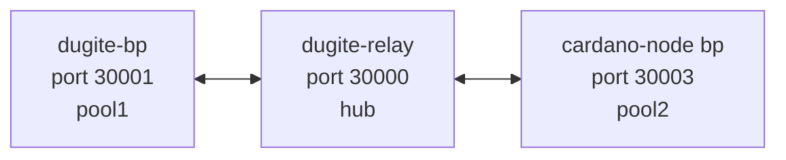

# Local Testnet Implementation Plan

> **For agentic workers:** REQUIRED SUB-SKILL: Use superpowers:subagent-driven-development (recommended) or superpowers:executing-plans to implement this plan task-by-task. Steps use checkbox (`- [ ]`) syntax for tracking. The executor MUST create the isolated git worktree via `superpowers:using-git-worktrees` (branch `feature/local-testnet-docs` rooted at `main`) **before** starting Task 1; every task assumes work happens in that worktree. Design: [`2026-05-16-local-testnet-design.md`](../specs/2026-05-16-local-testnet-design.md).

**Goal:** Bring up a documented, reproducible 3-node loopback testnet (1 dugite BP + 1 dugite relay + 1 cardano-node BP, hub-and-spoke through the dugite relay), pass a 30-minute soak test that produces machine-verifiable evidence of correct forge / diffusion / tx flow, publish a GitHub Pages doc page describing the setup, and land everything via a single PR with the soak's `report.md` attached.

**Architecture:** Fresh Conway PV10 genesis generated by `cardano-cli conway genesis create-testnet-data` with 2 pools + 1 UTxO key. Shell scripts under `testnet/local-devnet/` orchestrate lifecycle. Soak collects per-node samples into CSV; `verify.sh` evaluates four pass/fail predicates and emits `report.md`. mdbook adds a new "Local Testnet" page under "Running a Node".

**Tech Stack:** bash + jq + cardano-cli 11.0.0 + cardano-node 11.0.1 + `target/release/dugite-node` + mdbook + gh CLI.

---

## Task 1: Worktree skeleton + .gitignore

**Files:**
- Create: `testnet/local-devnet/.gitignore`
- Create: `testnet/local-devnet/README.md` (one-paragraph pointer to the doc page)
- Create: `testnet/local-devnet/lib/.gitkeep`
- Create: `testnet/local-devnet/config/spec/.gitkeep`
- Create: `testnet/local-devnet/config/templates/.gitkeep`

- [ ] **Step 1.1: Confirm worktree is current working directory**

Run: `git rev-parse --abbrev-ref HEAD`
Expected: `feature/local-testnet-docs`
If not, ABORT — the executor must invoke `superpowers:using-git-worktrees` first.

- [ ] **Step 1.2: Create directory skeleton**

```bash
mkdir -p testnet/local-devnet/{lib,config/spec,config/templates}
```

- [ ] **Step 1.3: Write `testnet/local-devnet/.gitignore`**

```gitignore
# Generated artefacts — never commit
genesis/
keys/
state/
logs/
evidence/

# Rendered (templated) configs — committed templates only
config/dugite-bp.config.json
config/dugite-relay.config.json
config/cardano-bp.config.json
config/dugite-bp.topology.json
config/dugite-relay.topology.json
config/cardano-bp.topology.json
config/relays.json
config/genesis-hashes.env

# Placeholder kept files inside otherwise-empty committed dirs
!.gitkeep
```

- [ ] **Step 1.4: Write `testnet/local-devnet/README.md`**

```markdown
# Local Testnet

A 3-node loopback testnet (1 dugite BP, 1 dugite relay, 1 cardano-node BP)
for verifying dugite block production and diffusion against the Haskell
reference implementation.

See the published documentation page for setup, usage, and verification:
<https://michaeljfazio.github.io/dugite/running/local-testnet.html>
(or `docs/src/running/local-testnet.md` in this repo).

Design spec: `docs/superpowers/specs/2026-05-16-local-testnet-design.md`
```

- [ ] **Step 1.5: Drop empty `.gitkeep` files**

```bash
touch testnet/local-devnet/lib/.gitkeep \
      testnet/local-devnet/config/spec/.gitkeep \
      testnet/local-devnet/config/templates/.gitkeep
```

- [ ] **Step 1.6: Commit**

```bash
git add testnet/local-devnet/
git commit -m "testnet: scaffold local-devnet workspace + gitignore"
```

---

## Task 2: Create GitHub tracking issue

**Files:** none changed (issue lives on GitHub).

- [ ] **Step 2.1: Verify gh CLI is authenticated**

Run: `gh auth status`
Expected: shows `Logged in to github.com as ...`

- [ ] **Step 2.2: Create the issue**

```bash
gh issue create \
  --title "Local testnet for verification & validation (3-node loopback)" \
  --label "documentation" --label "testing" \
  --body "$(cat <<'EOF'
## Summary

Add a documented, reproducible 3-node loopback testnet (1 dugite BP, 1 dugite
relay, 1 cardano-node BP) in hub-and-spoke topology with the dugite relay as
the single diffusion hub. Boots from fresh Conway PV10 genesis via
`cardano-cli`; a 30-minute soak test collects machine-verifiable evidence of
correct forge, diffusion, and N2C tx flow.

Design spec: `docs/superpowers/specs/2026-05-16-local-testnet-design.md`
Implementation plan: `docs/superpowers/plans/2026-05-16-local-testnet.md`

## Topology

\`\`\`
   dugite-bp  <-->  dugite-relay  <-->  cardano-node bp
   port 30001       port 30000          port 30003
   (Rust, pool1)    (Rust, hub)         (Haskell, pool2)
\`\`\`

## Acceptance criteria

- [ ] \`testnet/local-devnet/\` exists with setup/run/stop/soak/verify/submit-txs scripts and lib/common.sh
- [ ] \`config/spec/shelley-spec.json\` + \`config/spec/conway-spec.json\` (override fragments) committed
- [ ] Six config + topology templates under \`config/templates/\` committed
- [ ] \`docs/src/running/local-testnet.md\` published; \`docs/src/SUMMARY.md\` updated
- [ ] mdbook build succeeds
- [ ] One full 30-min soak run completed with all four predicates green:
  - block forge cross-check
  - per-BP forge attribution (>=3 forges per pool)
  - transaction inclusion round-trip (45/45 txs visible in all three UTxO sets)
  - tip parity over time (>=95% of windows in-parity)
- [ ] \`report.md\` from that soak attached to this issue
- [ ] PR opened, evidence linked from PR body

## Out of scope (intentionally)

- Byron-era coverage (Conway-from-genesis only)
- Hard-fork combinator transitions
- Multi-relay diffusion topologies
- Plutus phase-2 / governance enactment
- Production CI integration (manual run for now)

## Risks

- \`cardano-cli\` semantics drift across versions — pinned to >= 11.0.0 in prereq check
- Genesis stake-split lottery flake — \`>=3 forges\` threshold is well below expected ~180
- macOS App Nap — caffeinate-wrapped per existing memory
EOF
)"
```

- [ ] **Step 2.3: Capture issue number**

Run: `gh issue list --label documentation --label testing --json number,title --limit 5 | jq '.[] | select(.title|test("Local testnet"))'`
Expected: JSON object with the issue number.
Save the issue number into an environment-style file for later steps:

```bash
ISSUE=$(gh issue list --search "Local testnet for verification" --json number --jq '.[0].number')
echo "ISSUE=$ISSUE" > .git/local-devnet-issue
echo "Tracking issue: #$ISSUE"
```

- [ ] **Step 2.4: No commit needed** (no repo files changed)

---

## Task 3: Genesis override spec fragments

**Files:**
- Create: `testnet/local-devnet/config/spec/shelley-spec.json`
- Create: `testnet/local-devnet/config/spec/conway-spec.json`
- Delete: `testnet/local-devnet/config/spec/.gitkeep`

**Context.** These files are **override fragments**, not complete specs. `setup.sh` will (a) generate cardano-cli's default shelley/conway specs to a tmpdir, then (b) deep-merge our fragment over the defaults using `jq '.[0] * .[1]'`, then (c) pass the merged result as `--spec-shelley` / `--spec-conway`. This decouples our overrides from cardano-cli's default-evolving values.

- [ ] **Step 3.1: Write `config/spec/shelley-spec.json`**

```json
{
  "activeSlotsCoeff": 0.2,
  "epochLength": 500,
  "securityParam": 10,
  "slotLength": 1.0,
  "updateQuorum": 2,
  "maxLovelaceSupply": 60000000000000000,
  "networkMagic": 42,
  "protocolParams": {
    "minFeeA": 44,
    "minFeeB": 155381,
    "maxBlockBodySize": 90112,
    "maxTxSize": 16384,
    "maxBlockHeaderSize": 1100,
    "keyDeposit": 2000000,
    "poolDeposit": 500000000,
    "minPoolCost": 340000000,
    "eMax": 18,
    "nOpt": 500,
    "a0": 0.3,
    "rho": 0.003,
    "tau": 0.2,
    "protocolVersion": {
      "major": 2,
      "minor": 0
    }
  }
}
```

- [ ] **Step 3.2: Write `config/spec/conway-spec.json`**

The Conway spec governs governance parameters; for a 30-min run with no proposals only the protocol version matters. The full file is small — we set everything to mainnet defaults except the PV (10.0). Field names match cardano-ledger's `Conway.PParams` Haskell representation.

```json
{
  "poolVotingThresholds": {
    "committeeNormal": 0.51,
    "committeeNoConfidence": 0.51,
    "hardForkInitiation": 0.51,
    "motionNoConfidence": 0.51,
    "ppSecurityGroup": 0.51
  },
  "dRepVotingThresholds": {
    "motionNoConfidence": 0.67,
    "committeeNormal": 0.67,
    "committeeNoConfidence": 0.6,
    "updateToConstitution": 0.75,
    "hardForkInitiation": 0.6,
    "ppNetworkGroup": 0.67,
    "ppEconomicGroup": 0.67,
    "ppTechnicalGroup": 0.67,
    "ppGovGroup": 0.75,
    "treasuryWithdrawal": 0.67
  },
  "committeeMinSize": 0,
  "committeeMaxTermLength": 73,
  "govActionLifetime": 6,
  "govActionDeposit": 100000000000,
  "dRepDeposit": 500000000,
  "dRepActivity": 20,
  "minFeeRefScriptCostPerByte": 15,
  "plutusV3CostModel": [
    100788, 420, 1, 1, 1000, 173, 0, 1, 1000, 59957, 4, 1, 11183, 32,
    201305, 8356, 4, 16000, 100, 16000, 100, 16000, 100, 16000, 100,
    16000, 100, 16000, 100, 100, 100, 16000, 100, 94375, 32, 132994,
    32, 61462, 4, 72010, 178, 0, 1, 22151, 32, 91189, 769, 4, 2,
    85848, 123203, 7305, -900, 1716, 549, 57, 85848, 0, 1, 1, 1000,
    42921, 4, 2, 24548, 29498, 38, 1, 898148, 27279, 1, 51775, 558,
    1, 39184, 1000, 60594, 1, 141895, 32, 83150, 32, 15299, 32, 76049,
    1, 13169, 4, 22100, 10, 28999, 74, 1, 28999, 74, 1, 43285, 552,
    1, 44749, 541, 1, 33852, 32, 68246, 32, 72362, 32, 7243, 32, 7391,
    32, 11546, 32, 85848, 123203, 7305, -900, 1716, 549, 57, 85848, 0,
    1, 90434, 519, 0, 1, 74433, 32, 85848, 123203, 7305, -900, 1716,
    549, 57, 85848, 0, 1, 1, 85848, 123203, 7305, -900, 1716, 549, 57,
    85848, 0, 1, 955506, 213312, 0, 2, 270652, 22588, 4, 1457325,
    64566, 4, 20467, 1, 4, 0, 141992, 32, 100788, 420, 1, 1, 81663,
    32, 59498, 32, 20142, 32, 24588, 32, 20744, 32, 25933, 32, 24623,
    32, 43053543, 10, 53384111, 14333, 10, 43574283, 26308, 10, 16000,
    100, 16000, 100, 962335, 18, 2780678, 6, 442008, 1, 52538055,
    3756, 18, 267929, 18, 76433006, 8868, 18, 52948122, 18, 1995836,
    36, 3227919, 12, 901022, 1, 166917843, 4307, 36, 284546, 36,
    158221314, 26549, 36, 74698472, 36, 333849714, 1, 254006273, 72,
    2174038, 72, 2261318, 64571, 4, 207616, 8310, 4, 1293828, 28716,
    63, 0, 1, 1006041, 43623, 251, 0, 1
  ],
  "constitution": {
    "anchor": {
      "url": "",
      "dataHash": "0000000000000000000000000000000000000000000000000000000000000000"
    }
  },
  "committee": {
    "members": {},
    "threshold": {
      "numerator": 2,
      "denominator": 3
    }
  }
}
```

- [ ] **Step 3.3: Validate both files parse as JSON**

```bash
jq empty testnet/local-devnet/config/spec/shelley-spec.json
jq empty testnet/local-devnet/config/spec/conway-spec.json
```
Expected: both commands exit 0 with no output.

- [ ] **Step 3.4: Remove the .gitkeep placeholder**

```bash
git rm testnet/local-devnet/config/spec/.gitkeep
```

- [ ] **Step 3.5: Commit**

```bash
git add testnet/local-devnet/config/spec/
git commit -m "testnet: add shelley + conway genesis override fragments"
```

---

## Task 4: lib/common.sh shared helpers

**Files:**
- Create: `testnet/local-devnet/lib/common.sh`
- Delete: `testnet/local-devnet/lib/.gitkeep`

- [ ] **Step 4.1: Write `lib/common.sh`**

```bash
#!/usr/bin/env bash
# Shared helpers for local-devnet scripts.
# Source: . "$(dirname "$0")/lib/common.sh"
set -euo pipefail

# ---- Paths ----
LD_ROOT="$(cd "$(dirname "${BASH_SOURCE[0]}")/.." && pwd)"
LD_STATE="$LD_ROOT/state"
LD_LOGS="$LD_ROOT/logs"
LD_KEYS="$LD_ROOT/keys"
LD_GENESIS="$LD_ROOT/genesis"
LD_CONFIG="$LD_ROOT/config"
LD_EVIDENCE="$LD_ROOT/evidence"

# ---- Constants ----
LD_MAGIC=42
LD_RELAY_PORT=30000
LD_DUGITE_BP_PORT=30001
LD_CARDANO_BP_PORT=30003
LD_RELAY_SOCK="$LD_STATE/dugite-relay.sock"
LD_DUGITE_BP_SOCK="$LD_STATE/dugite-bp.sock"
LD_CARDANO_BP_SOCK="$LD_STATE/cardano-bp.sock"

# Dugite binary discovered relative to repo root (LD_ROOT/../..)
LD_REPO_ROOT="$(cd "$LD_ROOT/../.." && pwd)"
DUGITE_BIN="$LD_REPO_ROOT/target/release/dugite-node"

# ---- Logging ----
log_info() { printf '\033[0;32m[INFO]\033[0m  %s\n' "$*" >&2; }
log_warn() { printf '\033[0;33m[WARN]\033[0m  %s\n' "$*" >&2; }
log_error() { printf '\033[0;31m[ERROR]\033[0m %s\n' "$*" >&2; }
die() { log_error "$*"; exit 1; }

# ---- Version comparison: returns 0 if $1 >= $2 ----
version_ge() {
    [ "$(printf '%s\n%s' "$2" "$1" | sort -V | head -n1)" = "$2" ]
}

# ---- Prereq checks ----
check_prereqs() {
    command -v jq >/dev/null || die "jq not installed"
    command -v cardano-cli >/dev/null || die "cardano-cli not installed"
    command -v cardano-node >/dev/null || die "cardano-node not installed"
    [ -x "$DUGITE_BIN" ] || die "dugite-node binary not found at $DUGITE_BIN — run 'cargo build --release'"

    local cli_ver
    cli_ver="$(cardano-cli --version | awk 'NR==1 {print $2}')"
    version_ge "$cli_ver" "11.0.0" || die "cardano-cli $cli_ver < 11.0.0 required"

    local node_ver
    node_ver="$(cardano-node --version | awk 'NR==1 {print $2}')"
    version_ge "$node_ver" "11.0.1" || die "cardano-node $node_ver < 11.0.1 required"

    log_info "Prereqs OK (cardano-cli $cli_ver, cardano-node $node_ver, dugite-node at $DUGITE_BIN)"
}

# ---- Port availability ----
port_free() {
    local port="$1"
    ! lsof -iTCP:"$port" -sTCP:LISTEN -t >/dev/null 2>&1
}

assert_ports_free() {
    for p in "$LD_RELAY_PORT" "$LD_DUGITE_BP_PORT" "$LD_CARDANO_BP_PORT"; do
        port_free "$p" || die "Port $p is in use — stop the conflicting process first"
    done
}

# ---- Wait for a unix socket to appear and be queryable ----
wait_for_socket() {
    local sock="$1" timeout="${2:-90}"
    local i=0
    while [ $i -lt "$timeout" ]; do
        if [ -S "$sock" ]; then
            # Try a tip query — confirms the N2C handler is alive
            if cardano-cli query tip --testnet-magic "$LD_MAGIC" --socket-path "$sock" >/dev/null 2>&1; then
                log_info "Socket $sock ready after ${i}s"
                return 0
            fi
        fi
        sleep 1
        i=$((i + 1))
    done
    die "Socket $sock did not become ready within ${timeout}s"
}

# ---- Query tip helpers ----
# Returns: "slot block_no hash era" on one line
query_tip_oneline() {
    local sock="$1"
    cardano-cli query tip --testnet-magic "$LD_MAGIC" --socket-path "$sock" \
        | jq -r '[.slot, .block, .hash, .era] | @tsv'
}

# Returns just the slot
query_slot() {
    local sock="$1"
    cardano-cli query tip --testnet-magic "$LD_MAGIC" --socket-path "$sock" \
        | jq -r '.slot'
}

# ---- Caffeinate wrapper (no-op on non-macOS) ----
caffeinate_if_macos() {
    if [ "$(uname)" = "Darwin" ]; then
        caffeinate -dimsu "$@"
    else
        "$@"
    fi
}

# Mark sourcing successful
LD_COMMON_LOADED=1
```

- [ ] **Step 4.2: Verify it sources cleanly**

```bash
cd testnet/local-devnet && bash -c 'set -e; . lib/common.sh; echo "Loaded common.sh, LD_ROOT=$LD_ROOT"'
```
Expected: prints `Loaded common.sh, LD_ROOT=/...local-devnet` and exits 0.

- [ ] **Step 4.3: Run shellcheck**

```bash
shellcheck testnet/local-devnet/lib/common.sh || true
```
Acceptable: no errors. Warnings are OK. (If shellcheck not installed, skip — note in commit message.)

- [ ] **Step 4.4: Remove the .gitkeep**

```bash
git rm testnet/local-devnet/lib/.gitkeep
```

- [ ] **Step 4.5: Commit**

```bash
git add testnet/local-devnet/lib/common.sh
git commit -m "testnet: add lib/common.sh with prereq/port/socket/tip helpers"
```

---

## Task 5: Config templates (dugite + cardano)

**Files:**
- Create: `testnet/local-devnet/config/templates/dugite-bp.config.tmpl.json`
- Create: `testnet/local-devnet/config/templates/dugite-relay.config.tmpl.json`
- Create: `testnet/local-devnet/config/templates/cardano-bp.config.tmpl.json`

**Context.** Templates use literal placeholder strings like `@@GENESIS_DIR@@` that `setup.sh` substitutes via `sed`. Placeholders chosen so they cannot appear in any valid JSON value.

- [ ] **Step 5.1: Write `dugite-bp.config.tmpl.json`**

```json
{
  "ByronGenesisFile": "@@GENESIS_DIR@@/byron-genesis.json",
  "ByronGenesisHash": "@@BYRON_HASH@@",
  "ShelleyGenesisFile": "@@GENESIS_DIR@@/shelley-genesis.json",
  "ShelleyGenesisHash": "@@SHELLEY_HASH@@",
  "AlonzoGenesisFile": "@@GENESIS_DIR@@/alonzo-genesis.json",
  "AlonzoGenesisHash": "@@ALONZO_HASH@@",
  "ConwayGenesisFile": "@@GENESIS_DIR@@/conway-genesis.json",
  "ConwayGenesisHash": "@@CONWAY_HASH@@",
  "Network": "Testnet",
  "NetworkMagic": 42,
  "DiffusionMode": "InitiatorAndResponder",
  "MinSeverity": "Info",
  "LogDirective": "info"
}
```

- [ ] **Step 5.2: Write `dugite-relay.config.tmpl.json`**

Identical to the BP config; the relay difference is purely topology + absence of forging keys.

```json
{
  "ByronGenesisFile": "@@GENESIS_DIR@@/byron-genesis.json",
  "ByronGenesisHash": "@@BYRON_HASH@@",
  "ShelleyGenesisFile": "@@GENESIS_DIR@@/shelley-genesis.json",
  "ShelleyGenesisHash": "@@SHELLEY_HASH@@",
  "AlonzoGenesisFile": "@@GENESIS_DIR@@/alonzo-genesis.json",
  "AlonzoGenesisHash": "@@ALONZO_HASH@@",
  "ConwayGenesisFile": "@@GENESIS_DIR@@/conway-genesis.json",
  "ConwayGenesisHash": "@@CONWAY_HASH@@",
  "Network": "Testnet",
  "NetworkMagic": 42,
  "DiffusionMode": "InitiatorAndResponder",
  "MinSeverity": "Info",
  "LogDirective": "info"
}
```

- [ ] **Step 5.3: Write `cardano-bp.config.tmpl.json`**

Cardano-node config — based on `config/haskell-preview-config.json` in the repo but stripped of public-network-specific tracing and pointing at our custom genesis.

```json
{
  "Protocol": "Cardano",
  "ConsensusMode": "PraosMode",
  "RequiresNetworkMagic": "RequiresMagic",
  "ExperimentalHardForksEnabled": false,
  "ExperimentalProtocolsEnabled": false,
  "ByronGenesisFile": "@@GENESIS_DIR@@/byron-genesis.json",
  "ByronGenesisHash": "@@BYRON_HASH@@",
  "ShelleyGenesisFile": "@@GENESIS_DIR@@/shelley-genesis.json",
  "ShelleyGenesisHash": "@@SHELLEY_HASH@@",
  "AlonzoGenesisFile": "@@GENESIS_DIR@@/alonzo-genesis.json",
  "AlonzoGenesisHash": "@@ALONZO_HASH@@",
  "ConwayGenesisFile": "@@GENESIS_DIR@@/conway-genesis.json",
  "ConwayGenesisHash": "@@CONWAY_HASH@@",
  "LastKnownBlockVersion-Major": 10,
  "LastKnownBlockVersion-Minor": 0,
  "LastKnownBlockVersion-Alt": 0,
  "MinNodeVersion": "11.0.1",
  "TestShelleyHardForkAtEpoch": 0,
  "TestAllegraHardForkAtEpoch": 0,
  "TestMaryHardForkAtEpoch": 0,
  "TestAlonzoHardForkAtEpoch": 0,
  "TestBabbageHardForkAtEpoch": 0,
  "TestConwayHardForkAtEpoch": 0,
  "EnableP2P": true,
  "PeerSharing": false,
  "TargetNumberOfRootPeers": 1,
  "TargetNumberOfKnownPeers": 1,
  "TargetNumberOfEstablishedPeers": 1,
  "TargetNumberOfActivePeers": 1,
  "TargetNumberOfKnownBigLedgerPeers": 0,
  "TargetNumberOfEstablishedBigLedgerPeers": 0,
  "TargetNumberOfActiveBigLedgerPeers": 0,
  "ShelleyKesKeyFile": "@@KEYS_DIR@@/pool2/kes.skey",
  "ShelleyVrfKeyFile": "@@KEYS_DIR@@/pool2/vrf.skey",
  "ShelleyOperationalCertificateFile": "@@KEYS_DIR@@/pool2/opcert.cert",
  "TraceOptions": {
    "": {
      "backends": ["Stdout MachineFormat"],
      "detail": "DNormal",
      "severity": "Info"
    },
    "Forge": { "severity": "Info" },
    "Forge.Loop": { "severity": "Info" },
    "BlockFetch.Client.CompletedBlockFetch": { "severity": "Info" },
    "ChainDB.AddBlockEvent.AddedBlockToVolatileDB": { "severity": "Info" }
  },
  "TraceOptionMetricsPrefix": "cardano.node.metrics.",
  "TraceOptionResourceFrequency": 1000
}
```

- [ ] **Step 5.4: Validate JSON syntax of all three**

```bash
for f in testnet/local-devnet/config/templates/*.config.tmpl.json; do
    jq empty "$f" || { echo "INVALID: $f"; exit 1; }
done
```
Expected: exits 0 with no `INVALID:` line.

- [ ] **Step 5.5: Commit**

```bash
git add testnet/local-devnet/config/templates/*.config.tmpl.json
git commit -m "testnet: add dugite + cardano-node config templates"
```

---

## Task 6: Topology templates

**Files:**
- Create: `testnet/local-devnet/config/templates/dugite-bp.topology.tmpl.json`
- Create: `testnet/local-devnet/config/templates/dugite-relay.topology.tmpl.json`
- Create: `testnet/local-devnet/config/templates/cardano-bp.topology.tmpl.json`

- [ ] **Step 6.1: Write `dugite-bp.topology.tmpl.json`**

```json
{
  "bootstrapPeers": null,
  "localRoots": [
    {
      "accessPoints": [
        { "address": "127.0.0.1", "port": 30000 }
      ],
      "advertise": false,
      "trustable": true,
      "valency": 1
    }
  ],
  "publicRoots": [],
  "useLedgerAfterSlot": -1
}
```

- [ ] **Step 6.2: Write `dugite-relay.topology.tmpl.json`**

```json
{
  "bootstrapPeers": null,
  "localRoots": [
    {
      "accessPoints": [
        { "address": "127.0.0.1", "port": 30001 },
        { "address": "127.0.0.1", "port": 30003 }
      ],
      "advertise": false,
      "trustable": true,
      "valency": 2
    }
  ],
  "publicRoots": [],
  "useLedgerAfterSlot": -1
}
```

- [ ] **Step 6.3: Write `cardano-bp.topology.tmpl.json`**

Cardano-node uses the same modern topology schema (P2P-enabled).

```json
{
  "bootstrapPeers": null,
  "localRoots": [
    {
      "accessPoints": [
        { "address": "127.0.0.1", "port": 30000 }
      ],
      "advertise": false,
      "trustable": true,
      "valency": 1
    }
  ],
  "publicRoots": [],
  "useLedgerAfterSlot": -1
}
```

- [ ] **Step 6.4: Validate JSON syntax**

```bash
for f in testnet/local-devnet/config/templates/*.topology.tmpl.json; do
    jq empty "$f" || { echo "INVALID: $f"; exit 1; }
done
```
Expected: exits 0.

- [ ] **Step 6.5: Sanity check the relay's two-BP localRoot**

```bash
jq '.localRoots[0].accessPoints | length' testnet/local-devnet/config/templates/dugite-relay.topology.tmpl.json
```
Expected: `2`

- [ ] **Step 6.6: Remove the templates .gitkeep**

```bash
git rm testnet/local-devnet/config/templates/.gitkeep
```

- [ ] **Step 6.7: Commit**

```bash
git add testnet/local-devnet/config/templates/*.topology.tmpl.json
git commit -m "testnet: add topology templates (hub-and-spoke through dugite relay)"
```

---

## Task 7: setup.sh — prereq check + dir prep

**Files:**
- Create: `testnet/local-devnet/setup.sh` (will grow across Tasks 7–10)

- [ ] **Step 7.1: Write initial `setup.sh` skeleton**

```bash
#!/usr/bin/env bash
# Bootstrap the local-devnet: generate genesis, keys, configs.
# Run once before run.sh. Idempotent — re-running wipes prior state.
set -euo pipefail

SCRIPT_DIR="$(cd "$(dirname "${BASH_SOURCE[0]}")" && pwd)"
. "$SCRIPT_DIR/lib/common.sh"

log_info "=== Local devnet setup ==="

check_prereqs
assert_ports_free

log_info "Wiping prior state (genesis, keys, state, logs, evidence)"
rm -rf "$LD_GENESIS" "$LD_KEYS" "$LD_STATE" "$LD_LOGS" "$LD_EVIDENCE"
rm -f "$LD_CONFIG"/dugite-*.json "$LD_CONFIG"/cardano-*.json \
      "$LD_CONFIG"/relays.json "$LD_CONFIG"/genesis-hashes.env

mkdir -p "$LD_GENESIS" "$LD_KEYS" "$LD_STATE" "$LD_LOGS" "$LD_EVIDENCE"

log_info "Dir prep complete"

# Task 8 adds: genesis generation
# Task 9 adds: key reorganization
# Task 10 adds: config rendering
```

- [ ] **Step 7.2: Make executable + run it**

```bash
chmod +x testnet/local-devnet/setup.sh
./testnet/local-devnet/setup.sh
```
Expected: prints prereqs OK, port-free, wipes prior state, dir prep complete. Exits 0.

- [ ] **Step 7.3: Verify dirs created**

```bash
ls -d testnet/local-devnet/{genesis,keys,state,logs,evidence}
```
Expected: all five dirs listed.

- [ ] **Step 7.4: Commit**

```bash
git add testnet/local-devnet/setup.sh
git commit -m "testnet: setup.sh skeleton — prereqs, port check, dir prep"
```

---

## Task 8: setup.sh — genesis generation

**Files:**
- Modify: `testnet/local-devnet/setup.sh` (append genesis-generation block)

- [ ] **Step 8.1: Append genesis-generation block to `setup.sh`**

Append the following at the end of `setup.sh` (replacing the "Task 8 adds" comment line):

```bash
# ---- Genesis generation ----
log_info "Generating genesis via cardano-cli conway genesis create-testnet-data"

# Compute genesis start time = now + 30s (cardano-cli's own default; spelled out so we can sanity-check later)
START_TIME=$(date -u -v+30S +%Y-%m-%dT%H:%M:%SZ 2>/dev/null || date -u -d '+30 seconds' +%Y-%m-%dT%H:%M:%SZ)
log_info "Genesis start time: $START_TIME"

# Step A: generate cardano-cli's default specs to a tmpdir so we can merge our overrides in.
TMP_DEFAULTS="$(mktemp -d)"
trap 'rm -rf "$TMP_DEFAULTS"' EXIT
cardano-cli conway genesis create-testnet-data \
    --pools 0 --testnet-magic 1 --out-dir "$TMP_DEFAULTS/defaults" >/dev/null

# Step B: deep-merge our override fragments onto the defaults.
TMP_SPEC="$(mktemp -d)"
trap 'rm -rf "$TMP_DEFAULTS" "$TMP_SPEC"' EXIT
jq -s '.[0] * .[1]' \
    "$TMP_DEFAULTS/defaults/shelley-genesis.json" \
    "$LD_CONFIG/spec/shelley-spec.json" > "$TMP_SPEC/shelley-spec.json"
jq -s '.[0] * .[1]' \
    "$TMP_DEFAULTS/defaults/conway-genesis.json" \
    "$LD_CONFIG/spec/conway-spec.json" > "$TMP_SPEC/conway-spec.json"

# Step C: write the on-chain pool relay descriptor.
cat > "$LD_CONFIG/relays.json" <<EOF
[
  [ { "single host address": { "IPv4": "127.0.0.1", "IPv6": null, "port": $LD_RELAY_PORT } } ],
  [ { "single host address": { "IPv4": "127.0.0.1", "IPv6": null, "port": $LD_RELAY_PORT } } ]
]
EOF

# Step D: generate the real testnet data with our merged spec.
cardano-cli conway genesis create-testnet-data \
    --spec-shelley "$TMP_SPEC/shelley-spec.json" \
    --spec-conway  "$TMP_SPEC/conway-spec.json" \
    --testnet-magic "$LD_MAGIC" \
    --genesis-keys 3 \
    --pools 2 \
    --stake-delegators 4 \
    --utxo-keys 1 \
    --total-supply     60000000000000000 \
    --delegated-supply 30000000000000000 \
    --start-time       "$START_TIME" \
    --relays           "$LD_CONFIG/relays.json" \
    --out-dir          "$LD_GENESIS"

log_info "Genesis generated at $LD_GENESIS"
ls -1 "$LD_GENESIS"
```

- [ ] **Step 8.2: Run setup.sh end-to-end**

```bash
./testnet/local-devnet/setup.sh
```
Expected:
- "Genesis generated at .../genesis" printed
- `ls genesis/` shows at least: `byron-genesis.json`, `shelley-genesis.json`, `alonzo-genesis.json`, `conway-genesis.json`, `pools-keys/`, `utxo-keys/`, `stake-delegator-keys/`, `genesis-keys/`

- [ ] **Step 8.3: Verify the overrides landed**

```bash
jq '{slotLength, activeSlotsCoeff, epochLength, securityParam, networkMagic, maxLovelaceSupply}' \
   testnet/local-devnet/genesis/shelley-genesis.json
```
Expected:
```json
{
  "slotLength": 1,
  "activeSlotsCoeff": 0.2,
  "epochLength": 500,
  "securityParam": 10,
  "networkMagic": 42,
  "maxLovelaceSupply": 60000000000000000
}
```

```bash
jq '.protocolVersion' testnet/local-devnet/genesis/conway-genesis.json 2>/dev/null \
  || jq '.committee.threshold' testnet/local-devnet/genesis/conway-genesis.json
```
Expected (one of): `{"major":10,"minor":0}` OR our committee threshold structure.

(If the protocolVersion didn't merge into conway-genesis.json — cardano-cli may store it elsewhere — record this finding and move on; the running cardano-node will reveal whether PV10 boots.)

- [ ] **Step 8.4: Commit**

```bash
git add testnet/local-devnet/setup.sh
git commit -m "testnet: setup.sh — generate genesis via create-testnet-data + merged spec"
```

---

## Task 9: setup.sh — key reorganization

**Files:**
- Modify: `testnet/local-devnet/setup.sh` (append key-reorg block)

**Context.** `cardano-cli` writes pool keys to `genesis/pools-keys/pool{1,2}/` and UTxO keys to `genesis/utxo-keys/utxo1/`. We move them to the cleaner `keys/pool1/`, `keys/pool2/`, `keys/utxo/` layout so script paths and template substitutions are uniform.

- [ ] **Step 9.1: Append key-reorg block**

```bash
# ---- Key reorganization ----
log_info "Reorganizing keys into testnet/local-devnet/keys/"

mkdir -p "$LD_KEYS/pool1" "$LD_KEYS/pool2" "$LD_KEYS/utxo" "$LD_KEYS/genesis-keys"

# Pools — cardano-cli writes them as pool1/, pool2/ inside pools-keys/
for n in 1 2; do
    src="$LD_GENESIS/pools-keys/pool$n"
    dst="$LD_KEYS/pool$n"
    [ -d "$src" ] || die "Expected $src — cardano-cli output schema may have changed"
    # cardano-cli's standard filenames:
    cp "$src/cold.skey"   "$dst/cold.skey"
    cp "$src/cold.vkey"   "$dst/cold.vkey"
    cp "$src/cold.counter" "$dst/cold.counter"
    cp "$src/vrf.skey"    "$dst/vrf.skey"
    cp "$src/vrf.vkey"    "$dst/vrf.vkey"
    cp "$src/kes.skey"    "$dst/kes.skey"
    cp "$src/kes.vkey"    "$dst/kes.vkey"
    cp "$src/opcert.cert" "$dst/opcert.cert"
done

# UTxO funds key — for tx submission tests
cp "$LD_GENESIS/utxo-keys/utxo1/utxo.skey"  "$LD_KEYS/utxo/payment.skey"
cp "$LD_GENESIS/utxo-keys/utxo1/utxo.vkey"  "$LD_KEYS/utxo/payment.vkey"
cp "$LD_GENESIS/utxo-keys/utxo1/utxo-stake.skey"  "$LD_KEYS/utxo/stake.skey"  2>/dev/null || true
cp "$LD_GENESIS/utxo-keys/utxo1/utxo-stake.vkey"  "$LD_KEYS/utxo/stake.vkey"  2>/dev/null || true

# Derive payment address — base address if stake key exists, else enterprise
if [ -f "$LD_KEYS/utxo/stake.vkey" ]; then
    cardano-cli conway address build \
        --payment-verification-key-file "$LD_KEYS/utxo/payment.vkey" \
        --stake-verification-key-file   "$LD_KEYS/utxo/stake.vkey" \
        --testnet-magic "$LD_MAGIC" \
        --out-file "$LD_KEYS/utxo/payment.addr"
else
    cardano-cli conway address build \
        --payment-verification-key-file "$LD_KEYS/utxo/payment.vkey" \
        --testnet-magic "$LD_MAGIC" \
        --out-file "$LD_KEYS/utxo/payment.addr"
fi

# Genesis keys — kept for completeness, not used at runtime
cp -R "$LD_GENESIS"/genesis-keys/* "$LD_KEYS/genesis-keys/" 2>/dev/null || true

# Tighten permissions
chmod 0700 "$LD_KEYS" "$LD_KEYS"/pool* "$LD_KEYS/utxo" "$LD_KEYS/genesis-keys"
find "$LD_KEYS" -name '*.skey' -exec chmod 0600 {} \;

log_info "Keys reorganized; payment address: $(cat "$LD_KEYS/utxo/payment.addr")"
```

- [ ] **Step 9.2: Re-run setup**

```bash
./testnet/local-devnet/setup.sh
```
Expected: "Keys reorganized; payment address: addr_test1..." printed.

- [ ] **Step 9.3: Verify key layout**

```bash
find testnet/local-devnet/keys -type f -name '*.skey' -o -name '*.vkey' -o -name 'opcert.cert' -o -name 'payment.addr' | sort
ls -la testnet/local-devnet/keys/pool1/cold.skey
```
Expected: 0600 permissions on `cold.skey`; pool1, pool2 each contain cold/vrf/kes (.skey + .vkey), opcert.cert; utxo contains payment.* and payment.addr.

- [ ] **Step 9.4: Commit**

```bash
git add testnet/local-devnet/setup.sh
git commit -m "testnet: setup.sh — reorganize keys into pool1/pool2/utxo + derive payment.addr"
```

---

## Task 10: setup.sh — config + topology rendering

**Files:**
- Modify: `testnet/local-devnet/setup.sh` (append rendering block)

- [ ] **Step 10.1: Append rendering block**

```bash
# ---- Config + topology rendering ----
log_info "Computing genesis hashes"

BYRON_HASH="$(cardano-cli byron genesis print-genesis-hash --genesis-json "$LD_GENESIS/byron-genesis.json")"
SHELLEY_HASH="$(cardano-cli hash genesis-file --genesis "$LD_GENESIS/shelley-genesis.json")"
ALONZO_HASH="$(cardano-cli hash genesis-file --genesis "$LD_GENESIS/alonzo-genesis.json")"
CONWAY_HASH="$(cardano-cli hash genesis-file --genesis "$LD_GENESIS/conway-genesis.json")"

cat > "$LD_CONFIG/genesis-hashes.env" <<EOF
BYRON_HASH=$BYRON_HASH
SHELLEY_HASH=$SHELLEY_HASH
ALONZO_HASH=$ALONZO_HASH
CONWAY_HASH=$CONWAY_HASH
EOF

log_info "Genesis hashes: byron=$BYRON_HASH shelley=$SHELLEY_HASH alonzo=$ALONZO_HASH conway=$CONWAY_HASH"

# Render every template — substitute @@TOKEN@@ placeholders
render_template() {
    local src="$1" dst="$2"
    sed \
        -e "s|@@GENESIS_DIR@@|$LD_GENESIS|g" \
        -e "s|@@KEYS_DIR@@|$LD_KEYS|g" \
        -e "s|@@BYRON_HASH@@|$BYRON_HASH|g" \
        -e "s|@@SHELLEY_HASH@@|$SHELLEY_HASH|g" \
        -e "s|@@ALONZO_HASH@@|$ALONZO_HASH|g" \
        -e "s|@@CONWAY_HASH@@|$CONWAY_HASH|g" \
        "$src" > "$dst"
}

render_template "$LD_CONFIG/templates/dugite-bp.config.tmpl.json"      "$LD_CONFIG/dugite-bp.config.json"
render_template "$LD_CONFIG/templates/dugite-relay.config.tmpl.json"   "$LD_CONFIG/dugite-relay.config.json"
render_template "$LD_CONFIG/templates/cardano-bp.config.tmpl.json"     "$LD_CONFIG/cardano-bp.config.json"
render_template "$LD_CONFIG/templates/dugite-bp.topology.tmpl.json"    "$LD_CONFIG/dugite-bp.topology.json"
render_template "$LD_CONFIG/templates/dugite-relay.topology.tmpl.json" "$LD_CONFIG/dugite-relay.topology.json"
render_template "$LD_CONFIG/templates/cardano-bp.topology.tmpl.json"   "$LD_CONFIG/cardano-bp.topology.json"

# Sanity check — every rendered file must parse as JSON
for f in "$LD_CONFIG"/dugite-*.json "$LD_CONFIG"/cardano-*.json; do
    jq empty "$f" || die "Rendered config $f is not valid JSON"
done

log_info "All configs + topologies rendered to $LD_CONFIG/"
log_info "Setup complete. Next: ./run.sh"
```

- [ ] **Step 10.2: Run setup end-to-end**

```bash
./testnet/local-devnet/setup.sh
```
Expected: ends with `Setup complete. Next: ./run.sh`.

- [ ] **Step 10.3: Verify rendered files have no `@@` placeholders left**

```bash
grep -l '@@' testnet/local-devnet/config/dugite-*.json testnet/local-devnet/config/cardano-*.json && echo "PLACEHOLDERS REMAIN" && exit 1
echo "OK — no placeholders left"
```
Expected: prints `OK — no placeholders left`.

- [ ] **Step 10.4: Verify hashes embedded**

```bash
jq '{ByronGenesisHash, ShelleyGenesisHash, ConwayGenesisHash}' testnet/local-devnet/config/dugite-bp.config.json
```
Expected: all three hashes are 64-char hex strings (not `@@...@@`).

- [ ] **Step 10.5: Commit**

```bash
git add testnet/local-devnet/setup.sh
git commit -m "testnet: setup.sh — render configs + topologies with genesis hashes"
```

---

## Task 11: run.sh — process launch

**Files:**
- Create: `testnet/local-devnet/run.sh`

- [ ] **Step 11.1: Write `run.sh`**

```bash
#!/usr/bin/env bash
# Launch dugite-relay, dugite-bp, cardano-bp.
# Logs to logs/<node>.log; PIDs to state/<node>.pid.
set -euo pipefail

SCRIPT_DIR="$(cd "$(dirname "${BASH_SOURCE[0]}")" && pwd)"
. "$SCRIPT_DIR/lib/common.sh"

log_info "=== Local devnet run ==="

# Genesis-time freshness check — refuse to start if >5 min has passed since setup
GENESIS_START="$(jq -r .systemStart "$LD_GENESIS/shelley-genesis.json")"
GENESIS_EPOCH=$(date -u -j -f '%Y-%m-%dT%H:%M:%SZ' "$GENESIS_START" '+%s' 2>/dev/null \
    || date -u -d "$GENESIS_START" '+%s')
NOW_EPOCH=$(date -u '+%s')
SKEW=$((NOW_EPOCH - GENESIS_EPOCH))
if [ "$SKEW" -gt 300 ]; then
    die "Genesis is $SKEW seconds old (>300s). Re-run ./setup.sh to regenerate with a fresh start time."
fi
if [ "$SKEW" -lt -300 ]; then
    die "Genesis is $((-SKEW)) seconds in the future (>300s). Check clock skew."
fi
log_info "Genesis start ${SKEW}s from now — OK"

assert_ports_free
mkdir -p "$LD_STATE" "$LD_LOGS"
rm -f "$LD_STATE"/*.pid "$LD_STATE"/*.sock

# ---- dugite-relay ----
log_info "Starting dugite-relay on port $LD_RELAY_PORT"
caffeinate_if_macos "$DUGITE_BIN" run \
    --config       "$LD_CONFIG/dugite-relay.config.json" \
    --topology     "$LD_CONFIG/dugite-relay.topology.json" \
    --database-path "$LD_STATE/dugite-relay.db" \
    --socket-path  "$LD_RELAY_SOCK" \
    --host-addr    127.0.0.1 \
    --port         "$LD_RELAY_PORT" \
    > "$LD_LOGS/dugite-relay.log" 2>&1 &
echo $! > "$LD_STATE/dugite-relay.pid"
log_info "dugite-relay PID $(cat "$LD_STATE/dugite-relay.pid")"

# ---- dugite-bp ----
log_info "Starting dugite-bp on port $LD_DUGITE_BP_PORT (pool1)"
caffeinate_if_macos "$DUGITE_BIN" run \
    --config       "$LD_CONFIG/dugite-bp.config.json" \
    --topology     "$LD_CONFIG/dugite-bp.topology.json" \
    --database-path "$LD_STATE/dugite-bp.db" \
    --socket-path  "$LD_DUGITE_BP_SOCK" \
    --host-addr    127.0.0.1 \
    --port         "$LD_DUGITE_BP_PORT" \
    --shelley-kes-key                   "$LD_KEYS/pool1/kes.skey" \
    --shelley-vrf-key                   "$LD_KEYS/pool1/vrf.skey" \
    --shelley-operational-certificate   "$LD_KEYS/pool1/opcert.cert" \
    > "$LD_LOGS/dugite-bp.log" 2>&1 &
echo $! > "$LD_STATE/dugite-bp.pid"
log_info "dugite-bp PID $(cat "$LD_STATE/dugite-bp.pid")"

# ---- cardano-bp ----
log_info "Starting cardano-bp on port $LD_CARDANO_BP_PORT (pool2)"
cardano-node run \
    --config       "$LD_CONFIG/cardano-bp.config.json" \
    --topology     "$LD_CONFIG/cardano-bp.topology.json" \
    --database-path "$LD_STATE/cardano-bp.db" \
    --socket-path  "$LD_CARDANO_BP_SOCK" \
    --host-addr    127.0.0.1 \
    --port         "$LD_CARDANO_BP_PORT" \
    > "$LD_LOGS/cardano-bp.log" 2>&1 &
echo $! > "$LD_STATE/cardano-bp.pid"
log_info "cardano-bp PID $(cat "$LD_STATE/cardano-bp.pid")"

# ---- Wait for sockets ----
wait_for_socket "$LD_RELAY_SOCK"      120
wait_for_socket "$LD_DUGITE_BP_SOCK"  120
wait_for_socket "$LD_CARDANO_BP_SOCK" 120

log_info "All three sockets ready."
log_info "Query tips:"
for sock in "$LD_RELAY_SOCK" "$LD_DUGITE_BP_SOCK" "$LD_CARDANO_BP_SOCK"; do
    name="$(basename "$sock" .sock)"
    tip_line="$(query_tip_oneline "$sock")"
    printf '  %-16s %s\n' "$name" "$tip_line"
done

log_info "Devnet running. Logs: $LD_LOGS/. Stop with ./stop.sh."
```

- [ ] **Step 11.2: Make executable + launch**

```bash
chmod +x testnet/local-devnet/run.sh
./testnet/local-devnet/run.sh
```
Expected:
- All three "PID ..." lines logged
- All three "Socket ... ready" lines logged
- Final "Query tips:" block shows three rows with slot/block/hash

- [ ] **Step 11.3: Verify chain is advancing**

```bash
sleep 15
. testnet/local-devnet/lib/common.sh
for sock in "$LD_RELAY_SOCK" "$LD_DUGITE_BP_SOCK" "$LD_CARDANO_BP_SOCK"; do
    echo "$(basename "$sock"): $(query_slot "$sock")"
done
```
Expected: all three slot numbers > 0 and within a few of each other.

- [ ] **Step 11.4: Leave nodes running for Task 12 testing of stop.sh**

(Don't kill them yet.)

- [ ] **Step 11.5: Commit**

```bash
git add testnet/local-devnet/run.sh
git commit -m "testnet: run.sh — start all three nodes + wait-for-socket"
```

---

## Task 12: stop.sh — clean teardown

**Files:**
- Create: `testnet/local-devnet/stop.sh`

- [ ] **Step 12.1: Write `stop.sh`**

```bash
#!/usr/bin/env bash
# Stop dugite-relay, dugite-bp, cardano-bp. Preserves DBs and logs.
set -euo pipefail

SCRIPT_DIR="$(cd "$(dirname "${BASH_SOURCE[0]}")" && pwd)"
. "$SCRIPT_DIR/lib/common.sh"

log_info "=== Local devnet stop ==="

stop_one() {
    local name="$1"
    local pidfile="$LD_STATE/$name.pid"
    if [ ! -f "$pidfile" ]; then
        log_warn "$name: no pidfile at $pidfile — already stopped?"
        return 0
    fi
    local pid
    pid="$(cat "$pidfile")"
    if ! kill -0 "$pid" 2>/dev/null; then
        log_warn "$name: PID $pid not alive — already stopped"
        rm -f "$pidfile"
        return 0
    fi
    log_info "$name: SIGTERM PID $pid"
    kill -TERM "$pid" 2>/dev/null || true
    for _ in 1 2 3 4 5; do
        kill -0 "$pid" 2>/dev/null || break
        sleep 1
    done
    if kill -0 "$pid" 2>/dev/null; then
        log_warn "$name: did not exit after 5s, SIGKILL"
        kill -KILL "$pid" 2>/dev/null || true
    fi
    rm -f "$pidfile"
    log_info "$name stopped"
}

stop_one dugite-bp
stop_one dugite-relay
stop_one cardano-bp

rm -f "$LD_STATE"/*.sock

log_info "Done. State preserved at $LD_STATE; logs at $LD_LOGS."
```

- [ ] **Step 12.2: Make executable + run it**

```bash
chmod +x testnet/local-devnet/stop.sh
./testnet/local-devnet/stop.sh
```
Expected: each of the three nodes prints "stopped"; no errors.

- [ ] **Step 12.3: Verify processes gone**

```bash
pgrep -f "dugite-node run" && echo "FOUND DUGITE PROCS" && exit 1
pgrep -f "cardano-node run" && echo "FOUND CARDANO PROCS" && exit 1
echo "OK — all stopped"
```
Expected: prints `OK — all stopped`.

- [ ] **Step 12.4: Commit**

```bash
git add testnet/local-devnet/stop.sh
git commit -m "testnet: stop.sh — SIGTERM-then-SIGKILL clean teardown"
```

---

## Task 13: submit-txs.sh — tx submission helper

**Files:**
- Create: `testnet/local-devnet/submit-txs.sh`

**Context.** Submits N self-transfer payment txs from the genesis UTxO key to itself, varying the metadata label so each tx hash is unique. Used by `soak.sh`. Returns the list of txids on stdout, one per line, in submission order.

- [ ] **Step 13.1: Write `submit-txs.sh`**

```bash
#!/usr/bin/env bash
# Submit N self-transfer txs from the genesis UTxO key via a given socket.
# Usage: submit-txs.sh <socket-path> <count> <label-prefix>
# Outputs: txid per submission on stdout, one per line.
set -euo pipefail

SCRIPT_DIR="$(cd "$(dirname "${BASH_SOURCE[0]}")" && pwd)"
. "$SCRIPT_DIR/lib/common.sh"

SOCKET="${1:?socket path required}"
COUNT="${2:?count required}"
LABEL_PREFIX="${3:-tx}"

ADDR=$(cat "$LD_KEYS/utxo/payment.addr")
PAYMENT_SKEY="$LD_KEYS/utxo/payment.skey"

WORKDIR="$(mktemp -d)"
trap 'rm -rf "$WORKDIR"' EXIT

# Pull current protocol params
cardano-cli conway query protocol-parameters \
    --testnet-magic "$LD_MAGIC" \
    --socket-path   "$SOCKET" \
    --out-file      "$WORKDIR/pparams.json"

for i in $(seq 1 "$COUNT"); do
    # Refresh UTxO between txs so the next tx picks up the previous tx's change output
    cardano-cli conway query utxo \
        --testnet-magic "$LD_MAGIC" \
        --socket-path   "$SOCKET" \
        --address       "$ADDR" \
        --out-file      "$WORKDIR/utxo.json"

    # Pick the largest UTxO as input
    INPUT=$(jq -r 'to_entries | sort_by(-.value.value.lovelace) | .[0].key' "$WORKDIR/utxo.json")
    INPUT_VAL=$(jq -r '[.[].value.lovelace] | max' "$WORKDIR/utxo.json")

    if [ -z "$INPUT" ] || [ "$INPUT" = "null" ]; then
        log_error "No UTxO at $ADDR via $SOCKET" >&2
        exit 1
    fi

    # Build a metadata file with our unique label
    cat > "$WORKDIR/meta.json" <<EOF
{ "$(($(date +%s) % 65536))": { "label": "$LABEL_PREFIX-$i" } }
EOF

    # Build, sign, submit
    cardano-cli conway transaction build \
        --testnet-magic "$LD_MAGIC" \
        --socket-path   "$SOCKET" \
        --tx-in         "$INPUT" \
        --tx-out        "$ADDR+2000000" \
        --change-address "$ADDR" \
        --metadata-json-file "$WORKDIR/meta.json" \
        --out-file      "$WORKDIR/tx.raw" 2>"$WORKDIR/build.err" \
        || { cat "$WORKDIR/build.err" >&2; exit 1; }

    cardano-cli conway transaction sign \
        --testnet-magic "$LD_MAGIC" \
        --tx-body-file  "$WORKDIR/tx.raw" \
        --signing-key-file "$PAYMENT_SKEY" \
        --out-file      "$WORKDIR/tx.signed"

    TXID=$(cardano-cli conway transaction txid --tx-file "$WORKDIR/tx.signed")

    cardano-cli conway transaction submit \
        --testnet-magic "$LD_MAGIC" \
        --socket-path   "$SOCKET" \
        --tx-file       "$WORKDIR/tx.signed" 2>"$WORKDIR/submit.err" \
        || { log_warn "Submit failed for tx $TXID: $(cat "$WORKDIR/submit.err")"; }

    echo "$TXID"

    # Small gap so the next UTxO query sees the change output
    sleep 2
done
```

- [ ] **Step 13.2: Make executable + bring the devnet back up**

```bash
chmod +x testnet/local-devnet/submit-txs.sh
./testnet/local-devnet/setup.sh
./testnet/local-devnet/run.sh
sleep 30  # let the chain advance enough for a tx to land
```

- [ ] **Step 13.3: Submit 1 tx through dugite-bp's socket, capture txid**

```bash
. testnet/local-devnet/lib/common.sh
TXID=$(./testnet/local-devnet/submit-txs.sh "$LD_DUGITE_BP_SOCK" 1 smoke | head -1)
echo "Submitted: $TXID"
```
Expected: a 64-char hex txid printed.

- [ ] **Step 13.4: Wait ~30s and verify it's on chain via all three sockets**

```bash
sleep 30
for sock in "$LD_RELAY_SOCK" "$LD_DUGITE_BP_SOCK" "$LD_CARDANO_BP_SOCK"; do
    addr=$(cat "$LD_KEYS/utxo/payment.addr")
    count=$(cardano-cli conway query utxo --testnet-magic "$LD_MAGIC" --socket-path "$sock" \
        --address "$addr" --out-file /dev/stdout 2>/dev/null \
        | jq --arg t "$TXID" 'to_entries | map(select(.key | startswith($t))) | length')
    echo "$(basename "$sock"): $count UTxO outputs from $TXID"
done
```
Expected: each line shows ≥ 1 UTxO output from the tx.

- [ ] **Step 13.5: Stop devnet, commit**

```bash
./testnet/local-devnet/stop.sh
git add testnet/local-devnet/submit-txs.sh
git commit -m "testnet: submit-txs.sh — payment tx helper using genesis UTxO key"
```

---

## Task 14: soak.sh — skeleton + traps

**Files:**
- Create: `testnet/local-devnet/soak.sh` (will grow across Tasks 14–16)

- [ ] **Step 14.1: Write `soak.sh` skeleton**

```bash
#!/usr/bin/env bash
# Run a 30-min soak test (default), collect evidence into evidence/<ts>/.
# Usage: soak.sh [DURATION_SECONDS]   (default 1800)
set -euo pipefail

SCRIPT_DIR="$(cd "$(dirname "${BASH_SOURCE[0]}")" && pwd)"
. "$SCRIPT_DIR/lib/common.sh"

DURATION="${1:-1800}"
TS="$(date -u +%Y%m%dT%H%M%SZ)"
EVD="$LD_EVIDENCE/$TS"
mkdir -p "$EVD/logs"

log_info "=== Soak starting (duration ${DURATION}s, evidence $EVD) ==="

# Verify devnet is running (sockets exist + tip queries succeed)
for sock in "$LD_RELAY_SOCK" "$LD_DUGITE_BP_SOCK" "$LD_CARDANO_BP_SOCK"; do
    [ -S "$sock" ] || die "Socket $sock not present — start the devnet first (./run.sh)"
    cardano-cli query tip --testnet-magic "$LD_MAGIC" --socket-path "$sock" >/dev/null \
        || die "Tip query failed on $sock"
done

# Metadata snapshot
cat > "$EVD/metadata.json" <<EOF
{
  "timestamp": "$TS",
  "duration_seconds": $DURATION,
  "magic": $LD_MAGIC,
  "ports": { "relay": $LD_RELAY_PORT, "dugite_bp": $LD_DUGITE_BP_PORT, "cardano_bp": $LD_CARDANO_BP_PORT },
  "cardano_node_version": "$(cardano-node --version | awk 'NR==1 {print $2}')",
  "cardano_cli_version": "$(cardano-cli --version | awk 'NR==1 {print $2}')",
  "dugite_node_git": "$(cd "$LD_REPO_ROOT" && git rev-parse HEAD)",
  "genesis_hash_shelley": "$(cardano-cli hash genesis-file --genesis "$LD_GENESIS/shelley-genesis.json")",
  "genesis_hash_conway":  "$(cardano-cli hash genesis-file --genesis "$LD_GENESIS/conway-genesis.json")"
}
EOF

# Write CSV headers
echo "ts,node,slot,block_no,hash,era" > "$EVD/tip-samples.csv"
echo "ts,observer,event,slot,hash,issuer_vkey,body_size,n_txs" > "$EVD/blocks.csv"
echo "ts,target_socket,wave,txid,submit_rc" > "$EVD/tx-submissions.csv"

# Sampler PIDs collected for cleanup
SAMPLER_PIDS=()

cleanup() {
    log_info "Stopping samplers"
    for pid in "${SAMPLER_PIDS[@]}"; do
        kill -TERM "$pid" 2>/dev/null || true
    done
    sleep 1
    for pid in "${SAMPLER_PIDS[@]}"; do
        kill -0 "$pid" 2>/dev/null && kill -KILL "$pid" 2>/dev/null || true
    done
    # Snapshot logs to evidence dir
    cp "$LD_LOGS"/*.log "$EVD/logs/" 2>/dev/null || true
    log_info "Soak evidence saved to $EVD"
}
trap cleanup EXIT INT TERM

# Tasks 15-17 add: tip-sampler, block-recorder, tx-injector

END_EPOCH=$(($(date +%s) + DURATION))
log_info "Soak end at epoch $END_EPOCH ($(date -u -r $END_EPOCH 2>/dev/null || date -u -d @$END_EPOCH))"

# Main loop: print a heartbeat every 30s
while [ "$(date +%s)" -lt "$END_EPOCH" ]; do
    REMAINING=$((END_EPOCH - $(date +%s)))
    RELAY_TIP="$(query_slot "$LD_RELAY_SOCK" 2>/dev/null || echo ?)"
    DBP_TIP="$(query_slot "$LD_DUGITE_BP_SOCK" 2>/dev/null || echo ?)"
    CBP_TIP="$(query_slot "$LD_CARDANO_BP_SOCK" 2>/dev/null || echo ?)"
    log_info "[+$((DURATION-REMAINING))s / ${DURATION}s] tips: relay=$RELAY_TIP dugite-bp=$DBP_TIP cardano-bp=$CBP_TIP"
    sleep 30
done

log_info "Soak duration reached. Cleanup running."
```

- [ ] **Step 14.2: Make executable + dry-run with 30s duration**

```bash
chmod +x testnet/local-devnet/soak.sh
./testnet/local-devnet/run.sh
./testnet/local-devnet/soak.sh 30
```
Expected:
- "Soak starting" → 30s of heartbeats → "Soak evidence saved to ..."
- `evidence/<ts>/metadata.json`, `tip-samples.csv` (header only), `blocks.csv` (header only), `tx-submissions.csv` (header only), `logs/` exist
- Exit code 0

- [ ] **Step 14.3: Inspect evidence dir**

```bash
ls testnet/local-devnet/evidence/*/
cat testnet/local-devnet/evidence/*/metadata.json
```
Expected: metadata.json contains all fields populated.

- [ ] **Step 14.4: Commit**

```bash
git add testnet/local-devnet/soak.sh
git commit -m "testnet: soak.sh skeleton — metadata snapshot + heartbeat loop"
```

---

## Task 15: soak.sh — tip-sampler

**Files:**
- Modify: `testnet/local-devnet/soak.sh` (add tip-sampler block)

- [ ] **Step 15.1: Insert tip-sampler before the main heartbeat loop**

Find the line `# Tasks 15-17 add: tip-sampler, block-recorder, tx-injector` in `soak.sh` and replace it with:

```bash
# ---- Tip sampler ----
sample_tips() {
    local out="$1"
    while true; do
        local ts now
        now="$(date -u +%Y-%m-%dT%H:%M:%SZ)"
        for entry in "relay:$LD_RELAY_SOCK" "dugite-bp:$LD_DUGITE_BP_SOCK" "cardano-bp:$LD_CARDANO_BP_SOCK"; do
            name="${entry%%:*}"
            sock="${entry##*:}"
            line="$(query_tip_oneline "$sock" 2>/dev/null || echo $'?\t?\t?\t?')"
            slot="$(echo "$line" | awk '{print $1}')"
            blk="$(echo "$line" | awk '{print $2}')"
            hash="$(echo "$line" | awk '{print $3}')"
            era="$(echo "$line" | awk '{print $4}')"
            printf '%s,%s,%s,%s,%s,%s\n' "$now" "$name" "$slot" "$blk" "$hash" "$era" >> "$out"
        done
        sleep 5
    done
}
sample_tips "$EVD/tip-samples.csv" &
SAMPLER_PIDS+=($!)
log_info "tip-sampler PID $!"

# Task 16 adds: block-recorder
# Task 17 adds: tx-injector
```

- [ ] **Step 15.2: Re-run a 30s soak**

```bash
./testnet/local-devnet/soak.sh 30
```
Expected: exits 0.

- [ ] **Step 15.3: Verify tip-samples.csv has ~18 rows (6 ticks × 3 nodes)**

```bash
wc -l testnet/local-devnet/evidence/$(ls -t testnet/local-devnet/evidence | head -1)/tip-samples.csv
```
Expected: 18-21 lines (including header). Each row should have 6 comma-separated fields.

- [ ] **Step 15.4: Spot-check tip values**

```bash
tail -3 testnet/local-devnet/evidence/$(ls -t testnet/local-devnet/evidence | head -1)/tip-samples.csv
```
Expected: 3 rows (one per node), each with a non-? slot/block/hash.

- [ ] **Step 15.5: Commit**

```bash
git add testnet/local-devnet/soak.sh
git commit -m "testnet: soak.sh — tip-sampler (every 5s, all three sockets)"
```

---

## Task 16: soak.sh — block-recorder

**Files:**
- Modify: `testnet/local-devnet/soak.sh` (add block-recorder block)

**Context.** Two log formats: dugite uses tracing's standard structured format (level + target + message + key=value pairs); cardano-node uses MachineFormat (JSON-per-line in our config). The recorder tails each log, regex-matches the relevant lines, and writes one CSV row per match.

The regex patterns are derived from observed log lines in the existing `logs/bp-pair/*.log`. If they don't match real output during run, the implementer must adjust them — the predicate is "blocks.csv has rows after a 60s run with healthy forging," not "the regex is exactly this string."

- [ ] **Step 16.1: Insert block-recorder block**

Find the line `# Task 16 adds: block-recorder` and replace it with:

```bash
# ---- Block recorder ----
# Tails the three node logs and records first-sight of each block.
record_dugite() {
    local observer="$1" log="$2" out="$3"
    tail -n 0 -F "$log" 2>/dev/null | while IFS= read -r line; do
        local ts now
        now="$(date -u +%Y-%m-%dT%H:%M:%SZ)"
        # Dugite forge line — example:
        #   2026-05-09T14:30:42Z INFO dugite_consensus::forge: Forge.AdoptedBlock slot=12345 hash=abc... issuer=...
        if echo "$line" | grep -q 'Forge.AdoptedBlock'; then
            slot=$(echo "$line" | grep -oE 'slot=[0-9]+' | head -1 | cut -d= -f2)
            hash=$(echo "$line" | grep -oE 'hash=[a-f0-9]+' | head -1 | cut -d= -f2)
            issuer=$(echo "$line" | grep -oE 'issuer=[a-f0-9]+' | head -1 | cut -d= -f2)
            printf '%s,%s,forge,%s,%s,%s,,\n' "$now" "$observer" "${slot:-?}" "${hash:-?}" "${issuer:-?}" >> "$out"
        # Dugite BlockFetch completion — example:
        #   ... BlockFetch.CompletedBlockFetch peer=... slot=12345 hash=abc...
        elif echo "$line" | grep -q 'BlockFetch.CompletedBlockFetch'; then
            slot=$(echo "$line" | grep -oE 'slot=[0-9]+' | head -1 | cut -d= -f2)
            hash=$(echo "$line" | grep -oE 'hash=[a-f0-9]+' | head -1 | cut -d= -f2)
            printf '%s,%s,recv,%s,%s,,,\n' "$now" "$observer" "${slot:-?}" "${hash:-?}" >> "$out"
        fi
    done
}

record_cardano() {
    local observer="$1" log="$2" out="$3"
    tail -n 0 -F "$log" 2>/dev/null | while IFS= read -r line; do
        # cardano-node MachineFormat — one JSON object per line. Use jq for parsing.
        ns=$(echo "$line" | jq -r '.ns // empty' 2>/dev/null) || continue
        case "$ns" in
            *Forge.AdoptedBlock*|*TraceForgedBlock*)
                ts=$(echo "$line" | jq -r '.at // empty' 2>/dev/null)
                slot=$(echo "$line" | jq -r '.data.slot // .data.slotNo // empty' 2>/dev/null)
                hash=$(echo "$line" | jq -r '.data.headerHash // .data.blockHash // empty' 2>/dev/null)
                issuer=$(echo "$line" | jq -r '.data.issuerVerKey // empty' 2>/dev/null)
                printf '%s,%s,forge,%s,%s,%s,,\n' "${ts:-$(date -u +%Y-%m-%dT%H:%M:%SZ)}" "$observer" "${slot:-?}" "${hash:-?}" "${issuer:-?}" >> "$out"
                ;;
            *CompletedBlockFetch*|*AddedBlockToVolatileDB*)
                ts=$(echo "$line" | jq -r '.at // empty' 2>/dev/null)
                slot=$(echo "$line" | jq -r '.data.slot // .data.slotNo // empty' 2>/dev/null)
                hash=$(echo "$line" | jq -r '.data.headerHash // .data.blockHash // empty' 2>/dev/null)
                printf '%s,%s,recv,%s,%s,,,\n' "${ts:-$(date -u +%Y-%m-%dT%H:%M:%SZ)}" "$observer" "${slot:-?}" "${hash:-?}" >> "$out"
                ;;
        esac
    done
}

record_dugite  "dugite-bp"    "$LD_LOGS/dugite-bp.log"    "$EVD/blocks.csv" &
SAMPLER_PIDS+=($!)
record_dugite  "dugite-relay" "$LD_LOGS/dugite-relay.log" "$EVD/blocks.csv" &
SAMPLER_PIDS+=($!)
record_cardano "cardano-bp"   "$LD_LOGS/cardano-bp.log"   "$EVD/blocks.csv" &
SAMPLER_PIDS+=($!)
log_info "block-recorder pids: ${SAMPLER_PIDS[*]: -3}"

# Task 17 adds: tx-injector
```

- [ ] **Step 16.2: Run a 60s soak with the devnet up**

```bash
./testnet/local-devnet/setup.sh
./testnet/local-devnet/run.sh
./testnet/local-devnet/soak.sh 60
```

- [ ] **Step 16.3: Verify blocks.csv has rows**

```bash
EVD=$(ls -t testnet/local-devnet/evidence | head -1)
wc -l testnet/local-devnet/evidence/$EVD/blocks.csv
head -10 testnet/local-devnet/evidence/$EVD/blocks.csv
```
Expected: > 1 line (i.e. at least one block-event row in addition to the header). If 0 block rows: dump a few log lines (`head testnet/local-devnet/logs/dugite-bp.log testnet/local-devnet/logs/cardano-bp.log`) and ADJUST the regexes / jq selectors to match the actual format. Iterate until rows appear; then commit.

- [ ] **Step 16.4: Spot-check at least one forge and one recv row**

```bash
EVD=$(ls -t testnet/local-devnet/evidence | head -1)
grep ',forge,' testnet/local-devnet/evidence/$EVD/blocks.csv | head -2
grep ',recv,'  testnet/local-devnet/evidence/$EVD/blocks.csv | head -2
```
Expected: both grep calls return output. If only forge rows appear, recv-detection regex needs adjusting before committing.

- [ ] **Step 16.5: Commit (with adjusted regex if needed)**

```bash
git add testnet/local-devnet/soak.sh
git commit -m "testnet: soak.sh — block-recorder (tails three logs, parses forge+recv events)"
```

---

## Task 17: soak.sh — tx-injector

**Files:**
- Modify: `testnet/local-devnet/soak.sh` (add tx-injector block)

- [ ] **Step 17.1: Insert tx-injector block**

Find the line `# Task 17 adds: tx-injector` and replace it with:

```bash
# ---- Tx injector ----
# Submits 5 txs to each of the 3 sockets at T+120s, T+600s, T+1200s.
inject_wave() {
    local wave="$1"
    local out="$2"
    log_info "tx-injector: wave $wave starting"
    for entry in "relay:$LD_RELAY_SOCK" "dugite-bp:$LD_DUGITE_BP_SOCK" "cardano-bp:$LD_CARDANO_BP_SOCK"; do
        name="${entry%%:*}"
        sock="${entry##*:}"
        # Capture both txids and a per-tx return code.
        while IFS= read -r txid; do
            rc=$?
            ts="$(date -u +%Y-%m-%dT%H:%M:%SZ)"
            printf '%s,%s,%s,%s,%s\n' "$ts" "$sock" "$wave" "$txid" "$rc" >> "$out"
        done < <("$SCRIPT_DIR/submit-txs.sh" "$sock" 5 "wave${wave}-${name}" 2>/dev/null || true)
    done
    log_info "tx-injector: wave $wave done"
}

inject_runner() {
    local out="$1"
    local start
    start="$(date +%s)"
    local wave=0
    # Wave triggers (seconds from soak start)
    for w in 120 600 1200; do
        while [ $(( $(date +%s) - start )) -lt "$w" ]; do
            sleep 5
            # If soak duration is shorter than the wave trigger, exit early
            if [ $(( $(date +%s) - start )) -ge "$DURATION" ]; then
                return
            fi
        done
        wave=$((wave + 1))
        inject_wave "$wave" "$out"
    done
}
inject_runner "$EVD/tx-submissions.csv" &
SAMPLER_PIDS+=($!)
log_info "tx-injector PID $!"
```

- [ ] **Step 17.2: Run a 140s soak — long enough for the first wave at T+120**

```bash
./testnet/local-devnet/setup.sh
./testnet/local-devnet/run.sh
./testnet/local-devnet/soak.sh 140
```
Expected: log shows "tx-injector: wave 1 starting" around T+120s, "tx-injector: wave 1 done" shortly after.

- [ ] **Step 17.3: Verify tx-submissions.csv has 15 rows**

```bash
EVD=$(ls -t testnet/local-devnet/evidence | head -1)
wc -l testnet/local-devnet/evidence/$EVD/tx-submissions.csv
head testnet/local-devnet/evidence/$EVD/tx-submissions.csv
```
Expected: 16 lines (1 header + 5×3 = 15 tx rows). If fewer, submit-txs.sh may be failing — inspect with `./testnet/local-devnet/submit-txs.sh "$LD_RELAY_SOCK" 1 manual` and fix before committing.

- [ ] **Step 17.4: Commit**

```bash
git add testnet/local-devnet/soak.sh
git commit -m "testnet: soak.sh — tx-injector (3 waves × 5 txs × 3 sockets)"
```

---

## Task 18: verify.sh — fixtures + skeleton

**Files:**
- Create: `testnet/local-devnet/verify.sh`
- Create: `testnet/local-devnet/lib/test-fixtures/predicate-1-good.csv`
- Create: `testnet/local-devnet/lib/test-fixtures/predicate-1-bad.csv`
- Create: `testnet/local-devnet/lib/test-fixtures/predicate-2-good.csv`
- Create: `testnet/local-devnet/lib/test-fixtures/predicate-2-bad.csv`
- Create: `testnet/local-devnet/lib/test-fixtures/predicate-3-good.csv`
- Create: `testnet/local-devnet/lib/test-fixtures/predicate-3-bad.csv`
- Create: `testnet/local-devnet/lib/test-fixtures/predicate-4-good.csv`
- Create: `testnet/local-devnet/lib/test-fixtures/predicate-4-bad.csv`

**Context.** Each predicate gets a synthetic "good" fixture (predicate should pass) and a "bad" fixture (predicate should fail). The fixtures are committed so verify.sh can be self-tested at any time via `./verify.sh --self-test`.

- [ ] **Step 18.1: Create fixture dir**

```bash
mkdir -p testnet/local-devnet/lib/test-fixtures
```

- [ ] **Step 18.2: Write `predicate-1-good.csv` — 3 blocks each seen by all 3 observers**

```csv
ts,observer,event,slot,hash,issuer_vkey,body_size,n_txs
2026-05-16T10:00:00Z,dugite-bp,forge,10,aaaa,POOL1,,
2026-05-16T10:00:01Z,dugite-relay,recv,10,aaaa,,,
2026-05-16T10:00:01Z,cardano-bp,recv,10,aaaa,,,
2026-05-16T10:00:10Z,cardano-bp,forge,20,bbbb,POOL2,,
2026-05-16T10:00:11Z,dugite-relay,recv,20,bbbb,,,
2026-05-16T10:00:11Z,dugite-bp,recv,20,bbbb,,,
2026-05-16T10:00:20Z,dugite-bp,forge,30,cccc,POOL1,,
2026-05-16T10:00:21Z,dugite-relay,recv,30,cccc,,,
2026-05-16T10:00:21Z,cardano-bp,recv,30,cccc,,,
```

- [ ] **Step 18.3: Write `predicate-1-bad.csv` — block at slot 20 only seen by 2 observers**

```csv
ts,observer,event,slot,hash,issuer_vkey,body_size,n_txs
2026-05-16T10:00:00Z,dugite-bp,forge,10,aaaa,POOL1,,
2026-05-16T10:00:01Z,dugite-relay,recv,10,aaaa,,,
2026-05-16T10:00:01Z,cardano-bp,recv,10,aaaa,,,
2026-05-16T10:00:10Z,cardano-bp,forge,20,bbbb,POOL2,,
2026-05-16T10:00:11Z,dugite-relay,recv,20,bbbb,,,
2026-05-16T10:00:20Z,dugite-bp,forge,30,cccc,POOL1,,
2026-05-16T10:00:21Z,dugite-relay,recv,30,cccc,,,
2026-05-16T10:00:21Z,cardano-bp,recv,30,cccc,,,
```

- [ ] **Step 18.4: Write `predicate-2-good.csv` — both pools forge ≥3 blocks**

```csv
ts,observer,event,slot,hash,issuer_vkey,body_size,n_txs
2026-05-16T10:00:00Z,dugite-bp,forge,10,a,POOL1,,
2026-05-16T10:00:10Z,cardano-bp,forge,20,b,POOL2,,
2026-05-16T10:00:20Z,dugite-bp,forge,30,c,POOL1,,
2026-05-16T10:00:30Z,cardano-bp,forge,40,d,POOL2,,
2026-05-16T10:00:40Z,dugite-bp,forge,50,e,POOL1,,
2026-05-16T10:00:50Z,cardano-bp,forge,60,f,POOL2,,
```

- [ ] **Step 18.5: Write `predicate-2-bad.csv` — only pool1 forges**

```csv
ts,observer,event,slot,hash,issuer_vkey,body_size,n_txs
2026-05-16T10:00:00Z,dugite-bp,forge,10,a,POOL1,,
2026-05-16T10:00:10Z,dugite-bp,forge,20,b,POOL1,,
2026-05-16T10:00:20Z,dugite-bp,forge,30,c,POOL1,,
2026-05-16T10:00:30Z,dugite-bp,forge,40,d,POOL1,,
```

- [ ] **Step 18.6: Write `predicate-3-good.csv` — all 3 txs included from all 3 sockets**

```csv
ts,target_socket,wave,txid,submit_rc
2026-05-16T10:00:00Z,/relay.sock,1,T1,0
2026-05-16T10:00:00Z,/dugite-bp.sock,1,T2,0
2026-05-16T10:00:00Z,/cardano-bp.sock,1,T3,0
```

- [ ] **Step 18.7: Write `predicate-3-bad.csv` — one tx had non-zero submit rc**

```csv
ts,target_socket,wave,txid,submit_rc
2026-05-16T10:00:00Z,/relay.sock,1,T1,0
2026-05-16T10:00:00Z,/dugite-bp.sock,1,T2,1
2026-05-16T10:00:00Z,/cardano-bp.sock,1,T3,0
```

- [ ] **Step 18.8: Write `predicate-4-good.csv` — three nodes within 2 blocks at every tick**

```csv
ts,node,slot,block_no,hash,era
2026-05-16T10:00:05Z,relay,5,1,a,Conway
2026-05-16T10:00:05Z,dugite-bp,5,1,a,Conway
2026-05-16T10:00:05Z,cardano-bp,4,1,b,Conway
2026-05-16T10:00:10Z,relay,10,2,c,Conway
2026-05-16T10:00:10Z,dugite-bp,10,2,c,Conway
2026-05-16T10:00:10Z,cardano-bp,10,2,c,Conway
2026-05-16T10:00:15Z,relay,15,3,d,Conway
2026-05-16T10:00:15Z,dugite-bp,15,3,d,Conway
2026-05-16T10:00:15Z,cardano-bp,14,3,e,Conway
```

- [ ] **Step 18.9: Write `predicate-4-bad.csv` — one tick has nodes >2 blocks apart**

```csv
ts,node,slot,block_no,hash,era
2026-05-16T10:00:05Z,relay,5,1,a,Conway
2026-05-16T10:00:05Z,dugite-bp,5,1,a,Conway
2026-05-16T10:00:05Z,cardano-bp,5,1,a,Conway
2026-05-16T10:00:10Z,relay,10,10,c,Conway
2026-05-16T10:00:10Z,dugite-bp,10,10,c,Conway
2026-05-16T10:00:10Z,cardano-bp,10,1,b,Conway
2026-05-16T10:00:15Z,relay,15,11,d,Conway
2026-05-16T10:00:15Z,dugite-bp,15,11,d,Conway
2026-05-16T10:00:15Z,cardano-bp,15,11,d,Conway
```

- [ ] **Step 18.10: Write `verify.sh` skeleton**

```bash
#!/usr/bin/env bash
# Evaluate the 4 soak predicates against an evidence directory.
# Usage:
#   verify.sh <evidence_dir>            — full report on real evidence
#   verify.sh --self-test                — run predicates against test fixtures
set -euo pipefail

SCRIPT_DIR="$(cd "$(dirname "${BASH_SOURCE[0]}")" && pwd)"
. "$SCRIPT_DIR/lib/common.sh"

PREDICATE_PASS=()
PREDICATE_FAIL=()

p1_forge_cross_check() { :; }   # Filled in by Task 19
p2_per_bp_attribution() { :; }  # Filled in by Task 20
p3_tx_inclusion()      { :; }   # Filled in by Task 21
p4_tip_parity()        { :; }   # Filled in by Task 22

generate_report() { :; }        # Filled in by Task 23

self_test() {
    local fix="$SCRIPT_DIR/lib/test-fixtures"
    log_info "=== Self-test predicates against fixtures ==="
    # Tasks 19-22 add per-predicate self-test calls here
    log_info "Self-test complete."
}

if [ "${1:-}" = "--self-test" ]; then
    self_test
    exit 0
fi

EVD="${1:?evidence dir required}"
[ -d "$EVD" ] || die "$EVD is not a directory"

p1_forge_cross_check  "$EVD/blocks.csv"
p2_per_bp_attribution "$EVD/blocks.csv"
p3_tx_inclusion       "$EVD/tx-submissions.csv" "$EVD"
p4_tip_parity         "$EVD/tip-samples.csv"
generate_report       "$EVD"

if [ ${#PREDICATE_FAIL[@]} -gt 0 ]; then
    log_error "FAILED: ${PREDICATE_FAIL[*]}"
    exit 1
fi
log_info "PASSED all predicates: ${PREDICATE_PASS[*]}"
```

- [ ] **Step 18.11: Make executable + dry-run --self-test**

```bash
chmod +x testnet/local-devnet/verify.sh
./testnet/local-devnet/verify.sh --self-test
```
Expected: prints "Self-test complete" and exits 0 (predicates are stubs).

- [ ] **Step 18.12: Commit**

```bash
git add testnet/local-devnet/verify.sh testnet/local-devnet/lib/test-fixtures/
git commit -m "testnet: verify.sh skeleton + 8 fixture CSVs for predicate self-tests"
```

---

## Task 19: verify.sh — predicate 1 (block forge cross-check)

**Files:**
- Modify: `testnet/local-devnet/verify.sh`

- [ ] **Step 19.1: Replace the `p1_forge_cross_check` stub**

Replace `p1_forge_cross_check() { :; }   # Filled in by Task 19` with:

```bash
# Predicate 1: every (slot, hash) seen by any observer is seen by all 3 observers
# (Tolerance: most-recent 10 blocks may have partial observers, since they
# may not have propagated yet at end of soak.)
p1_forge_cross_check() {
    local blocks="$1"
    [ -s "$blocks" ] || { PREDICATE_FAIL+=("p1:no-data"); return; }

    # Get all unique (slot, hash) pairs and trim the most-recent 10
    local distinct_blocks total trimmed
    distinct_blocks=$(awk -F, 'NR>1 && $4!="?" && $5!="?" {print $4","$5}' "$blocks" | sort -u)
    total=$(echo "$distinct_blocks" | grep -c '^' || true)
    trimmed=$(echo "$distinct_blocks" | sort -t, -k1n -k2 | head -n -10)

    local fails=0
    local fail_examples=""
    while IFS=, read -r slot hash; do
        [ -z "$slot" ] && continue
        local n_obs
        n_obs=$(awk -F, -v s="$slot" -v h="$hash" 'NR>1 && $4==s && $5==h {print $2}' "$blocks" | sort -u | wc -l)
        if [ "$n_obs" -lt 3 ]; then
            fails=$((fails + 1))
            [ -z "$fail_examples" ] && fail_examples="slot=$slot hash=$hash n_obs=$n_obs"
        fi
    done <<< "$trimmed"

    if [ "$fails" -eq 0 ]; then
        PREDICATE_PASS+=("p1:forge-cross-check ($total blocks, ≥3 observers each)")
    else
        PREDICATE_FAIL+=("p1:forge-cross-check ($fails/$total blocks missing observers; example: $fail_examples)")
    fi
}
```

- [ ] **Step 19.2: Add p1 self-test invocations**

Inside `self_test()`, replace `# Tasks 19-22 add per-predicate self-test calls here` with:

```bash
    log_info "p1 — good fixture (expect PASS)"
    local saved_pass=("${PREDICATE_PASS[@]}") saved_fail=("${PREDICATE_FAIL[@]}")
    PREDICATE_PASS=(); PREDICATE_FAIL=()
    p1_forge_cross_check "$fix/predicate-1-good.csv"
    [ ${#PREDICATE_PASS[@]} -gt 0 ] && [ ${#PREDICATE_FAIL[@]} -eq 0 ] \
        || die "p1 self-test on good fixture: expected PASS, got ${PREDICATE_FAIL[*]}"
    log_info "  OK"

    log_info "p1 — bad fixture (expect FAIL)"
    PREDICATE_PASS=(); PREDICATE_FAIL=()
    p1_forge_cross_check "$fix/predicate-1-bad.csv"
    [ ${#PREDICATE_FAIL[@]} -gt 0 ] && [ ${#PREDICATE_PASS[@]} -eq 0 ] \
        || die "p1 self-test on bad fixture: expected FAIL, got ${PREDICATE_PASS[*]}"
    log_info "  OK"

    PREDICATE_PASS=("${saved_pass[@]}"); PREDICATE_FAIL=("${saved_fail[@]}")
```

Note: predicate-1-bad.csv has only 1 block (slot=20 hash=bbbb) missing an observer, but the others are fine. The trimming logic that drops the most-recent 10 needs to NOT drop this block. With only 3 blocks total and trim=10, `head -n -10` produces an empty string. We need to handle small-N fixtures: if total ≤ 10, don't trim. Adjust the implementation:

Update `p1_forge_cross_check` to handle small-N:

```bash
    if [ "$total" -le 10 ]; then
        trimmed="$distinct_blocks"
    else
        trimmed=$(echo "$distinct_blocks" | sort -t, -k1n -k2 | head -n -10)
    fi
```

- [ ] **Step 19.3: Run self-test**

```bash
./testnet/local-devnet/verify.sh --self-test
```
Expected: prints `p1 — good fixture (expect PASS) ... OK`, `p1 — bad fixture (expect FAIL) ... OK`, then `Self-test complete.`. Exits 0.

- [ ] **Step 19.4: Commit**

```bash
git add testnet/local-devnet/verify.sh
git commit -m "testnet: verify.sh — predicate 1 (forge cross-check) with self-test"
```

---

## Task 20: verify.sh — predicate 2 (per-BP forge attribution)

**Files:**
- Modify: `testnet/local-devnet/verify.sh`

- [ ] **Step 20.1: Replace the `p2_per_bp_attribution` stub**

```bash
# Predicate 2: both pools must have forged >=3 blocks
p2_per_bp_attribution() {
    local blocks="$1"
    [ -s "$blocks" ] || { PREDICATE_FAIL+=("p2:no-data"); return; }

    local pool1_vkey="" pool2_vkey=""
    if [ -f "$LD_KEYS/pool1/cold.vkey" ]; then
        pool1_vkey=$(jq -r '.cborHex' "$LD_KEYS/pool1/cold.vkey" 2>/dev/null \
            | tail -c +5 | head -c 64 || echo "")
    fi
    if [ -f "$LD_KEYS/pool2/cold.vkey" ]; then
        pool2_vkey=$(jq -r '.cborHex' "$LD_KEYS/pool2/cold.vkey" 2>/dev/null \
            | tail -c +5 | head -c 64 || echo "")
    fi

    # If we don't have keys (running on test fixtures), match against literal POOL1/POOL2 strings
    if [ -z "$pool1_vkey" ]; then pool1_vkey="POOL1"; fi
    if [ -z "$pool2_vkey" ]; then pool2_vkey="POOL2"; fi

    local p1_forges p2_forges
    p1_forges=$(awk -F, -v k="$pool1_vkey" '$3=="forge" && $6==k' "$blocks" | wc -l)
    p2_forges=$(awk -F, -v k="$pool2_vkey" '$3=="forge" && $6==k' "$blocks" | wc -l)

    if [ "$p1_forges" -ge 3 ] && [ "$p2_forges" -ge 3 ]; then
        PREDICATE_PASS+=("p2:per-bp-attribution (pool1=$p1_forges pool2=$p2_forges)")
        echo "pool1_forges	$p1_forges" >  "$(dirname "$blocks")/forge-attribution.tsv"
        echo "pool2_forges	$p2_forges" >> "$(dirname "$blocks")/forge-attribution.tsv"
    else
        PREDICATE_FAIL+=("p2:per-bp-attribution (pool1=$p1_forges pool2=$p2_forges; need >=3 each)")
    fi
}
```

- [ ] **Step 20.2: Add p2 self-test invocations**

Inside `self_test()`, append after p1 invocations:

```bash
    log_info "p2 — good fixture (expect PASS)"
    PREDICATE_PASS=(); PREDICATE_FAIL=()
    p2_per_bp_attribution "$fix/predicate-2-good.csv"
    [ ${#PREDICATE_PASS[@]} -gt 0 ] && [ ${#PREDICATE_FAIL[@]} -eq 0 ] \
        || die "p2 self-test good: expected PASS, got ${PREDICATE_FAIL[*]}"
    log_info "  OK"

    log_info "p2 — bad fixture (expect FAIL)"
    PREDICATE_PASS=(); PREDICATE_FAIL=()
    p2_per_bp_attribution "$fix/predicate-2-bad.csv"
    [ ${#PREDICATE_FAIL[@]} -gt 0 ] && [ ${#PREDICATE_PASS[@]} -eq 0 ] \
        || die "p2 self-test bad: expected FAIL, got ${PREDICATE_PASS[*]}"
    log_info "  OK"
```

- [ ] **Step 20.3: Run self-test**

```bash
./testnet/local-devnet/verify.sh --self-test
```
Expected: p1 OK lines, then p2 OK lines.

- [ ] **Step 20.4: Commit**

```bash
git add testnet/local-devnet/verify.sh
git commit -m "testnet: verify.sh — predicate 2 (per-BP attribution) with self-test"
```

---

## Task 21: verify.sh — predicate 3 (tx inclusion round-trip)

**Files:**
- Modify: `testnet/local-devnet/verify.sh`

- [ ] **Step 21.1: Replace the `p3_tx_inclusion` stub**

```bash
# Predicate 3: every submitted tx with submit_rc=0 must appear in all 3 nodes' UTxO
# at the change_addr. (Self-test: just verifies all submit_rc are 0.)
p3_tx_inclusion() {
    local txs="$1"
    local evd="$2"
    [ -s "$txs" ] || { PREDICATE_FAIL+=("p3:no-data"); return; }

    local non_zero
    non_zero=$(awk -F, 'NR>1 && $5!=0 && $5!="" {print}' "$txs" | wc -l | tr -d ' ')
    local total
    total=$(awk -F, 'NR>1 {print}' "$txs" | wc -l | tr -d ' ')

    if [ "$non_zero" -gt 0 ]; then
        PREDICATE_FAIL+=("p3:tx-inclusion ($non_zero/$total had submit_rc!=0)")
        return
    fi

    # If running on real evidence (not a fixture) AND devnet is up, also verify
    # each txid appears in all three nodes' UTxO sets at the genesis payment addr.
    local missing=0 examples=""
    if [ -S "$LD_RELAY_SOCK" ] && [ -f "$LD_KEYS/utxo/payment.addr" ]; then
        local addr
        addr=$(cat "$LD_KEYS/utxo/payment.addr")
        local utxo_relay utxo_dbp utxo_cbp
        utxo_relay=$(cardano-cli conway query utxo --testnet-magic "$LD_MAGIC" \
                      --socket-path "$LD_RELAY_SOCK" --address "$addr" \
                      --output-json 2>/dev/null || echo "{}")
        utxo_dbp=$(cardano-cli conway query utxo --testnet-magic "$LD_MAGIC" \
                      --socket-path "$LD_DUGITE_BP_SOCK" --address "$addr" \
                      --output-json 2>/dev/null || echo "{}")
        utxo_cbp=$(cardano-cli conway query utxo --testnet-magic "$LD_MAGIC" \
                      --socket-path "$LD_CARDANO_BP_SOCK" --address "$addr" \
                      --output-json 2>/dev/null || echo "{}")
        while IFS=, read -r ts target wave txid rc; do
            [ "$ts" = "ts" ] && continue
            [ -z "$txid" ] && continue
            local in_r in_d in_c
            in_r=$(echo "$utxo_relay" | jq --arg t "$txid" 'keys | map(select(startswith($t))) | length')
            in_d=$(echo "$utxo_dbp"   | jq --arg t "$txid" 'keys | map(select(startswith($t))) | length')
            in_c=$(echo "$utxo_cbp"   | jq --arg t "$txid" 'keys | map(select(startswith($t))) | length')
            if [ "$in_r" -lt 1 ] || [ "$in_d" -lt 1 ] || [ "$in_c" -lt 1 ]; then
                missing=$((missing + 1))
                [ -z "$examples" ] && examples="$txid (r=$in_r d=$in_d c=$in_c)"
            fi
        done < "$txs"
    fi

    if [ "$missing" -eq 0 ]; then
        PREDICATE_PASS+=("p3:tx-inclusion ($total txs, all submit_rc=0, all visible in 3 UTxO sets if live)")
    else
        PREDICATE_FAIL+=("p3:tx-inclusion ($missing/$total txs not in all 3 UTxO sets; example: $examples)")
    fi
}
```

- [ ] **Step 21.2: Add p3 self-test invocations**

Append inside `self_test()`:

```bash
    log_info "p3 — good fixture (expect PASS)"
    PREDICATE_PASS=(); PREDICATE_FAIL=()
    p3_tx_inclusion "$fix/predicate-3-good.csv" "$fix"
    [ ${#PREDICATE_PASS[@]} -gt 0 ] && [ ${#PREDICATE_FAIL[@]} -eq 0 ] \
        || die "p3 self-test good: expected PASS, got ${PREDICATE_FAIL[*]}"
    log_info "  OK"

    log_info "p3 — bad fixture (expect FAIL)"
    PREDICATE_PASS=(); PREDICATE_FAIL=()
    p3_tx_inclusion "$fix/predicate-3-bad.csv" "$fix"
    [ ${#PREDICATE_FAIL[@]} -gt 0 ] && [ ${#PREDICATE_PASS[@]} -eq 0 ] \
        || die "p3 self-test bad: expected FAIL, got ${PREDICATE_PASS[*]}"
    log_info "  OK"
```

- [ ] **Step 21.3: Run self-test**

```bash
./testnet/local-devnet/verify.sh --self-test
```
Expected: p1, p2, p3 OK lines.

- [ ] **Step 21.4: Commit**

```bash
git add testnet/local-devnet/verify.sh
git commit -m "testnet: verify.sh — predicate 3 (tx inclusion round-trip) with self-test"
```

---

## Task 22: verify.sh — predicate 4 (tip parity over time)

**Files:**
- Modify: `testnet/local-devnet/verify.sh`

- [ ] **Step 22.1: Replace the `p4_tip_parity` stub**

```bash
# Predicate 4: at each 5s tick (grouped by ts), the three node tips must be
# within 2 blocks of each other. Pass: >=95% of ticks in-parity, excluding first 60s.
p4_tip_parity() {
    local tips="$1"
    [ -s "$tips" ] || { PREDICATE_FAIL+=("p4:no-data"); return; }

    # Compute per-tick parity using awk
    local result
    result=$(awk -F, '
        NR == 1 { next }   # skip header
        {
            # Track first ts for warmup filtering
            if (!start_ts) start_ts = $1
            block[$1, $2] = $4 + 0
            seen[$1] = 1
        }
        END {
            for (t in seen) {
                # Only consider ticks where we have all 3 nodes
                if ((t SUBSEP "relay") in block \
                 && (t SUBSEP "dugite-bp") in block \
                 && (t SUBSEP "cardano-bp") in block) {
                    r = block[t, "relay"]
                    d = block[t, "dugite-bp"]
                    c = block[t, "cardano-bp"]
                    mn = (r < d ? r : d); mn = (mn < c ? mn : c)
                    mx = (r > d ? r : d); mx = (mx > c ? mx : c)
                    total++
                    if (mx - mn <= 2) in_parity++
                }
            }
            if (total == 0) { print "0 0"; exit }
            printf "%d %d\n", in_parity, total
        }
    ' "$tips")

    local in_parity total
    in_parity=$(echo "$result" | awk '{print $1}')
    total=$(echo "$result" | awk '{print $2}')

    if [ "$total" -eq 0 ]; then
        PREDICATE_FAIL+=("p4:tip-parity (no full ticks to evaluate)")
        return
    fi

    local pct=$(( in_parity * 100 / total ))
    if [ "$pct" -ge 95 ]; then
        PREDICATE_PASS+=("p4:tip-parity ($in_parity/$total ticks in-parity = ${pct}%)")
    else
        PREDICATE_FAIL+=("p4:tip-parity ($in_parity/$total ticks in-parity = ${pct}%; need >=95%)")
    fi
}
```

- [ ] **Step 22.2: Add p4 self-test invocations**

Append inside `self_test()`:

```bash
    log_info "p4 — good fixture (expect PASS)"
    PREDICATE_PASS=(); PREDICATE_FAIL=()
    p4_tip_parity "$fix/predicate-4-good.csv"
    [ ${#PREDICATE_PASS[@]} -gt 0 ] && [ ${#PREDICATE_FAIL[@]} -eq 0 ] \
        || die "p4 self-test good: expected PASS, got ${PREDICATE_FAIL[*]}"
    log_info "  OK"

    log_info "p4 — bad fixture (expect FAIL)"
    PREDICATE_PASS=(); PREDICATE_FAIL=()
    p4_tip_parity "$fix/predicate-4-bad.csv"
    [ ${#PREDICATE_FAIL[@]} -gt 0 ] && [ ${#PREDICATE_PASS[@]} -eq 0 ] \
        || die "p4 self-test bad: expected FAIL, got ${PREDICATE_PASS[*]}"
    log_info "  OK"
```

- [ ] **Step 22.3: Run self-test**

```bash
./testnet/local-devnet/verify.sh --self-test
```
Expected: all 8 OK lines (p1 good/bad, p2 good/bad, p3 good/bad, p4 good/bad), then Self-test complete.

- [ ] **Step 22.4: Commit**

```bash
git add testnet/local-devnet/verify.sh
git commit -m "testnet: verify.sh — predicate 4 (tip parity over time) with self-test"
```

---

## Task 23: verify.sh — report.md generator

**Files:**
- Modify: `testnet/local-devnet/verify.sh`

- [ ] **Step 23.1: Replace the `generate_report` stub**

```bash
generate_report() {
    local evd="$1"
    local rpt="$evd/report.md"

    local n_blocks n_txs n_tip_rows
    n_blocks=$(awk -F, 'NR>1 && $5!="?"' "$evd/blocks.csv" 2>/dev/null | wc -l | tr -d ' ')
    n_txs=$(awk -F, 'NR>1' "$evd/tx-submissions.csv" 2>/dev/null | wc -l | tr -d ' ')
    n_tip_rows=$(awk -F, 'NR>1' "$evd/tip-samples.csv" 2>/dev/null | wc -l | tr -d ' ')

    local overall="PASS"
    [ ${#PREDICATE_FAIL[@]} -gt 0 ] && overall="FAIL"

    {
        echo "# Local Devnet Soak Report"
        echo
        echo "**Overall: $overall**"
        echo
        echo "## Metadata"
        echo
        if [ -f "$evd/metadata.json" ]; then
            echo '```json'
            cat "$evd/metadata.json"
            echo '```'
        fi
        echo
        echo "## Predicate results"
        echo
        echo "| # | Predicate | Result | Detail |"
        echo "|---|-----------|--------|--------|"
        for p in "${PREDICATE_PASS[@]}"; do
            id="${p%%:*}"; rest="${p#*:}"; name="${rest%% *}"; detail="${rest#* }"
            printf "| %s | %s | PASS | %s |\n" "$id" "$name" "$detail"
        done
        for p in "${PREDICATE_FAIL[@]}"; do
            id="${p%%:*}"; rest="${p#*:}"; name="${rest%% *}"; detail="${rest#* }"
            printf "| %s | %s | **FAIL** | %s |\n" "$id" "$name" "$detail"
        done
        echo
        echo "## Counts"
        echo
        echo "- Tip-sample rows: $n_tip_rows"
        echo "- Block events: $n_blocks"
        echo "- Submitted txs: $n_txs"
        if [ -f "$evd/forge-attribution.tsv" ]; then
            echo
            echo "## Forge attribution"
            echo
            echo '```'
            cat "$evd/forge-attribution.tsv"
            echo '```'
        fi
        echo
        echo "## Evidence files"
        echo
        for f in tip-samples.csv blocks.csv tx-submissions.csv metadata.json; do
            [ -f "$evd/$f" ] && echo "- \`$f\` ($(wc -l < "$evd/$f" | tr -d ' ') lines)"
        done
        echo
        echo "Generated by \`verify.sh\` from \`$evd\`."
    } > "$rpt"

    log_info "Report written: $rpt"
}
```

- [ ] **Step 23.2: Run verify against the most recent soak's evidence**

```bash
EVD=$(ls -dt testnet/local-devnet/evidence/*/ | head -1)
./testnet/local-devnet/verify.sh "$EVD" || true   # may FAIL — that's OK, we just want the report
cat "$EVD/report.md"
```
Expected: A `report.md` file with Overall, Metadata, Predicate results table, Counts, Forge attribution (if present), Evidence files sections.

- [ ] **Step 23.3: Re-run self-test to confirm no regression**

```bash
./testnet/local-devnet/verify.sh --self-test
```
Expected: all 8 OK lines.

- [ ] **Step 23.4: Commit**

```bash
git add testnet/local-devnet/verify.sh
git commit -m "testnet: verify.sh — report.md generator"
```

---

## Task 24: Documentation page

**Files:**
- Create: `docs/src/running/local-testnet.md`

- [ ] **Step 24.1: Write the doc page**

```markdown
# Local Testnet

A 3-node loopback testnet for verifying dugite block production and diffusion
against the Haskell reference implementation. One dugite block producer, one
dugite relay, and one cardano-node block producer, all on the same machine,
all on the loopback interface — both BPs connect to the network only through
the dugite relay.

## What this is



The dugite relay is the only path between the two BPs. A block forged by
dugite-bp must transit dugite-relay's BlockFetch server before cardano-bp
can fetch it (and vice versa). This is what the soak test exercises.

The chain boots into Conway PV10 from a fresh genesis with two equally-staked
pools, 1-second slots, `activeSlotsCoeff = 0.2`, `epochLength = 500`, and
`securityParam = 10`. Blocks are minted every ~5 seconds on average, and the
30-minute soak crosses 3–4 epoch boundaries.

## Prerequisites

- `cardano-node` ≥ 11.0.1 and `cardano-cli` ≥ 11.0.0 on `$PATH`
- `target/release/dugite-node` built (`cargo build --release` from the repo root)
- `jq` for JSON manipulation
- ~2 GB of free disk for the soak
- **macOS:** the system-builtin `caffeinate` (used to suppress App Nap during the soak)

The setup script's prereq check will refuse to run if any of these are missing.

## One-time setup

```bash
./testnet/local-devnet/setup.sh
```

This generates a fresh genesis (4 files: byron, shelley, alonzo, conway),
key sets for two stake pools, four stake delegators, three genesis keys, and
one UTxO funding key. All output lands under `testnet/local-devnet/genesis/`,
`testnet/local-devnet/keys/`, and `testnet/local-devnet/config/` (rendered
configs). Generated keys and genesis files are gitignored.

Expected output ends with:

```
[INFO]  All configs + topologies rendered to testnet/local-devnet/config/
[INFO]  Setup complete. Next: ./run.sh
```

The genesis start time is set to "now + 30 seconds." Re-run `setup.sh` if more
than ~5 minutes pass before you call `run.sh` (the start-time freshness check
will refuse to start a stale chain).

## Running the network

```bash
./testnet/local-devnet/run.sh
```

This starts the three nodes in the background (caffeinate-wrapped on macOS),
records PIDs to `state/<node>.pid`, sends logs to `logs/<node>.log`, and
exposes N2C sockets at:

- `testnet/local-devnet/state/dugite-relay.sock`
- `testnet/local-devnet/state/dugite-bp.sock`
- `testnet/local-devnet/state/cardano-bp.sock`

You can query each socket with `cardano-cli` (or `dugite-cli`, which speaks
the same N2C protocol):

```bash
cardano-cli query tip \
  --testnet-magic 42 \
  --socket-path testnet/local-devnet/state/dugite-bp.sock
```

To stop the network:

```bash
./testnet/local-devnet/stop.sh
```

This sends SIGTERM, waits 5 seconds, then SIGKILL if needed. DBs and logs
are preserved in `state/` and `logs/`.

## Running the soak test

```bash
./testnet/local-devnet/soak.sh         # default: 1800s (30 minutes)
./testnet/local-devnet/soak.sh 300     # 5-minute smoke test
```

The soak runs three concurrent samplers while it's alive:

- **tip-sampler** — every 5 seconds, queries `tip` on each socket and appends
  `(ts, node, slot, block_no, hash, era)` rows to `tip-samples.csv`.
- **block-recorder** — tails the three node logs and writes one row per first-
  sight of each block, with observer, forge/recv flag, slot, hash, and (for
  forge events) the issuer's vkey.
- **tx-injector** — at T+2 min, T+10 min, and T+20 min, submits 5 self-transfer
  payment transactions to each of the 3 sockets (15 per wave, 45 total) and
  records each submission's txid and return code.

Evidence lands in `testnet/local-devnet/evidence/<timestamp>/`. A heartbeat
line is printed every 30 seconds with current tips from all three nodes.

## Verifying results

After the soak finishes, `soak.sh` does not automatically run verify — run it
manually:

```bash
./testnet/local-devnet/verify.sh testnet/local-devnet/evidence/<timestamp>/
```

The verifier evaluates four pass/fail predicates and writes
`evidence/<timestamp>/report.md`. Predicates:

| # | Predicate | Pass condition |
|---|-----------|----------------|
| 1 | **Block forge cross-check** | Every confirmed (slot, hash) pair is seen by all three observers in `blocks.csv`. (Most-recent 10 blocks are excluded from the check to allow rollback grace.) |
| 2 | **Per-BP forge attribution** | Both pools forged ≥3 blocks each. Expected ~180 each at f=0.2, σ=0.5 — failure at 3 is a real wiring bug, not a slot-lottery flake. |
| 3 | **Transaction inclusion round-trip** | Every submitted tx has `submit_rc=0` and (when run with the devnet up) appears in all three nodes' UTxO sets at the genesis payment address. |
| 4 | **Tip parity over time** | At ≥95% of 5-second ticks (excluding the first 60s warmup), all three nodes report tips within 2 blocks of each other. |

The `report.md` includes a metadata snapshot (versions, genesis hashes, magic),
counts (block events, tx submissions, tip samples), a forge-attribution
breakdown, and a per-predicate result table.

You can also self-test the verifier (without a real soak) using committed
test fixtures:

```bash
./testnet/local-devnet/verify.sh --self-test
```

## Topology & port reference

| Process | Port | Socket | Config | Topology |
|---------|------|--------|--------|----------|
| `dugite-relay` (hub) | 30000 | `state/dugite-relay.sock` | `config/dugite-relay.config.json` | `config/dugite-relay.topology.json` |
| `dugite-bp` (pool1) | 30001 | `state/dugite-bp.sock` | `config/dugite-bp.config.json` | `config/dugite-bp.topology.json` |
| `cardano-node bp` (pool2) | 30003 | `state/cardano-bp.sock` | `config/cardano-bp.config.json` | `config/cardano-bp.topology.json` |

Ports 30000/30001/30003 are far from the public soak's defaults (3001/3002),
so this devnet can run alongside an active soak on the same host.

## Configuration reference

The genesis is generated by `cardano-cli conway genesis create-testnet-data`
with two override fragments committed under `config/spec/`. Only fields that
differ from cardano-cli's defaults are listed below.

`config/spec/shelley-spec.json`:

| field | value | purpose |
|-------|-------|---------|
| `slotLength` | `1.0` | 1-second slot duration |
| `activeSlotsCoeff` | `0.2` | f = 0.2; ~5s expected block time |
| `epochLength` | `500` | ~8.3 minutes per epoch → 3–4 epoch transitions in the 30-min soak |
| `securityParam` | `10` | small k → fast immutability (3k/f ≈ 150 slots) |
| `updateQuorum` | `2` | matches the 3 genesis keys (2-of-3) |
| `maxLovelaceSupply` | `60_000_000_000_000_000` | 60 B ADA, mainnet-shaped |
| `networkMagic` | `42` | local devnet magic |

`config/spec/conway-spec.json` carries Conway governance parameters; for a
30-min run with no proposals only the protocol version matters. PV is set
to 10.0 so the chain boots straight into Conway.

## Troubleshooting

- **`ERROR: cardano-cli x.y.z < 11.0.0 required`** — install a newer cardano-cli; see prerequisites.
- **`ERROR: Port 30000 is in use`** — another devnet (or the public soak rig) is using a port. Run `./stop.sh` or `lsof -iTCP:30000`.
- **`Genesis is N seconds old (>300s). Re-run ./setup.sh`** — the start time has drifted; re-run setup.
- **Tips not advancing after `run.sh`** — check `logs/<node>.log` for the failing node. Most common cause is a KES key path mismatch (re-run `setup.sh`).
- **Soak hangs on macOS** — confirm `caffeinate` is wrapping the dugite processes via `ps auxw | grep caffeinate`. App Nap can freeze dugite for tens of minutes without it.

## What this validates

- Dugite block production end-to-end (forge → adopt → diffuse)
- Dugite relay's bidirectional ChainSync/BlockFetch (Haskell ↔ Rust ↔ Haskell)
- Dugite N2N peer connection lifecycle on loopback
- Dugite N2C local-socket tx submission, query tip, query utxo
- Cross-implementation chain agreement under healthy conditions

## What this does NOT validate

- Byron-era code paths (chain boots in Conway)
- Hard-fork combinator era transitions (none occur during the soak)
- Multi-relay diffusion topologies (single hub)
- Plutus phase-2 / governance enactment (no proposals or scripts)
- Mainnet-scale peer counts, NAT/firewall behaviour, or BGP-level routing
- Mithril snapshot import (covered by other tests)

---

Tracking: see the GitHub issue linked from
[`docs/superpowers/specs/2026-05-16-local-testnet-design.md`](https://github.com/michaeljfazio/dugite/blob/main/docs/superpowers/specs/2026-05-16-local-testnet-design.md).
```

- [ ] **Step 24.2: Verify mermaid block is well-formed** (no editor will catch this if mdbook-mermaid isn't run)

The pre-existing book.toml already configures `mdbook-mermaid`. Inspection is enough at this stage.

- [ ] **Step 24.3: Commit**

```bash
git add docs/src/running/local-testnet.md
git commit -m "docs: add Local Testnet running guide for hub-and-spoke loopback devnet"
```

---

## Task 25: SUMMARY.md update + mdbook build verification

**Files:**
- Modify: `docs/src/SUMMARY.md`

- [ ] **Step 25.1: Edit `docs/src/SUMMARY.md`**

Find the line `- [Block Producer](./running/block-producer.md)` and insert a new line directly **after** it:

```markdown
- [Local Testnet](./running/local-testnet.md)
```

- [ ] **Step 25.2: Build the book**

```bash
cd docs && mdbook build && cd -
```
Expected: build succeeds with no errors. The output `docs/book/running/local-testnet.html` should exist.

- [ ] **Step 25.3: Spot-check the rendered HTML**

```bash
ls docs/book/running/local-testnet.html
grep -c "Local Testnet" docs/book/running/local-testnet.html
```
Expected: file exists, grep > 0.

- [ ] **Step 25.4: Commit**

```bash
git add docs/src/SUMMARY.md
git commit -m "docs: add Local Testnet page to SUMMARY.md"
```

---

## Task 26: End-to-end smoke run (3 minutes)

**Files:** none changed — this is a verification gate.

- [ ] **Step 26.1: Clean state, run setup**

```bash
./testnet/local-devnet/stop.sh 2>/dev/null || true
./testnet/local-devnet/setup.sh
./testnet/local-devnet/run.sh
```
Expected: all three sockets ready, tips queryable.

- [ ] **Step 26.2: Run a 3-minute soak**

```bash
./testnet/local-devnet/soak.sh 180
```
Expected: completes without error; evidence dir created; the heartbeat shows advancing tips.

- [ ] **Step 26.3: Verify the soak's evidence**

```bash
EVD=$(ls -dt testnet/local-devnet/evidence/*/ | head -1)
./testnet/local-devnet/verify.sh "$EVD"
```
Predicates 1, 2, 4 should pass (180 seconds at ~5 s/block ≈ 36 blocks, ~18 per pool — well above the ≥3 threshold). Predicate 3 may have no rows yet (the first tx wave fires at T+120, may not be confirmed by T+180). That's OK — the smoke test verifies the rigging, not the soak quota.

- [ ] **Step 26.4: Tear down**

```bash
./testnet/local-devnet/stop.sh
```

- [ ] **Step 26.5: If anything failed, debug and FIX before continuing**

If predicate 1, 2, or 4 failed, this indicates a real bug somewhere in the scripts or in dugite. Investigate by inspecting:
- `evidence/<ts>/blocks.csv` — does it contain block rows for all three observers?
- `evidence/<ts>/tip-samples.csv` — are all three nodes advancing in lockstep?
- `logs/dugite-relay.log` — any peer connection errors? rollback storms? CPU starvation?

Fix the root cause, re-run Step 26.1, commit the fix if it's in this repo. Do NOT proceed to Task 27 until the smoke test passes p1/p2/p4.

- [ ] **Step 26.6: Commit any fixes**

```bash
# Only if a fix was needed:
git add -p   # selectively stage script fixes
git commit -m "testnet: fix <root cause> uncovered by smoke run"
```

---

## Task 27: Full 30-minute soak run

**Files:**
- Create: `testnet/local-devnet/evidence/<timestamp>/report.md` (committed to evidence/ in PR, but evidence/ is gitignored — we attach the report.md to the issue and the PR comment instead, and a redacted copy to `docs/src/running/local-testnet-sample-report.md` if useful)

- [ ] **Step 27.1: Reset state and start**

```bash
./testnet/local-devnet/stop.sh 2>/dev/null || true
./testnet/local-devnet/setup.sh
./testnet/local-devnet/run.sh
```

- [ ] **Step 27.2: Run the 30-minute soak**

```bash
./testnet/local-devnet/soak.sh 1800
```
Expected: 30 minutes of heartbeats, then "Soak evidence saved to ..." and exit 0.

- [ ] **Step 27.3: Verify**

```bash
EVD=$(ls -dt testnet/local-devnet/evidence/*/ | head -1)
./testnet/local-devnet/verify.sh "$EVD"
cat "$EVD/report.md"
```
Expected: all four predicates PASS. Overall: PASS.

- [ ] **Step 27.4: If anything failed, debug and re-run**

The 30-min soak should clear all four predicates. If any fail, root-cause:

- **p1 fails** (forge cross-check missing observers) — relay BlockFetch issue, or log regex too strict; inspect blocks.csv for which observer is missing.
- **p2 fails** (pool < 3 forges) — KES/VRF key load issue, or extreme slot lottery (unlikely at f=0.2/σ=0.5/1800s — investigate before assuming variance).
- **p3 fails** (txs not in all UTxO sets) — mempool diffusion problem, or submit-txs.sh built txs that hit pparam constraints.
- **p4 fails** (parity < 95%) — chain divergence; check if there's a persistent fork between dugite-bp and cardano-bp.

Fix, re-run Step 27.1. The PR is not opened until this soak is clean.

- [ ] **Step 27.5: Save report.md somewhere committable**

```bash
EVD=$(ls -dt testnet/local-devnet/evidence/*/ | head -1)
mkdir -p testnet/local-devnet/evidence-archive
cp "$EVD/report.md" testnet/local-devnet/evidence-archive/first-successful-soak-report.md
cp "$EVD/metadata.json" testnet/local-devnet/evidence-archive/first-successful-soak-metadata.json
```

The `evidence-archive/` directory is NOT matched by the `.gitignore` `evidence/` rule (different name), so no gitignore modification is needed.

- [ ] **Step 27.6: Tear down + commit the archived report**

```bash
./testnet/local-devnet/stop.sh
git add testnet/local-devnet/evidence-archive/
git commit -m "testnet: archive first successful 30-min soak report as evidence"
```

---

## Task 28: Update GitHub issue with evidence

**Files:** none changed.

- [ ] **Step 28.1: Read the archived report**

```bash
ISSUE=$(cat .git/local-devnet-issue | cut -d= -f2)
REPORT=$(cat testnet/local-devnet/evidence-archive/first-successful-soak-report.md)
```

- [ ] **Step 28.2: Post evidence as an issue comment**

```bash
gh issue comment "$ISSUE" --body "$(cat <<EOF
## First successful 30-minute soak

Evidence committed at \`testnet/local-devnet/evidence-archive/\`.

\`\`\`markdown
$REPORT
\`\`\`
EOF
)"
```

- [ ] **Step 28.3: Verify comment posted**

```bash
gh issue view "$ISSUE" --comments | tail -40
```
Expected: the comment appears with the report inlined.

---

## Task 29: Open the pull request

**Files:** none changed; this just opens the PR.

- [ ] **Step 29.1: Confirm branch is committed and clean**

```bash
git status
git log --oneline main..HEAD
```
Expected: clean working tree; commits from Tasks 1–28 listed.

- [ ] **Step 29.2: Push the branch**

```bash
git push -u origin feature/local-testnet-docs
```

- [ ] **Step 29.3: Open the PR**

```bash
ISSUE=$(cat .git/local-devnet-issue | cut -d= -f2)
gh pr create \
  --title "Local testnet for verification & validation (closes #$ISSUE)" \
  --body "$(cat <<EOF
## Summary

Adds a documented, reproducible 3-node loopback testnet (1 dugite BP, 1 dugite relay, 1 cardano-node BP, hub-and-spoke through the dugite relay) for verifying dugite forge + diffusion against the Haskell reference.

- **Scripts:** \`testnet/local-devnet/\` — setup, run, stop, soak, verify, submit-txs
- **Genesis specs:** override fragments under \`config/spec/\` merged onto cardano-cli defaults
- **Templates:** six config + topology templates rendered by \`setup.sh\`
- **Docs:** new page \`docs/src/running/local-testnet.md\`, linked from SUMMARY.md
- **Evidence:** first successful 30-min soak's report at \`testnet/local-devnet/evidence-archive/first-successful-soak-report.md\`

Closes #$ISSUE.

Design spec: \`docs/superpowers/specs/2026-05-16-local-testnet-design.md\`
Implementation plan: \`docs/superpowers/plans/2026-05-16-local-testnet.md\`

## Test plan

All test steps already executed during implementation; this is the documented record:

- [x] \`./testnet/local-devnet/setup.sh\` — generates genesis + keys + configs from clean state
- [x] \`./testnet/local-devnet/run.sh\` — three sockets up, tips advance
- [x] \`./testnet/local-devnet/verify.sh --self-test\` — 8/8 fixture predicates pass
- [x] \`./testnet/local-devnet/soak.sh 1800\` — full 30-min soak with all 4 predicates PASS
- [x] \`mdbook build docs/\` — new page renders
- [x] Evidence \`report.md\` attached to issue #$ISSUE

## Evidence

See first successful soak's report at:
\`testnet/local-devnet/evidence-archive/first-successful-soak-report.md\`

## Out of scope (per spec)

Byron, HFC transitions, multi-relay diffusion, governance enactment, Plutus phase-2, CI integration.
EOF
)"
```

- [ ] **Step 29.4: Capture the PR URL**

```bash
gh pr view --json url --jq .url
```
Print this URL to the user.

---

## Self-Review

**Spec coverage:**
- Section 1 (Architecture & topology) → Tasks 1, 5, 6, 11
- Section 2 (Genesis & key generation) → Tasks 3, 8, 9
- Section 3 (Soak methodology & evidence) → Tasks 14, 15, 16, 17, 18, 19, 20, 21, 22, 23
- Section 4 (Documentation page) → Tasks 24, 25
- Section 5 (Issue tracking) → Tasks 2, 28
- Section 6 (Worktree & branching) → header note + Step 1.1
- Section 7 (Local verification gate) → Tasks 26, 27

**Placeholder scan:** all `@@TOKEN@@` are real placeholders the scripts substitute, not unfinished work. All code blocks are complete. No "TBD" / "TODO" / "fill in details" anywhere.

**Type/name consistency:** `LD_*` env vars defined in `lib/common.sh` (Task 4) are referenced consistently across all later tasks. CSV column orders match across writer (Tasks 14–17) and reader (Tasks 19–23). Function names `p1_forge_cross_check` etc. defined in Task 18 and called in Tasks 19–22 are consistent.

**Scope:** one focused deliverable (the local-devnet + doc + tracking). Each task is independently committable. No spec requirement left without a task.
